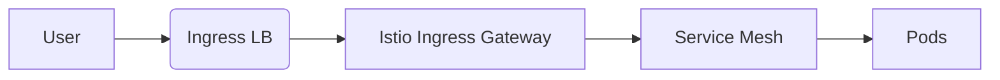
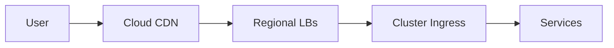

# Kubernetes Load Balancing: Ingress vs. Service Mesh vs. External Load Balancers

Kubernetes offers multiple approaches to load balancing traffic, each serving different needs in the application architecture. Here's a comprehensive comparison of the three main methods:

## 1. Kubernetes Ingress

**Purpose**: HTTP/HTTPS layer 7 routing and load balancing

### Implementation:
```yaml
apiVersion: networking.k8s.io/v1
kind: Ingress
metadata:
  name: app-ingress
  annotations:
    nginx.ingress.kubernetes.io/load-balance: "ewma"
spec:
  rules:
  - host: myapp.example.com
    http:
      paths:
      - path: /
        pathType: Prefix
        backend:
          service:
            name: app-service
            port:
              number: 80
```

### Characteristics:
- **Pros**:
  - Path-based and host-based routing
  - TLS termination
  - Cost-efficient (single LB IP)
  - Annotation-based customization
- **Cons**:
  - HTTP/HTTPS only (L7)
  - Limited TCP/UDP support
  - No fine-grained traffic control

### Use Cases:
- Web applications needing URL routing
- API gateways
- TLS termination for multiple services

## 2. Service Mesh (Istio, Linkerd)

**Purpose**: Fine-grained L7 traffic management with observability

### Istio Example:
```yaml
apiVersion: networking.istio.io/v1alpha3
kind: VirtualService
metadata:
  name: app-virtual-service
spec:
  hosts:
  - "myapp.example.com"
  http:
  - route:
    - destination:
        host: app-service
        subset: v1
      weight: 90
    - destination:
        host: app-service
        subset: v2
      weight: 10
```

### Characteristics:
- **Pros**:
  - Advanced traffic splitting (canary, blue-green)
  - Circuit breaking
  - Automatic mTLS
  - Rich observability (metrics, tracing)
  - Service-to-service load balancing
- **Cons**:
  - Complex setup
  - Performance overhead (sidecar proxies)
  - Steeper learning curve

### Use Cases:
- Microservices architectures
- Progressive rollouts
- Zero-trust networks
- Complex routing scenarios

## 3. External Load Balancers (Cloud Providers)

**Purpose**: Direct L3/L4 traffic distribution

### Implementation:
```yaml
apiVersion: v1
kind: Service
metadata:
  name: app-loadbalancer
spec:
  type: LoadBalancer
  ports:
  - port: 443
    targetPort: 8443
  selector:
    app: my-app
```

### Characteristics:
- **Pros**:
  - Simple configuration
  - Works with any protocol (TCP/UDP)
  - Cloud-native integrations (AWS ALB, GCP LB)
  - High performance
- **Cons**:
  - Cost (per-LB pricing)
  - Limited to L4 features
  - No application awareness
  - Multiple IPs needed for multiple services

### Use Cases:
- Non-HTTP services (gRPC, databases)
- Performance-critical applications
- Legacy applications

## Comparative Analysis

| Feature                | Ingress            | Service Mesh       | External LB        |
|------------------------|--------------------|--------------------|--------------------|
| **Layer**             | L7 (HTTP/HTTPS)   | L4-L7              | L3-L4              |
| **Routing**           | Host/path-based   | Advanced policies  | Port-based         |
| **TLS**              | Termination       | End-to-end mTLS    | Passthrough        |
| **Traffic Control**  | Basic             | Fine-grained       | None               |
| **Observability**    | Basic metrics     | Rich telemetry     | Cloud provider     |
| **Performance**      | Good              | Overhead           | Excellent          |
| **Cost**            | Low               | Moderate           | High (per-LB)      |
| **Complexity**      | Moderate          | High               | Low                |

## Hybrid Approaches

### 1. Ingress + Service Mesh


### 2. Global LB + Ingress


## Best Practices

1. **Start Simple**: Begin with Ingress for web apps
2. **Adopt Service Mesh Gradually**: Only when you need advanced features
3. **Use External LBs Judiciously**: Reserve for specific performance needs
4. **Layer Solutions**:
   - Global LB for geo-distribution
   - Ingress for HTTP routing
   - Service mesh for internal traffic
5. **Monitor Performance**: Watch for latency introduced by each layer

## Emerging Patterns

1. **Gateway API**: Next-gen Ingress (in beta)
   ```yaml
   apiVersion: gateway.networking.k8s.io/v1beta1
   kind: HTTPRoute
   metadata:
     name: app-route
   spec:
     rules:
     - matches:
       - path:
           type: PathPrefix
           value: /v2
       filters:
       - type: RequestMirror
         requestMirror:
           backendRef:
             name: app-v2
             port: 80
   ```

2. **eBPF-based Load Balancing**: Cilium's replacement for kube-proxy

Choose the right combination based on your application requirements, team expertise, and operational complexity tolerance. Most production environments end up using a combination of these approaches for different layers of their stack.