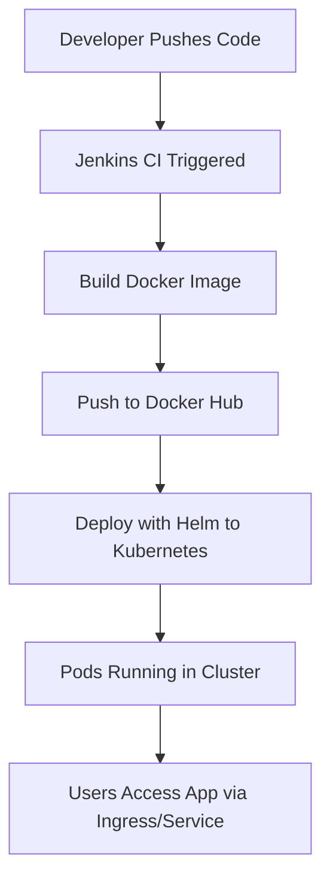

Creating a complete **DevOps project** that integrates **Docker**, **Kubernetes**, **Jenkins**, **Helm**, and **CI/CD pipelines** involves building an end-to-end deployment system for a cloud-native application. Here's a structured, step-by-step guide to help you set it up.

---

## 🔧 🔁 **💡 Project Overview**

We'll create a pipeline that:

1. Builds a Docker image of a web app.
2. Pushes it to Docker Hub or a private registry.
3. Uses Helm to deploy the app to Kubernetes.
4. Triggers this process automatically via Jenkins CI/CD.

---

## 🔹 1. **Technologies Used**

| Tool          | Purpose                                |
| ------------- | -------------------------------------- |
| Docker        | Containerize the app                   |
| Jenkins       | Automate CI/CD pipelines               |
| Kubernetes    | Run the app in a containerized cluster |
| Helm          | Package and deploy app to Kubernetes   |
| GitHub/GitLab | Source control and webhook integration |

---

## 🔁 2. **Step-by-Step Implementation**

---

### 🧱 Step 1: Create a Simple Web Application

**Folder Structure**:

```
devops-project/
├── app/
│   ├── app.py
│   ├── requirements.txt
│   └── Dockerfile
├── helm/
│   └── myapp/
│       ├── Chart.yaml
│       ├── values.yaml
│       └── templates/
│           ├── deployment.yaml
│           └── service.yaml
```

**🔹 app/app.py (Flask App)**:

```python
from flask import Flask
app = Flask(__name__)

@app.route('/')
def hello():
    return "Hello from DevOps Pipeline!"

if __name__ == '__main__':
    app.run(host='0.0.0.0', port=5000)
```

**🔹 app/requirements.txt**:

```
Flask==2.0.1
```

---

### 🐳 Step 2: Dockerize the App

**Dockerfile**:

```Dockerfile
FROM python:3.9-slim
WORKDIR /app
COPY requirements.txt .
RUN pip install -r requirements.txt
COPY . .
CMD ["python", "app.py"]
```

**Build & Push**:

```bash
docker build -t your_dockerhub_username/devops-app:latest .
docker push your_dockerhub_username/devops-app:latest
```

---

### ☸️ Step 3: Set Up Kubernetes with Helm

**helm/myapp/Chart.yaml**:

```yaml
apiVersion: v2
name: myapp
version: 0.1.0
```

**helm/myapp/values.yaml**:

```yaml
image:
  repository: your_dockerhub_username/devops-app
  tag: latest
  pullPolicy: IfNotPresent

service:
  type: NodePort
  port: 80
  targetPort: 5000
```

**helm/myapp/templates/deployment.yaml**:

```yaml
apiVersion: apps/v1
kind: Deployment
metadata:
  name: myapp
spec:
  replicas: 2
  selector:
    matchLabels:
      app: myapp
  template:
    metadata:
      labels:
        app: myapp
    spec:
      containers:
      - name: myapp
        image: "{{ .Values.image.repository }}:{{ .Values.image.tag }}"
        ports:
        - containerPort: 5000
```

**helm/myapp/templates/service.yaml**:

```yaml
apiVersion: v1
kind: Service
metadata:
  name: myapp-service
spec:
  type: {{ .Values.service.type }}
  selector:
    app: myapp
  ports:
    - port: {{ .Values.service.port }}
      targetPort: {{ .Values.service.targetPort }}
```

---

### 🛠️ Step 4: Set Up Jenkins

**1. Install Jenkins Plugins**:

* Docker Pipeline
* Kubernetes CLI Plugin
* Git
* Blue Ocean (optional)

**2. Configure Jenkins Credentials**:

* Docker Hub credentials
* Kubeconfig file for Jenkins user (as a secret file)

**3. Create Jenkinsfile in root**:

```groovy
pipeline {
    agent any

    environment {
        DOCKERHUB_CREDENTIALS = credentials('dockerhub-creds')
        KUBE_CONFIG = credentials('kubeconfig')
        IMAGE_NAME = "your_dockerhub_username/devops-app"
    }

    stages {
        stage('Checkout') {
            steps {
                git 'https://github.com/yourname/devops-project.git'
            }
        }

        stage('Build Docker Image') {
            steps {
                script {
                    sh 'docker build -t $IMAGE_NAME:$BUILD_NUMBER ./app'
                }
            }
        }

        stage('Push Image') {
            steps {
                script {
                    withCredentials([usernamePassword(credentialsId: 'dockerhub-creds', usernameVariable: 'USER', passwordVariable: 'PASS')]) {
                        sh """
                        echo $PASS | docker login -u $USER --password-stdin
                        docker push $IMAGE_NAME:$BUILD_NUMBER
                        """
                    }
                }
            }
        }

        stage('Deploy to Kubernetes') {
            steps {
                script {
                    withCredentials([file(credentialsId: 'kubeconfig', variable: 'KUBECONFIG')]) {
                        sh """
                        helm upgrade --install myapp ./helm/myapp \
                          --set image.repository=$IMAGE_NAME \
                          --set image.tag=$BUILD_NUMBER \
                          --kubeconfig=$KUBECONFIG
                        """
                    }
                }
            }
        }
    }

    post {
        success {
            echo 'Deployment successful!'
        }
        failure {
            echo 'Deployment failed!'
        }
    }
}
```

---

### 🔔 Step 5: Trigger Pipeline Automatically

* Set up a **GitHub webhook** to trigger Jenkins builds on `push`.
* Configure polling or event-based triggers in Jenkins job settings.

---

## 📊 Step 6: Monitoring and Observability

(Optional but recommended)

* Install **Prometheus + Grafana** in Kubernetes.
* Use tools like **Lens**, **K9s**, or **kubectl get pods** to observe deployments.
* Add **Slack notifications** in the Jenkins pipeline for alerts.

---

## ✅ Final Workflow Summary



---

## 📦 Bonus: GitHub Repository Layout

```
.
├── app/
│   └── (source code + Dockerfile)
├── helm/
│   └── myapp/ (Helm chart)
├── Jenkinsfile
├── README.md
```

---

## 🧩 Want More?

Let me know if you'd like:

* A ready-to-fork GitHub template of this project
* TLS/HTTPS Ingress setup
* Argo CD or GitOps version
* Monitoring & alerting setup

