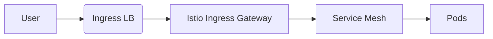
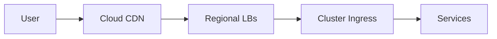
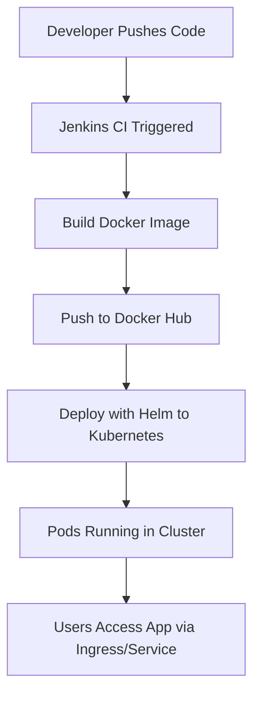

# Managing Applications in Kubernetes with Deployments and ReplicaSets

Kubernetes Deployments provide a declarative way to manage applications by controlling ReplicaSets, which in turn manage Pods. Here's how it works and a YAML example:

## Key Concepts

1. **Deployment**: Manages the desired state of your application
2. **ReplicaSet**: Ensures the specified number of pod replicas are running
3. **Rolling Updates**: Deployments support zero-downtime updates
4. **Rollbacks**: Ability to revert to previous versions

## YAML Example

Here's a complete example Deployment YAML for a simple web application:

```yaml
apiVersion: apps/v1
kind: Deployment
metadata:
  name: webapp-deployment
  labels:
    app: webapp
spec:
  replicas: 3
  selector:
    matchLabels:
      app: webapp
  strategy:
    type: RollingUpdate
    rollingUpdate:
      maxSurge: 1
      maxUnavailable: 0
  template:
    metadata:
      labels:
        app: webapp
    spec:
      containers:
      - name: webapp-container
        image: nginx:1.19.1
        ports:
        - containerPort: 80
        resources:
          requests:
            cpu: "100m"
            memory: "128Mi"
          limits:
            cpu: "200m"
            memory: "256Mi"
```

## Step-by-Step Management

### 1. Create the Deployment
```bash
kubectl apply -f deployment.yaml
```

### 2. Check Deployment Status
```bash
kubectl get deployments
kubectl describe deployment webapp-deployment
```

### 3. View ReplicaSets
```bash
kubectl get replicasets
kubectl describe replicaset <replicaset-name>
```

### 4. View Pods
```bash
kubectl get pods --selector app=webapp
```

### 5. Update the Deployment (Rolling Update)
Edit the deployment.yaml file to change the image version:
```yaml
image: nginx:1.20.0
```

Then apply:
```bash
kubectl apply -f deployment.yaml
```

### 6. Check Rollout Status
```bash
kubectl rollout status deployment/webapp-deployment
```

### 7. Rollback if Needed
```bash
kubectl rollout undo deployment/webapp-deployment
```

### 8. Scale the Deployment
```bash
kubectl scale deployment webapp-deployment --replicas=5
```

## Key Benefits

1. **Self-healing**: Automatically replaces failed pods
2. **Scaling**: Easily scale up/down with simple commands
3. **Updates**: Controlled rollout of new versions
4. **Rollbacks**: Quickly revert problematic updates

# Kubernetes Ingress: Managing External Access to Services

Kubernetes Ingress is an API object that provides HTTP/HTTPS routing rules to manage external access to services in a cluster. It acts as a smart traffic router, offering a more flexible alternative to NodePort or LoadBalancer services.

## How Ingress Works

1. **Ingress Resource**: You define rules in a YAML manifest that specify how to route incoming requests
2. **Ingress Controller**: A pod that watches for Ingress resources and configures the underlying load balancer/proxy
3. **External Access**: Clients connect to the Ingress endpoint which then routes to appropriate services

## Key Components

### 1. Ingress Resource (YAML Definition)
Defines the routing rules, TLS certificates, and backend services.

### 2. Ingress Controller
Actual implementation that processes the rules (common options: NGINX, Traefik, HAProxy, ALB, Istio)

### 3. Backend Services
Your regular ClusterIP services that Ingress routes to

## Example Ingress YAML

```yaml
apiVersion: networking.k8s.io/v1
kind: Ingress
metadata:
  name: webapp-ingress
  annotations:
    nginx.ingress.kubernetes.io/rewrite-target: /
spec:
  tls:
  - hosts:
    - myapp.example.com
    secretName: tls-secret
  rules:
  - host: myapp.example.com
    http:
      paths:
      - path: /webapp
        pathType: Prefix
        backend:
          service:
            name: webapp-service
            port:
              number: 80
      - path: /api
        pathType: Prefix
        backend:
          service:
            name: api-service
            port:
              number: 8080
```

## How Ingress Helps Manage External Access

1. **Host-Based Routing**: Route traffic based on domain name
   ```yaml
   - host: api.example.com → api-service
   - host: app.example.com → webapp-service
   ```

2. **Path-Based Routing**: Route based on URL path
   ```yaml
   - path: /v1 → legacy-service
   - path: /v2 → modern-service
   ```

3. **TLS Termination**: Handle SSL certificates at the ingress level
   ```yaml
   tls:
   - hosts: [myapp.example.com]
     secretName: tls-secret
   ```

4. **Load Balancing**: Distribute traffic across service pods

5. **Name-Based Virtual Hosting**: Serve multiple websites from single IP

6. **Traffic Control**: Annotations for rate limiting, redirects, rewrites

## Benefits Over Other Approaches

| Feature          | Ingress | LoadBalancer | NodePort |
|------------------|---------|--------------|----------|
| Single IP        | ✅       | ❌ (per service) | ❌        |
| Path routing     | ✅       | ❌            | ❌        |
| Host routing     | ✅       | ❌            | ❌        |
| TLS termination  | ✅       | ✅            | ❌        |
| Cost efficiency  | ✅       | ❌            | ✅        |

## Typical Workflow

1. Deploy an Ingress Controller (once per cluster)
2. Create ClusterIP Services for your applications
3. Define Ingress resources with routing rules
4. The Ingress Controller configures itself based on your rules
5. External DNS points to the Ingress Controller's IP

## Common Ingress Controllers

- **NGINX Ingress**: Most popular, feature-rich
- **Traefik**: Dynamic configuration, good for microservices
- **AWS ALB Ingress**: Native integration with AWS ALB
- **HAProxy**: High performance
- **Istio Gateway**: Part of service mesh

Ingress provides a powerful, declarative way to manage external access while keeping your services abstracted from networking details.

# Kubernetes ConfigMaps and Secrets: Managing Configuration Data

ConfigMaps and Secrets are Kubernetes objects used to decouple configuration data from container images, making applications more portable and secure.

## ConfigMaps

**Purpose**: Store non-sensitive configuration data in key-value pairs.

### Use Cases for ConfigMaps:
1. Environment variables for applications
2. Configuration files (e.g., nginx.conf, application.properties)
3. Command-line arguments
4. Any non-sensitive app configuration

### Example ConfigMap YAML:
```yaml
apiVersion: v1
kind: ConfigMap
metadata:
  name: app-config
data:
  # Key-value pairs
  APP_COLOR: blue
  APP_MODE: prod
  
  # File-like configuration
  nginx.conf: |
    server {
      listen 80;
      server_name localhost;
      location / {
        proxy_pass http://webapp-service;
      }
    }
```

### Using ConfigMap in a Pod:
```yaml
apiVersion: v1
kind: Pod
metadata:
  name: webapp-pod
spec:
  containers:
  - name: webapp
    image: nginx
    envFrom:
    - configMapRef:
        name: app-config  # Import all key-value pairs as env vars
    volumeMounts:
    - name: config-volume
      mountPath: /etc/nginx
  volumes:
  - name: config-volume
    configMap:
      name: app-config   # Mount specific config files
```

## Secrets

**Purpose**: Store sensitive data like passwords, API keys, and TLS certificates in an encrypted form (base64 encoded, not encrypted by default - consider external secret management for production).

### Use Cases for Secrets:
1. Database credentials
2. API tokens/keys
3. TLS certificates
4. SSH keys
5. Any sensitive configuration

### Example Secret YAML:
```yaml
apiVersion: v1
kind: Secret
metadata:
  name: db-secret
type: Opaque  # Default type for arbitrary data
data:
  # Base64 encoded values (echo -n "value" | base64)
  DB_USER: cm9vdA==
  DB_PASSWORD: cGFzc3dvcmQxMjM=
```

### Using Secret in a Pod:
```yaml
apiVersion: v1
kind: Pod
metadata:
  name: db-pod
spec:
  containers:
  - name: database
    image: mysql
    env:
    - name: MYSQL_ROOT_PASSWORD  # Environment variable name
      valueFrom:
        secretKeyRef:
          name: db-secret        # Secret name
          key: DB_PASSWORD      # Key in secret
    volumeMounts:
    - name: cert-volume
      mountPath: /etc/mysql/certs
  volumes:
  - name: cert-volume
    secret:
      secretName: tls-secret     # Mount secret as files
```

## Key Differences

| Feature          | ConfigMap               | Secret                     |
|------------------|-------------------------|----------------------------|
| Data type        | Plain text              | Base64 encoded             |
| Security         | Non-sensitive data      | Sensitive data             |
| Storage          | etcd (unencrypted)      | etcd (base64, not encrypted) |
| Use case         | Configuration files     | Credentials, certificates  |
| Size limitation  | 1MB per ConfigMap       | 1MB per Secret             |

## Best Practices

1. **For Secrets**:
   - Use third-party secret managers (AWS Secrets Manager, HashiCorp Vault) for production
   - Enable etcd encryption at rest
   - Use Kubernetes RBAC to restrict access
   - Consider using SealedSecrets for GitOps workflows

2. **For ConfigMaps**:
   - Use immutable ConfigMaps (`immutable: true`) for better performance
   - Group related configurations together
   - Use annotations for metadata/versioning

3. **For Both**:
   - Update references when configs change (may require pod restart)
   - Use rolling updates when configuration changes
   - Consider using ConfigMap/Secret generators with Kustomize

These mechanisms enable proper separation of configuration from application code, making your Kubernetes applications more secure and portable across environments.

# Helm: Kubernetes Package Manager

Helm is the package manager for Kubernetes that simplifies application deployment by:
- Packaging all Kubernetes resources into a single deployable unit (chart)
- Enabling versioning and sharing of applications
- Supporting templating to customize deployments
- Managing dependencies between components

## Key Concepts

1. **Chart**: A packaged Helm application (collection of YAML templates + metadata)
2. **Release**: A deployed instance of a chart
3. **Repository**: A collection of shareable charts
4. **Values**: Customizable parameters for the chart

## Creating a Helm Chart

### 1. Initialize a new chart
```bash
helm create myapp-chart
```

This creates a directory structure:
```
myapp-chart/
  ├── Chart.yaml          # Chart metadata
  ├── values.yaml         # Default configuration values
  ├── charts/             # Subcharts/dependencies
  └── templates/          # Kubernetes resource templates
      ├── deployment.yaml
      ├── service.yaml
      ├── ingress.yaml
      └── _helpers.tpl    # Template helpers
```

### 2. Customize the Chart

**Edit Chart.yaml**:
```yaml
apiVersion: v2
name: myapp-chart
description: A Helm chart for my application
version: 0.1.0
appVersion: 1.0.0
```

**Modify templates/deployment.yaml** (example snippet):
```yaml
apiVersion: apps/v1
kind: Deployment
metadata:
  name: {{ include "myapp-chart.fullname" . }}
spec:
  replicas: {{ .Values.replicaCount }}
  template:
    spec:
      containers:
      - name: {{ .Chart.Name }}
        image: "{{ .Values.image.repository }}:{{ .Values.image.tag }}"
        ports:
        - containerPort: {{ .Values.service.port }}
```

**Update values.yaml**:
```yaml
replicaCount: 3
image:
  repository: nginx
  tag: stable
  pullPolicy: IfNotPresent
service:
  type: ClusterIP
  port: 80
```

### 3. Package Dependencies (if any)
```bash
helm dependency update myapp-chart
```

## Deploying the Helm Chart

### 1. Install the Chart
```bash
helm install myapp-release ./myapp-chart
```

### 2. Upgrade with Custom Values
Create a custom values file `custom-values.yaml`:
```yaml
replicaCount: 5
image:
  tag: latest
```

Then upgrade:
```bash
helm upgrade myapp-release ./myapp-chart -f custom-values.yaml
```

### 3. Verify Deployment
```bash
helm list
helm status myapp-release
kubectl get pods
```

### 4. Rollback (if needed)
```bash
helm rollback myapp-release 0  # Revert to revision 0
```

## Why Helm Simplifies Kubernetes Deployments

1. **Templating**: Avoids YAML duplication with Go templating
   ```yaml
   env:
   {{- range $key, $value := .Values.envVars }}
     - name: {{ $key }}
       value: {{ $value | quote }}
   {{- end }}
   ```

2. **Value Management**: Single place to control all parameters
   ```yaml
   # values.yaml
   resources:
     limits:
       cpu: 500m
       memory: 512Mi
   ```

3. **Release Management**: Track versions and rollbacks
   ```bash
   helm history myapp-release
   ```

4. **Hooks**: Execute jobs at specific points in release lifecycle
   ```yaml
   annotations:
     "helm.sh/hook": pre-install
   ```

5. **Sharing**: Publish to chart repositories
   ```bash
   helm package myapp-chart
   helm push myapp-chart-0.1.0.tgz my-repo
   ```

## Advanced Features

- **Library Charts**: Reusable chart components
- **Chart Tests**: Validation for installed charts
- **Subcharts**: Modular application components
- **Post-renderers**: Customize manifests after templating

Helm transforms Kubernetes deployments from manual YAML management to a structured, repeatable process with version control and easy customization.

# Helm Templates, Values, and Releases Explained with Best Practices

## Helm Core Components

### 1. Templates
- **Purpose**: Go-templated Kubernetes manifests that become actual resources when deployed
- **Location**: `templates/` directory in a chart
- **Features**:
  - Use Go template language with Sprig functions
  - Access values from `values.yaml` via `{{ .Values.param }}`
  - Include helper functions from `_helpers.tpl`

**Example Deployment Template** (`templates/deployment.yaml`):
```yaml
apiVersion: apps/v1
kind: Deployment
metadata:
  name: {{ include "mychart.fullname" . }}
spec:
  replicas: {{ .Values.replicaCount }}
  template:
    spec:
      containers:
      - name: {{ .Chart.Name }}
        image: "{{ .Values.image.repository }}:{{ .Values.image.tag }}"
        {{- with .Values.resources }}
        resources:
          {{- toYaml . | nindent 10 }}
        {{- end }}
```

### 2. Values
- **Purpose**: Configuration parameters that customize the chart
- **Sources** (in order of precedence):
  1. Command-line (`--set` flags)
  2. Custom values files (`-f myvalues.yaml`)
  3. Default `values.yaml` in chart
  4. Parent chart's `values.yaml` (for subcharts)

**Example values.yaml**:
```yaml
replicaCount: 3
image:
  repository: nginx
  tag: stable
  pullPolicy: IfNotPresent
resources:
  limits:
    cpu: 200m
    memory: 256Mi
```

### 3. Releases
- **Definition**: An instance of a chart running in a Kubernetes cluster
- **Management**:
  - Each `helm install` creates a new release
  - Releases are versioned (revisions)
  - Stored as Secrets in the cluster by default

**Release Lifecycle**:
```
helm install → helm upgrade → helm rollback → helm uninstall
```

## Helm Chart Best Practices

### 1. Structure and Organization
```
mychart/
├── Chart.yaml          # Required: Chart metadata
├── values.yaml        # Required: Default configuration
├── charts/            # Optional: Subcharts/dependencies
├── templates/         # Required: Kubernetes manifests
│   ├── deployment.yaml
│   ├── service.yaml
│   ├── _helpers.tpl   # Template helpers
│   └── tests/        # Test pods
└── README.md          # Documentation
```

### 2. Templating Practices
- **Use named templates** (`_helpers.tpl`) for reusable components:
  ```tpl
  {{- define "mychart.labels" -}}
  app.kubernetes.io/name: {{ .Chart.Name }}
  app.kubernetes.io/instance: {{ .Release.Name }}
  {{- end }}
  ```
  
- **Add input validation**:
  ```yaml
  {{- if not .Values.image.tag }}
  {{- fail "image.tag is required" }}
  {{- end }}
  ```

- **Use `include` over `template`** (preserves scope):
  ```yaml
  labels:
    {{- include "mychart.labels" . | nindent 4 }}
  ```

### 3. Values Management
- **Document all values** in `values.yaml` with comments:
  ```yaml
  # replicaCount: Number of application instances
  replicaCount: 1
  ```
  
- **Group related values** hierarchically:
  ```yaml
  autoscaling:
    enabled: true
    minReplicas: 2
    maxReplicas: 5
  ```

- **Provide sensible defaults** but allow overrides:
  ```yaml
  service:
    type: ClusterIP  # LoadBalancer for production
    port: 80
  ```

### 4. Security Practices
- **Never put secrets in values.yaml** - Use Kubernetes Secrets instead
- **Use `helm lint`** to validate charts
- **Make charts immutable** when possible:
  ```yaml
  apiVersion: v2
  name: mychart
  description: My immutable chart
  type: application
  ```

### 5. Release Management
- **Use semantic versioning** for charts:
  ```yaml
  version: 1.2.3  # MAJOR.MINOR.PATCH
  ```
  
- **Implement upgrade hooks** for migrations:
  ```yaml
  annotations:
    "helm.sh/hook": pre-upgrade
  ```

- **Test with --dry-run** before actual deployment:
  ```bash
  helm install myapp ./mychart --dry-run --debug
  ```

### 6. Advanced Techniques
- **Conditional templates**:
  ```yaml
  {{- if .Values.ingress.enabled }}
  apiVersion: networking.k8s.io/v1
  kind: Ingress
  ...
  {{- end }}
  ```

- **Range over values**:
  ```yaml
  env:
  {{- range $key, $value := .Values.envVars }}
    - name: {{ $key }}
      value: {{ $value | quote }}
  {{- end }}
  ```

- **Template partials** for complex objects:
  ```tpl
  {{- define "mychart.resources" }}
  {{- if .Values.resources }}
  resources:
    {{- toYaml .Values.resources | nindent 4 }}
  {{- end }}
  {{- end }}
  ```

## Practical Example Workflow

1. **Create a new chart**:
   ```bash
   helm create myapp && rm -rf myapp/templates/*
   ```

2. **Add templates** (deployment.yaml, service.yaml etc.)

3. **Define values** in values.yaml

4. **Package and deploy**:
   ```bash
   helm package myapp
   helm install myapp ./myapp-0.1.0.tgz --values prod-values.yaml
   ```

5. **Upgrade**:
   ```bash
   helm upgrade myapp ./myapp --set replicaCount=5
   ```

Helm's templating system combined with these best practices enables you to create maintainable, reusable, and production-grade Kubernetes deployments that can be customized for different environments while keeping your manifests DRY (Don't Repeat Yourself).

# Setting Up a CI/CD Pipeline in Jenkins

Here's a complete guide to creating a basic Jenkins pipeline that compiles code and deploys it to a target environment.

## Prerequisites
- Jenkins installed (with Pipeline plugin)
- Git repository with your code
- Build tools (Maven, Gradle, npm, etc.) installed on Jenkins agents
- Deployment target access (Kubernetes, server, etc.)

## Step 1: Create a New Pipeline Job

1. In Jenkins dashboard, click **New Item**
2. Enter a name (e.g., "MyApp-CI-CD") and select **Pipeline**
3. Click **OK**

## Step 2: Configure the Pipeline

### Option A: Pipeline Script (Jenkinsfile in SCM)
1. In your project root, create a `Jenkinsfile` with the pipeline definition
2. In Jenkins job configuration:
   - Select **Pipeline script from SCM**
   - Choose your SCM (Git, GitHub, etc.)
   - Specify repository URL and credentials
   - Set branch (e.g., `main`)
   - Specify script path (`Jenkinsfile`)

### Option B: Direct Pipeline Script
1. In Jenkins job configuration:
   - Select **Pipeline script**
   - Paste the pipeline definition directly

## Basic Pipeline Example (Java/Maven to Kubernetes)

Here's a complete `Jenkinsfile` example:

```groovy
pipeline {
    agent any
    
    environment {
        // Define environment variables
        APP_NAME = "my-java-app"
        VERSION = "1.0.${BUILD_NUMBER}"
        DOCKER_IMAGE = "myregistry/${APP_NAME}:${VERSION}"
        KUBE_CONFIG = credentials('kubeconfig') // Stored in Jenkins credentials
    }
    
    stages {
        stage('Checkout') {
            steps {
                git branch: 'main',
                url: 'https://github.com/your-repo/your-java-app.git'
            }
        }
        
        stage('Build') {
            steps {
                sh 'mvn clean package'
                archiveArtifacts artifacts: 'target/*.jar', fingerprint: true
            }
        }
        
        stage('Test') {
            steps {
                sh 'mvn test'
                junit 'target/surefire-reports/*.xml'
            }
        }
        
        stage('Build Docker Image') {
            steps {
                script {
                    docker.build(DOCKER_IMAGE)
                }
            }
        }
        
        stage('Push Image') {
            steps {
                script {
                    docker.withRegistry('https://registry.example.com', 'dockerhub-creds') {
                        docker.image(DOCKER_IMAGE).push()
                    }
                }
            }
        }
        
        stage('Deploy to Kubernetes') {
            steps {
                sh """
                    kubectl --kubeconfig=${KUBE_CONFIG} set image deployment/${APP_NAME} ${APP_NAME}=${DOCKER_IMAGE}
                """
            }
        }
    }
    
    post {
        always {
            cleanWs() // Clean workspace
        }
        success {
            slackSend channel: '#deployments',
                     message: "SUCCESS: Job ${env.JOB_NAME} build ${env.BUILD_NUMBER}"
        }
        failure {
            slackSend channel: '#deployments',
                     message: "FAILED: Job ${env.JOB_NAME} build ${env.BUILD_NUMBER}"
        }
    }
}
```

## Key Components Explained

### 1. Pipeline Structure
- `agent`: Where the pipeline runs (any available agent)
- `environment`: Shared variables for all stages
- `stages`: The main workflow steps
- `post`: Actions after pipeline completes

### 2. Core Stages
1. **Checkout**: Gets code from version control
2. **Build**: Compiles source code (Maven in this case)
3. **Test**: Runs unit tests and reports results
4. **Docker Build**: Creates container image
5. **Push Image**: Stores image in registry
6. **Deploy**: Updates Kubernetes deployment

### 3. Advanced Features
- **Credentials**: Securely stored in Jenkins (kubeconfig, Docker Hub)
- **Artifact Archiving**: Saves build outputs
- **Test Reporting**: JUnit test results visualization
- **Notifications**: Slack integration

## Setting Up Required Plugins

Ensure these Jenkins plugins are installed:
- Pipeline
- Docker Pipeline
- Kubernetes CLI
- Git
- JUnit
- Slack Notification
- Credentials Binding

## Best Practices

1. **Use Jenkinsfile in SCM**: Store pipeline definition with your code
2. **Secure Credentials**: Never hardcode secrets - use Jenkins credentials store
3. **Parallelize Stages**: Run independent stages in parallel
4. **Implement Rollbacks**: Add stage to revert failed deployments
5. **Parameterize Builds**: Allow runtime inputs:
   ```groovy
   parameters {
       choice(name: 'DEPLOY_ENV', choices: ['dev', 'staging', 'prod'], description: 'Target environment')
       booleanParam(name: 'RUN_TESTS', defaultValue: true, description: 'Run all tests?')
   }
   ```
6. **Use Shared Libraries**: Reusable pipeline components across projects

## Visualizing the Pipeline

Jenkins provides several visualization tools:
- **Blue Ocean**: Modern UI for pipeline visualization
- **Stage View**: Traditional stage progress view
- **Build History**: Timeline of past executions

This pipeline gives you a complete CI/CD workflow from code commit to production deployment, with testing and artifact management built in. You can extend it with additional stages like security scanning, performance testing, or approval gates for production deployments.

# Jenkins + Docker Integration: Automated Containerized CI/CD

Here's a complete practical guide to integrating Jenkins with Docker for automating container builds and deployments, including a working example.

## Prerequisites
- Jenkins server with Docker plugins installed
- Docker installed on Jenkins agents (or Jenkins server)
- Docker Hub/registry credentials configured in Jenkins
- Kubernetes cluster (for deployment, optional)

## Step 1: Configure Jenkins for Docker

1. **Install required plugins**:
   - Docker
   - Docker Pipeline
   - Docker Build Step

2. **Add Docker credentials** in Jenkins:
   - Go to **Credentials** → **System** → **Global credentials**
   - Add username/password for your Docker registry

## Step 2: Create a Docker-Enabled Pipeline

Here's a complete `Jenkinsfile` example that:
1. Builds a Node.js application
2. Creates a Docker image
3. Pushes to Docker Hub
4. Deploys to Kubernetes

```groovy
pipeline {
    agent {
        docker {
            image 'node:14-alpine'
            args '-u root:root' // Needed for file permissions
            reuseNode true
        }
    }

    environment {
        APP_NAME = "nodejs-app"
        DOCKER_IMAGE = "your-dockerhub/${APP_NAME}:${BUILD_NUMBER}"
        KUBE_NAMESPACE = "default"
        // Credentials from Jenkins
        DOCKER_CREDS = credentials('dockerhub-creds')
        KUBECONFIG = credentials('kubeconfig')
    }

    stages {
        stage('Checkout') {
            steps {
                checkout scm
            }
        }

        stage('Install Dependencies') {
            steps {
                sh 'npm install'
            }
        }

        stage('Run Tests') {
            steps {
                sh 'npm test'
            }
        }

        stage('Build Docker Image') {
            agent any // Needs Docker daemon
            steps {
                script {
                    docker.build(DOCKER_IMAGE)
                }
            }
        }

        stage('Push Image') {
            steps {
                script {
                    docker.withRegistry('https://registry.hub.docker.com', DOCKER_CREDS) {
                        docker.image(DOCKER_IMAGE).push()
                    }
                }
            }
        }

        stage('Deploy to Kubernetes') {
            steps {
                sh """
                    kubectl --kubeconfig=${KUBECONFIG} -n ${KUBE_NAMESPACE} \
                    set image deployment/${APP_NAME} ${APP_NAME}=${DOCKER_IMAGE}
                """
            }
        }
    }

    post {
        always {
            cleanWs()
        }
        success {
            slackSend(color: 'good', message: "SUCCESS: ${JOB_NAME} #${BUILD_NUMBER}")
        }
        failure {
            slackSend(color: 'danger', message: "FAILED: ${JOB_NAME} #${BUILD_NUMBER}")
        }
    }
}
```

## Key Integration Points Explained

### 1. Docker Build Agent
```groovy
agent {
    docker {
        image 'node:14-alpine' // Uses Node.js container for build
        args '-u root:root'
    }
}
```
- Runs build stages inside a containerized environment
- Ensures consistent build tools across executions

### 2. Docker Image Building
```groovy
script {
    docker.build(DOCKER_IMAGE)
}
```
- Requires a `Dockerfile` in your project root
- Example `Dockerfile` for Node.js app:
```dockerfile
FROM node:14-alpine
WORKDIR /app
COPY package*.json ./
RUN npm install --production
COPY . .
EXPOSE 3000
CMD ["npm", "start"]
```

### 3. Secure Registry Push
```groovy
docker.withRegistry('https://registry.hub.docker.com', DOCKER_CREDS) {
    docker.image(DOCKER_IMAGE).push()
}
```
- Uses Jenkins-stored credentials
- Supports private registries (Artifactory, ECR, GCR, etc.)

### 4. Kubernetes Deployment
```groovy
sh """
    kubectl set image deployment/${APP_NAME} ${APP_NAME}=${DOCKER_IMAGE}
"""
```
- Assumes existing Kubernetes deployment
- Alternative: `kubectl apply -f k8s-deployment.yaml`

## Advanced Integration Patterns

### 1. Multi-Architecture Builds
```groovy
stage('Build Multi-Arch Image') {
    steps {
        sh """
            docker buildx build --platform linux/amd64,linux/arm64 \
            -t ${DOCKER_IMAGE} --push .
        """
    }
}
```

### 2. Docker Compose Testing
```groovy
stage('Integration Tests') {
    steps {
        sh 'docker-compose -f docker-compose.test.yml up --build --abort-on-container-exit'
    }
}
```

### 3. Parameterized Builds
```groovy
parameters {
    choice(name: 'ENVIRONMENT', choices: ['dev', 'staging', 'prod'])
    string(name: 'IMAGE_TAG', defaultValue: 'latest')
}
```

### 4. Docker Content Trust
```groovy
environment {
    DOCKER_CONTENT_TRUST = '1'
}
```

## Best Practices

1. **Use Docker-in-Docker (DinD)** for isolated builds:
   ```groovy
   agent {
       docker {
           image 'docker:dind'
           args '--privileged -v /var/run/docker.sock:/var/run/docker.sock'
       }
   }
   ```

2. **Cache dependencies** between builds:
   ```groovy
   stage('Install Dependencies') {
       steps {
           sh '''
               docker run -v ${PWD}:/app -v /app/node_modules \
               node:14-alpine npm install
           '''
       }
   }
   ```

3. **Scan images for vulnerabilities**:
   ```groovy
   stage('Security Scan') {
       steps {
           sh 'docker scan ${DOCKER_IMAGE}'
       }
   }
   ```

4. **Clean up old images**:
   ```groovy
   post {
       always {
           sh 'docker system prune -f || true'
       }
   }
   ```

## Monitoring the Pipeline

1. **Blue Ocean View**: Visual pipeline progress
2. **Console Output**: Detailed build logs
3. **Docker Hub**: Verify pushed images
4. **Kubernetes**: Check deployment status
   ```bash
   kubectl get pods -w
   kubectl describe deployment/nodejs-app
   ```

This integration provides a complete workflow from code commit to production deployment, leveraging Docker for consistent builds and environments throughout the pipeline.

# Configuring GitHub Webhooks for Jenkins Auto-Triggered Builds

Here's a complete step-by-step guide to setting up GitHub webhooks that automatically trigger Jenkins builds when code is pushed:

## Prerequisites
- Jenkins server accessible via HTTPS (GitHub requires HTTPS for webhooks)
- GitHub repository admin access
- Jenkins GitHub Plugin installed (`GitHub plugin` and `GitHub API plugin`)

## Step 1: Configure Jenkins for GitHub Integration

### 1. Install Required Plugins
- Manage Jenkins → Manage Plugins → Available
- Install:
  - GitHub plugin
  - GitHub API plugin
  - (Optional) Pipeline: GitHub Plugin

### 2. Set Up GitHub Server in Jenkins
1. Go to **Manage Jenkins → Configure System**
2. Find **GitHub** section
3. Add GitHub Server:
   - Name: `GitHub`
   - API URL: `https://api.github.com`
4. Add credentials:
   - Kind: **Secret text**
   - Secret: [GitHub personal access token] (with `repo` scope)
   - ID: `github-token`

## Step 2: Configure the Jenkins Job

### For Freestyle Projects:
1. Create/Edit job → **Configure**
2. Under **Source Code Management**:
   - Select Git
   - Enter Repository URL: `https://github.com/your-username/your-repo.git`
3. Under **Build Triggers**:
   - Check **GitHub hook trigger for GITScm polling**

### For Pipeline Projects:
1. Use this trigger definition in your `Jenkinsfile`:
```groovy
triggers {
    githubPush()
}
```
Or for more control:
```groovy
triggers {
    GitHubPushTrigger {
        branchesToBuild = ['main', 'develop']
    }
}
```

## Step 3: Set Up GitHub Webhook

1. Go to your GitHub repository → **Settings → Webhooks → Add webhook**
2. Configure the webhook:
   - Payload URL: `https://your-jenkins-server/github-webhook/`
   - Content type: `application/json`
   - Secret: [Optional] Add a secret that matches Jenkins configuration
   - Which events: 
     - For push events: **Just the push event**
     - For all events: **Send me everything**
3. Click **Add webhook**

## Step 4: Verify the Connection

1. In GitHub, check the webhook's recent deliveries
2. In Jenkins, check:
   - **Manage Jenkins → System Log** for GitHub plugin logs
   - Job's **Build History** for triggered builds

## Troubleshooting Tips

### Common Issues and Fixes:
1. **Webhook not triggering**:
   - Verify Jenkins URL is accessible from GitHub
   - Check Jenkins logs (`/var/log/jenkins/jenkins.log`)
   - Test with `curl -X POST https://your-jenkins-server/github-webhook/`

2. **403 Forbidden errors**:
   - Ensure GitHub token has proper permissions
   - Verify webhook secret matches (if used)

3. **Builds not starting**:
   - Check "GitHub hook trigger" is enabled in job config
   - Verify SCM polling is disabled (conflicts with webhooks)

## Advanced Configuration

### 1. Filtering Specific Branches
In your `Jenkinsfile`:
```groovy
triggers {
    githubPush()
}
pipeline {
    agent any
    stages {
        stage('Build') {
            when {
                branch 'main' // Only build on main branch pushes
            }
            steps {
                sh 'make build'
            }
        }
    }
}
```

### 2. Using Webhook Secrets
1. Generate a secret:
   ```bash
   openssl rand -hex 20
   ```
2. Add to Jenkins GitHub server config
3. Use same secret in GitHub webhook

### 3. Multibranch Pipelines
1. Create **New Item → Multibranch Pipeline**
2. Configure branch sources to auto-discover branches/PRs
3. Webhooks will automatically trigger builds for all branches

## Security Best Practices

1. **Use HTTPS**: GitHub requires HTTPS for webhooks
2. **Restrict IPs**: Configure GitHub webhook to only allow Jenkins server IP
3. **Use Secrets**: Always use webhook secrets for verification
4. **Limit Permissions**: GitHub token only needs `repo` scope
5. **Rotate Secrets**: Periodically update webhook and API tokens

This setup creates a fully automated CI pipeline where any push to GitHub triggers the corresponding Jenkins job immediately, enabling true continuous integration.

# Jenkins Pipeline as Code: Declarative vs Scripted Pipelines

Jenkins Pipeline as Code is an infrastructure-as-code approach that defines CI/CD pipelines using code (typically Groovy) stored in version control, rather than configuring jobs through Jenkins' UI.

## Pipeline as Code Benefits
- **Version-controlled** pipeline definitions
- **Reproducible** builds across environments
- **Code review** for pipeline changes
- **Reusable** components via shared libraries
- **Auditable** change history

## Declarative Pipeline

The newer, simpler syntax with opinionated structure, ideal for most use cases.

### Basic Structure:
```groovy
pipeline {
    agent any
    stages {
        stage('Build') {
            steps {
                // Build steps
            }
        }
        stage('Test') {
            steps {
                // Test steps
            }
        }
    }
    post {
        always {
            // Cleanup steps
        }
    }
}
```

### Complete Example:
```groovy
// Jenkinsfile (Declarative)
pipeline {
    agent {
        docker {
            image 'maven:3.8.6-jdk-11'
            args '-v $HOME/.m2:/root/.m2' // Cache Maven artifacts
        }
    }
    
    options {
        timeout(time: 1, unit: 'HOURS')
        buildDiscarder(logRotator(numToKeepStr: '10'))
    }
    
    environment {
        VERSION = "1.0.${BUILD_NUMBER}"
        DOCKER_IMAGE = "my-registry/app:${VERSION}"
    }
    
    stages {
        stage('Checkout') {
            steps {
                checkout scm
            }
        }
        
        stage('Build') {
            steps {
                sh 'mvn clean package'
                archiveArtifacts artifacts: 'target/*.jar', fingerprint: true
            }
        }
        
        stage('Test') {
            steps {
                sh 'mvn test'
                junit 'target/surefire-reports/*.xml'
            }
        }
        
        stage('Docker Build') {
            when {
                branch 'main'
            }
            steps {
                script {
                    docker.build(DOCKER_IMAGE)
                }
            }
        }
    }
    
    post {
        success {
            slackSend channel: '#builds',
                     message: "SUCCESS: ${JOB_NAME} #${BUILD_NUMBER}"
        }
        failure {
            slackSend channel: '#builds',
                     message: "FAILED: ${JOB_NAME} #${BUILD_NUMBER}"
        }
    }
}
```

## Scripted Pipeline

The original flexible Groovy-based syntax for advanced use cases.

### Basic Structure:
```groovy
node {
    stage('Build') {
        // Build steps
    }
    stage('Test') {
        // Test steps
    }
}
```

### Complete Example:
```groovy
// Jenkinsfile (Scripted)
def dockerImage = null

node('docker-agent') {
    checkout scm
    
    stage('Build') {
        docker.image('maven:3.8.6-jdk-11').inside('-v $HOME/.m2:/root/.m2') {
            sh 'mvn clean package'
        }
        archiveArtifacts artifacts: 'target/*.jar', fingerprint: true
    }
    
    stage('Test') {
        docker.image('maven:3.8.6-jdk-11').inside {
            sh 'mvn test'
        }
        junit 'target/surefire-reports/*.xml'
    }
    
    if (env.BRANCH_NAME == 'main') {
        stage('Docker Build') {
            dockerImage = docker.build("my-registry/app:1.0.${BUILD_NUMBER}")
        }
        
        stage('Deploy') {
            docker.withRegistry('https://my-registry', 'docker-creds') {
                dockerImage.push()
            }
            sh "kubectl set image deployment/app app=my-registry/app:1.0.${BUILD_NUMBER}"
        }
    }
}

// Post-build actions
if (currentBuild.result == 'SUCCESS') {
    slackSend channel: '#builds', 
             message: "SUCCESS: ${JOB_NAME} #${BUILD_NUMBER}"
} else {
    slackSend channel: '#builds',
             message: "FAILED: ${JOB_NAME} #${BUILD_NUMBER}"
}
```

## Key Differences

| Feature                | Declarative                          | Scripted                          |
|------------------------|--------------------------------------|-----------------------------------|
| **Syntax**             | Structured with predefined sections  | Flexible Groovy code              |
| **Learning Curve**     | Easier                               | Steeper (requires Groovy knowledge)|
| **Validation**         | Early syntax validation              | Runtime error checking            |
| **When to Use**        | Most standard CI/CD pipelines        | Complex logic/advanced workflows  |
| **Directives**         | Uses `pipeline`, `stages`, etc.      | Uses Groovy constructs            |
| **Error Handling**     | Built-in post conditions             | Manual try/catch blocks           |
| **Restartability**     | Built-in checkpoint support          | Manual implementation             |

## Best Practices for Both Styles

1. **Store in SCM**: Always keep Jenkinsfile in version control
2. **Start Simple**: Begin with declarative, switch to scripted only when needed
3. **Use Shared Libraries**: For reusable functions across pipelines
4. **Parameterize Builds**: Allow runtime configuration
   ```groovy
   parameters {
       string(name: 'DEPLOY_ENV', defaultValue: 'staging')
   }
   ```
5. **Secure Credentials**: Use Jenkins credential store
   ```groovy
   environment {
       AWS_ACCESS_KEY_ID = credentials('aws-access-key')
   }
   ```
6. **Clean Up**: Always clean workspace in post-build
   ```groovy
   post {
       always {
           cleanWs()
       }
   }
   ```

## When to Choose Which

### Use Declarative When:
- You need a simple, readable pipeline
- You want built-in syntax checking
- Your workflow fits standard CI/CD patterns
- You're new to Jenkins Pipelines

### Use Scripted When:
- You need complex logic (loops, conditionals)
- You require advanced error handling
- You're integrating with external systems
- You need dynamic pipeline generation

Both approaches can coexist - you can call scripted code from declarative pipelines using the `script` block when needed.

# Git Branching Strategies and CI/CD Integration: GitFlow in Practice

GitFlow is a branching model that provides a structured approach to managing features, releases, and hotfixes in a way that enhances CI/CD processes. Here's how it works with CI/CD pipelines and a practical setup example.

## How GitFlow Enhances CI/CD

1. **Clear Environment Mapping**:
   - `develop` → Staging environment
   - `main` → Production environment
   - `feature/*` → Ephemeral test environments

2. **Automated Quality Gates**:
   - Feature branches run unit tests
   - Develop branch runs integration tests
   - Release branches run full regression tests

3. **Controlled Releases**:
   - Release branches enable gradual rollout
   - Hotfix branches allow emergency patches

4. **Parallel Development**:
   - Multiple features can progress simultaneously
   - Release preparation doesn't block new development

## GitFlow CI/CD Setup Example

### 1. Branch Structure
```
main        - Production code (always deployable)
release/*   - Release preparation branches
develop     - Integration branch (nightly builds)
feature/*   - Feature development branches
hotfix/*    - Critical bug fixes
```

### 2. Jenkins Pipeline Setup (Declarative)

```groovy
// Jenkinsfile at repository root
pipeline {
    agent any
    options {
        skipDefaultCheckout true
    }

    stages {
        stage('Checkout & Detect Branch Type') {
            steps {
                checkout scm
                script {
                    // Determine branch type
                    if (env.BRANCH_NAME == 'main') {
                        env.BRANCH_TYPE = 'production'
                    } else if (env.BRANCH_NAME == 'develop') {
                        env.BRANCH_TYPE = 'staging'
                    } else if (env.BRANCH_NAME.startsWith('release/')) {
                        env.BRANCH_TYPE = 'release'
                    } else if (env.BRANCH_NAME.startsWith('feature/')) {
                        env.BRANCH_TYPE = 'feature'
                    } else if (env.BRANCH_NAME.startsWith('hotfix/')) {
                        env.BRANCH_TYPE = 'hotfix'
                    }
                }
            }
        }

        stage('Build') {
            steps {
                sh 'mvn clean package'
                stash name: 'artifacts', includes: 'target/*.jar'
            }
        }

        stage('Unit Tests') {
            steps {
                sh 'mvn test'
                junit 'target/surefire-reports/*.xml'
            }
        }

        stage('Integration Tests') {
            when {
                expression { 
                    env.BRANCH_TYPE == 'develop' || 
                    env.BRANCH_TYPE == 'release' 
                }
            }
            steps {
                sh 'mvn verify -Pintegration-tests'
                archiveArtifacts artifacts: 'target/*.war', fingerprint: true
            }
        }

        stage('Deploy') {
            steps {
                script {
                    switch(env.BRANCH_TYPE) {
                        case 'feature':
                            // Deploy to feature env
                            sh "kubectl apply -f k8s/overlays/feature/${env.BRANCH_NAME.replaceAll('/', '-')}"
                            break
                        case 'develop':
                            // Deploy to staging
                            sh 'kubectl apply -f k8s/overlays/staging'
                            break
                        case 'release':
                        case 'hotfix':
                            // Deploy to pre-prod
                            sh 'kubectl apply -f k8s/overlays/pre-prod'
                            break
                        case 'production':
                            // Deploy to production
                            sh 'kubectl apply -f k8s/overlays/production'
                            break
                    }
                }
            }
        }

        stage('Approval') {
            when {
                anyOf {
                    branch 'release/*'
                    branch 'hotfix/*'
                }
            }
            steps {
                timeout(time: 1, unit: 'HOURS') {
                    input message: "Deploy to production?", ok: "Confirm"
                }
            }
        }
    }

    post {
        success {
            script {
                if (env.BRANCH_TYPE == 'feature') {
                    slackSend channel: '#features', 
                             message: "Feature ${env.BRANCH_NAME} ready for review"
                }
            }
        }
        always {
            cleanWs()
        }
    }
}
```

### 3. GitFlow Workflow with CI/CD

**Feature Development**:
1. Developer creates feature branch: `git checkout -b feature/new-payment develop`
2. CI pipeline runs on every push:
   - Builds code
   - Runs unit tests
   - Deploys to ephemeral environment (feature.new-payment.example.com)

**Release Preparation**:
1. Create release branch: `git checkout -b release/1.2 develop`
2. CI pipeline:
   - Runs full integration tests
   - Deploys to pre-production
   - Requires manual approval for production

**Hotfix Workflow**:
1. Create from main: `git checkout -b hotfix/urgent-fix main`
2. CI pipeline:
   - Runs critical path tests only
   - Fast-tracks to production after approval

### 4. Kubernetes Overlay Structure

```
k8s/
├── base/                # Common configurations
├── overlays/
│   ├── feature/         # Feature-specific configs
│   │   └── feature-new-payment/
│   ├── staging/         # Develop branch configs
│   ├── pre-prod/        # Release branch configs
│   └── production/      # Main branch configs
```

### 5. Automated Version Bumping

```groovy
stage('Version Bump') {
    when {
        branch 'release/*'
    }
    steps {
        script {
            def version = readMavenPom().getVersion()
            def newVersion = version.replace('-SNAPSHOT', '')
            sh "mvn versions:set -DnewVersion=${newVersion}"
            sh "git commit -am 'Bump version to ${newVersion}'"
        }
    }
}
```

## Benefits of This Setup

1. **Environment Consistency**: Each branch type maps to a specific environment
2. **Quality Enforcement**: Test requirements escalate toward production
3. **Traceability**: Every production deploy comes from an explicit release branch
4. **Parallel Workflows**: Features and releases can progress simultaneously
5. **Emergency Path**: Hotfixes bypass normal workflow when needed

## Advanced Enhancements

1. **Automated PR Gates**:
   ```groovy
   stage('PR Validation') {
       when {
           changeRequest()
       }
       steps {
           sh 'mvn verify -Pquick-tests'
       }
   }
   ```

2. **Feature Environment Teardown**:
   ```groovy
   post {
       cleanup {
           script {
               if (env.BRANCH_TYPE == 'feature') {
                   sh "kubectl delete -f k8s/overlays/feature/${env.BRANCH_NAME.replaceAll('/', '-')}"
               }
           }
       }
   }
   ```

3. **Release Notes Generation**:
   ```groovy
   stage('Generate Release Notes') {
       when {
           branch 'release/*'
       }
       steps {
           sh """
               git log --pretty=format:"- %s" develop..HEAD > release-notes.md
           """
           archiveArtifacts artifacts: 'release-notes.md'
       }
   }
   ```

This GitFlow+CI/CD integration provides a robust framework that balances development velocity with production stability, ensuring code progresses through well-defined quality gates before reaching users.

# Setting Up Prometheus for Kubernetes Monitoring

Prometheus is the de facto standard for monitoring Kubernetes applications. Here's a comprehensive guide to setting it up and configuring key metrics and alerts.

## Installation Methods

### 1. Using Helm (Recommended)
```bash
# Add Prometheus community charts
helm repo add prometheus-community https://prometheus-community.github.io/helm-charts
helm repo update

# Install kube-prometheus stack (includes Grafana)
helm install prometheus prometheus-community/kube-prometheus-stack \
  --namespace monitoring \
  --create-namespace \
  --set prometheus.prometheusSpec.serviceMonitorSelectorNilUsesHelmValues=false
```

### 2. Using Prometheus Operator
```bash
kubectl apply -f https://raw.githubusercontent.com/prometheus-operator/kube-prometheus/main/manifests/setup.yaml
kubectl apply -f https://raw.githubusercontent.com/prometheus-operator/kube-prometheus/main/manifests/
```

## Key Components

1. **Prometheus Server**: Time-series database and evaluation engine
2. **Alertmanager**: Handles alerts routing and deduplication
3. **Grafana**: Visualization dashboard (included in kube-prometheus-stack)
4. **Exporters**:
   - kube-state-metrics: Kubernetes object state metrics
   - node-exporter: Node-level hardware metrics
   - application-specific exporters

## Key Kubernetes Metrics to Monitor

### Cluster-Level Metrics
| Metric | Description | Alert Threshold Example |
|--------|-------------|-------------------------|
| `kube_node_status_condition` | Node health conditions | `condition="Ready",status!="true"` |
| `kube_pod_status_phase` | Pod status phases | `phase!="Running" for 5m` |
| `kube_deployment_status_replicas_unavailable` | Unavailable replicas | `> 0 for 10m` |
| `kube_node_status_allocatable_cpu_cores` | Available CPU | `(sum by (node) - sum by (node) (rate(container_cpu_usage_seconds_total[5m])) / sum by (node) (kube_node_status_allocatable_cpu_cores) > 0.9` |

### Node-Level Metrics
| Metric | Description | Alert Threshold |
|--------|-------------|-----------------|
| `node_memory_MemAvailable_bytes` | Available memory | `< 10% total memory` |
| `node_cpu_seconds_total` | CPU usage | `> 90% utilization` |
| `node_filesystem_avail_bytes` | Disk space | `< 15% free space` |
| `node_network_receive_bytes_total` | Network traffic | Spikes detection |

### Application-Level Metrics
| Metric | Description | Alert Threshold |
|--------|-------------|-----------------|
| `http_requests_total` | Request count | Sudden drops |
| `http_request_duration_seconds` | Latency | `99th percentile > 1s` |
| `container_memory_working_set_bytes` | Memory usage | `> 90% of limit` |
| `container_cpu_usage_seconds_total` | CPU usage | `> 80% of limit` |

## Configuring Service Monitoring

### 1. ServiceMonitor for Your Application
```yaml
apiVersion: monitoring.coreos.com/v1
kind: ServiceMonitor
metadata:
  name: webapp-monitor
  namespace: your-app-ns
spec:
  selector:
    matchLabels:
      app: webapp
  endpoints:
  - port: web
    path: /metrics
    interval: 30s
```

### 2. PodMonitor for Stateful Applications
```yaml
apiVersion: monitoring.coreos.com/v1
kind: PodMonitor
metadata:
  name: redis-monitor
spec:
  selector:
    matchLabels:
      app: redis
  podMetricsEndpoints:
  - port: metrics
```

## Alerting Rules Configuration

### 1. Custom Alert Rules
```yaml
apiVersion: monitoring.coreos.com/v1
kind: PrometheusRule
metadata:
  name: custom-rules
  namespace: monitoring
spec:
  groups:
  - name: node-alerts
    rules:
    - alert: HighNodeCPU
      expr: 100 - (avg by (instance) (irate(node_cpu_seconds_total{mode="idle"}[5m])) * 100 > 90
      for: 10m
      labels:
        severity: warning
      annotations:
        summary: "High CPU usage on {{ $labels.instance }}"
        description: "CPU usage is {{ $value }}%"
        
  - name: application-alerts
    rules:
    - alert: HighLatency
      expr: histogram_quantile(0.99, sum(rate(http_request_duration_seconds_bucket[5m])) by (le, service) > 1
      for: 5m
      labels:
        severity: critical
```

## Key Alert Categories

1. **Resource Alerts**:
   - CPU/Memory/Disk pressure
   - Node not ready
   - Persistent volume claims full

2. **Application Alerts**:
   - High error rates (`rate(http_requests_total{status_code=~"5.."}[5m])`)
   - Increased latency
   - Dead letter queues

3. **Business Metrics**:
   - Transaction failures
   - Order processing delays
   - API rate limiting

## Accessing the Dashboards

1. **Prometheus UI**:
   ```bash
   kubectl port-forward -n monitoring svc/prometheus-operated 9090
   ```
   Access at `http://localhost:9090`

2. **Grafana**:
   ```bash
   kubectl port-forward -n monitoring svc/prometheus-grafana 3000:80
   ```
   Default credentials: admin/prom-operator

## Advanced Configuration

### 1. Long-Term Storage with Thanos
```yaml
# values.yaml for kube-prometheus-stack
prometheus:
  prometheusSpec:
    thanos:
      objectStorageConfig:
        key: thanos.yaml
        name: thanos-objstore-config
```

### 2. Custom Scraping Config
```yaml
additionalScrapeConfigs:
- job_name: 'external-service'
  static_configs:
  - targets: ['external.service:9115']
```

### 3. Recording Rules
```yaml
groups:
- name: recording-rules
  rules:
  - record: cluster:node_cpu:avg_rate5m
    expr: avg by (cluster) (rate(node_cpu_seconds_total[5m]))
```

## Best Practices

1. **Labeling Strategy**: Consistent labels across services
2. **Metric Cardinality**: Avoid high-cardinality labels
3. **Alert Fatigue**: Set meaningful thresholds and durations
4. **SLO Monitoring**: Track error budgets
   ```promql
   (sum(rate(http_requests_total{status_code!~"5.."}[7d])) / sum(rate(http_requests_total[7d])))
   ```
5. **Multi-Cluster**: Use Thanos or Cortex for federation

This setup provides comprehensive visibility into your Kubernetes applications with meaningful alerts to proactively address issues before they impact users.

# Setting Up EFK Stack for Kubernetes Logging

The EFK (Elasticsearch, Fluentd, Kibana) stack is a powerful solution for centralized logging in Kubernetes environments. Here's a complete guide to deploying and configuring it:

## Prerequisites
- Kubernetes cluster (v1.19+ recommended)
- `kubectl` configured with cluster access
- Helm v3+ installed
- Minimum 4GB RAM available in cluster

## Deployment Methods

### Method 1: Using Helm (Recommended)

1. **Add Helm Repositories**:
   ```bash
   helm repo add elastic https://helm.elastic.co
   helm repo add fluent https://fluent.github.io/helm-charts
   helm repo update
   ```

2. **Install Elasticsearch**:
   ```bash
   helm install elasticsearch elastic/elasticsearch \
     --namespace logging \
     --create-namespace \
     --set replicas=3 \
     --set minimumMasterNodes=2 \
     --set resources.requests.memory=4Gi \
     --set resources.limits.memory=8Gi
   ```

3. **Install Fluentd**:
   ```bash
   helm install fluentd fluent/fluentd \
     --namespace logging \
     --set elasticsearch.host=elasticsearch-master.logging.svc.cluster.local \
     --set elasticsearch.port=9200 \
     --set resources.requests.memory=512Mi \
     --set resources.limits.memory=1Gi
   ```

4. **Install Kibana**:
   ```bash
   helm install kibana elastic/kibana \
     --namespace logging \
     --set service.type=LoadBalancer \
     --set elasticsearchHosts=http://elasticsearch-master.logging.svc.cluster.local:9200
   ```

### Method 2: Manual YAML Deployment

1. **Create Namespace**:
   ```bash
   kubectl create namespace logging
   ```

2. **Deploy Elasticsearch StatefulSet** (`elasticsearch.yaml`):
   ```yaml
   apiVersion: apps/v1
   kind: StatefulSet
   metadata:
     name: elasticsearch
     namespace: logging
   spec:
     serviceName: elasticsearch
     replicas: 3
     selector:
       matchLabels:
         app: elasticsearch
     template:
       metadata:
         labels:
           app: elasticsearch
       spec:
         containers:
         - name: elasticsearch
           image: docker.elastic.co/elasticsearch/elasticsearch:7.17.3
           ports:
           - containerPort: 9200
             name: http
           - containerPort: 9300
             name: transport
           volumeMounts:
           - name: data
             mountPath: /usr/share/elasticsearch/data
           env:
           - name: discovery.type
             value: single-node # For production, use "zen" with proper config
           - name: ES_JAVA_OPTS
             value: "-Xms2g -Xmx2g"
         volumes:
         - name: data
           emptyDir: {}
   ```

3. **Deploy Fluentd DaemonSet** (`fluentd.yaml`):
   ```yaml
   apiVersion: apps/v1
   kind: DaemonSet
   metadata:
     name: fluentd
     namespace: logging
   spec:
     selector:
       matchLabels:
         app: fluentd
     template:
       metadata:
         labels:
           app: fluentd
       spec:
         containers:
         - name: fluentd
           image: fluent/fluentd-kubernetes-daemonset:v1.14.6-debian-elasticsearch7-1.0
           env:
           - name: FLUENT_ELASTICSEARCH_HOST
             value: "elasticsearch.logging.svc.cluster.local"
           - name: FLUENT_ELASTICSEARCH_PORT
             value: "9200"
           volumeMounts:
           - name: varlog
             mountPath: /var/log
           - name: varlibdockercontainers
             mountPath: /var/lib/docker/containers
             readOnly: true
         volumes:
         - name: varlog
           hostPath:
             path: /var/log
         - name: varlibdockercontainers
           hostPath:
             path: /var/lib/docker/containers
   ```

4. **Deploy Kibana Deployment** (`kibana.yaml`):
   ```yaml
   apiVersion: apps/v1
   kind: Deployment
   metadata:
     name: kibana
     namespace: logging
   spec:
     replicas: 1
     selector:
       matchLabels:
         app: kibana
     template:
       metadata:
         labels:
           app: kibana
       spec:
         containers:
         - name: kibana
           image: docker.elastic.co/kibana/kibana:7.17.3
           ports:
           - containerPort: 5601
           env:
           - name: ELASTICSEARCH_HOSTS
             value: "http://elasticsearch.logging.svc.cluster.local:9200"
   ```

## Configuration Details

### Fluentd Configuration (Customize as needed)

Create a ConfigMap for custom Fluentd configuration (`fluentd-config.yaml`):
```yaml
apiVersion: v1
kind: ConfigMap
metadata:
  name: fluentd-config
  namespace: logging
data:
  fluent.conf: |
    <source>
      @type tail
      path /var/log/containers/*.log
      pos_file /var/log/fluentd-containers.log.pos
      tag kubernetes.*
      read_from_head true
      <parse>
        @type json
        time_format %Y-%m-%dT%H:%M:%S.%NZ
      </parse>
    </source>

    <filter kubernetes.**>
      @type kubernetes_metadata
    </filter>

    <match kubernetes.**>
      @type elasticsearch
      host elasticsearch.logging.svc.cluster.local
      port 9200
      logstash_format true
      logstash_prefix fluentd
      include_tag_key true
      type_name _doc
    </match>
```

### Elasticsearch Resource Requirements

For production environments, consider these settings:
```yaml
resources:
  requests:
    cpu: "1000m"
    memory: "4Gi"
  limits:
    cpu: "2000m"
    memory: "8Gi"
```

## Verification and Access

1. **Check Pod Status**:
   ```bash
   kubectl get pods -n logging
   ```

2. **Access Kibana**:
   ```bash
   kubectl port-forward svc/kibana-kibana 5601:5601 -n logging
   ```
   Open `http://localhost:5601`

3. **Verify Logs in Elasticsearch**:
   ```bash
   kubectl exec -it elasticsearch-0 -n logging -- curl http://localhost:9200/_cat/indices?v
   ```

## Production Considerations

1. **Persistent Storage**:
   ```yaml
   volumeClaimTemplates:
   - metadata:
       name: data
     spec:
       accessModes: [ "ReadWriteOnce" ]
       storageClassName: "standard"
       resources:
         requests:
           storage: 50Gi
   ```

2. **Security**:
   - Enable Elasticsearch security features (x-pack)
   - Use network policies to restrict access
   - Implement TLS between components

3. **Log Retention**:
   Configure Index Lifecycle Management (ILM) policies in Elasticsearch

4. **Multi-Line Logs**:
   Add Fluentd multiline parsing for stack traces:
   ```xml
   <filter kubernetes.**>
     @type concat
     key log
     multiline_start_regexp /^\d{4}-\d{2}-\d{2}/
   </filter>
   ```

5. **Custom Log Processing**:
   ```xml
   <filter app.**>
     @type record_transformer
     <record>
       service_name ${record.dig("kubernetes", "labels", "app")}
     </record>
   </filter>
   ```

## Troubleshooting

1. **No Logs in Kibana**:
   - Check Fluentd logs: `kubectl logs fluentd-xxxx -n logging`
   - Verify Elasticsearch connection from Fluentd
   - Check index patterns in Kibana

2. **Performance Issues**:
   - Increase Fluentd buffer size
   - Scale Elasticsearch nodes
   - Optimize Elasticsearch shard count

This EFK stack setup provides a robust logging solution that collects, processes, stores, and visualizes logs from all Kubernetes pods and nodes. The Helm method is recommended for most deployments as it simplifies maintenance and upgrades.

# Kubernetes Load Balancing: Ingress vs. Service Mesh vs. External Load Balancers

Kubernetes offers multiple approaches to load balancing traffic, each serving different needs in the application architecture. Here's a comprehensive comparison of the three main methods:

## 1. Kubernetes Ingress

**Purpose**: HTTP/HTTPS layer 7 routing and load balancing

### Implementation:
```yaml
apiVersion: networking.k8s.io/v1
kind: Ingress
metadata:
  name: app-ingress
  annotations:
    nginx.ingress.kubernetes.io/load-balance: "ewma"
spec:
  rules:
  - host: myapp.example.com
    http:
      paths:
      - path: /
        pathType: Prefix
        backend:
          service:
            name: app-service
            port:
              number: 80
```

### Characteristics:
- **Pros**:
  - Path-based and host-based routing
  - TLS termination
  - Cost-efficient (single LB IP)
  - Annotation-based customization
- **Cons**:
  - HTTP/HTTPS only (L7)
  - Limited TCP/UDP support
  - No fine-grained traffic control

### Use Cases:
- Web applications needing URL routing
- API gateways
- TLS termination for multiple services

## 2. Service Mesh (Istio, Linkerd)

**Purpose**: Fine-grained L7 traffic management with observability

### Istio Example:
```yaml
apiVersion: networking.istio.io/v1alpha3
kind: VirtualService
metadata:
  name: app-virtual-service
spec:
  hosts:
  - "myapp.example.com"
  http:
  - route:
    - destination:
        host: app-service
        subset: v1
      weight: 90
    - destination:
        host: app-service
        subset: v2
      weight: 10
```

### Characteristics:
- **Pros**:
  - Advanced traffic splitting (canary, blue-green)
  - Circuit breaking
  - Automatic mTLS
  - Rich observability (metrics, tracing)
  - Service-to-service load balancing
- **Cons**:
  - Complex setup
  - Performance overhead (sidecar proxies)
  - Steeper learning curve

### Use Cases:
- Microservices architectures
- Progressive rollouts
- Zero-trust networks
- Complex routing scenarios

## 3. External Load Balancers (Cloud Providers)

**Purpose**: Direct L3/L4 traffic distribution

### Implementation:
```yaml
apiVersion: v1
kind: Service
metadata:
  name: app-loadbalancer
spec:
  type: LoadBalancer
  ports:
  - port: 443
    targetPort: 8443
  selector:
    app: my-app
```

### Characteristics:
- **Pros**:
  - Simple configuration
  - Works with any protocol (TCP/UDP)
  - Cloud-native integrations (AWS ALB, GCP LB)
  - High performance
- **Cons**:
  - Cost (per-LB pricing)
  - Limited to L4 features
  - No application awareness
  - Multiple IPs needed for multiple services

### Use Cases:
- Non-HTTP services (gRPC, databases)
- Performance-critical applications
- Legacy applications

## Comparative Analysis

| Feature                | Ingress            | Service Mesh       | External LB        |
|------------------------|--------------------|--------------------|--------------------|
| **Layer**             | L7 (HTTP/HTTPS)   | L4-L7              | L3-L4              |
| **Routing**           | Host/path-based   | Advanced policies  | Port-based         |
| **TLS**              | Termination       | End-to-end mTLS    | Passthrough        |
| **Traffic Control**  | Basic             | Fine-grained       | None               |
| **Observability**    | Basic metrics     | Rich telemetry     | Cloud provider     |
| **Performance**      | Good              | Overhead           | Excellent          |
| **Cost**            | Low               | Moderate           | High (per-LB)      |
| **Complexity**      | Moderate          | High               | Low                |

## Hybrid Approaches

### 1. Ingress + Service Mesh


### 2. Global LB + Ingress


## Best Practices

1. **Start Simple**: Begin with Ingress for web apps
2. **Adopt Service Mesh Gradually**: Only when you need advanced features
3. **Use External LBs Judiciously**: Reserve for specific performance needs
4. **Layer Solutions**:
   - Global LB for geo-distribution
   - Ingress for HTTP routing
   - Service mesh for internal traffic
5. **Monitor Performance**: Watch for latency introduced by each layer

## Emerging Patterns

1. **Gateway API**: Next-gen Ingress (in beta)
   ```yaml
   apiVersion: gateway.networking.k8s.io/v1beta1
   kind: HTTPRoute
   metadata:
     name: app-route
   spec:
     rules:
     - matches:
       - path:
           type: PathPrefix
           value: /v2
       filters:
       - type: RequestMirror
         requestMirror:
           backendRef:
             name: app-v2
             port: 80
   ```

2. **eBPF-based Load Balancing**: Cilium's replacement for kube-proxy

Choose the right combination based on your application requirements, team expertise, and operational complexity tolerance. Most production environments end up using a combination of these approaches for different layers of their stack.

Securing a **Kubernetes cluster** is crucial for protecting workloads, infrastructure, and sensitive data. Here's how it can be done using **RBAC**, **Network Policies**, and **Pod Security**:

---

## ✅ 1. **Role-Based Access Control (RBAC)**

RBAC in Kubernetes is used to **control who can perform what actions** on which resources.

### 🔐 Key Concepts:

* **Roles/ClusterRoles**: Define sets of permissions.

  * `Role` is **namespace-scoped**
  * `ClusterRole` is **cluster-wide**
* **RoleBindings/ClusterRoleBindings**: Assign roles to users or service accounts.

  * Bind users to roles within a namespace (RoleBinding)
  * Or across the cluster (ClusterRoleBinding)

### 🛡️ Best Practices:

* Follow **Principle of Least Privilege** – only give necessary access.
* Avoid using `cluster-admin` role unless absolutely required.
* Regularly audit and review permissions using:

  ```bash
  kubectl auth can-i --as <user> --namespace <ns> <verb> <resource>
  ```

---

## 🌐 2. **Network Policies**

Network Policies control **traffic flow between pods** at the network level.

### 🔐 What they do:

* Define **which pods can communicate** with other pods or external endpoints.
* Applied using labels and selectors.

### ✍️ Example Policy:

```yaml
apiVersion: networking.k8s.io/v1
kind: NetworkPolicy
metadata:
  name: deny-all
  namespace: my-namespace
spec:
  podSelector: {}  # apply to all pods
  policyTypes:
  - Ingress
  - Egress
```

This policy **denies all ingress and egress** traffic.

### 🛡️ Best Practices:

* Start with a **default deny-all** policy and explicitly allow necessary communication.
* Apply **namespace-level segmentation**.
* Use **labeling standards** to ensure policies apply correctly.

> ⚠️ Note: Network Policies only work if your **CNI plugin** (like Calico or Cilium) supports them.

---

## 📦 3. **Pod Security (PodSecurity Admission or PSA)**

Kubernetes Pod Security governs **what a pod is allowed to do** (e.g., privilege escalation, host access).

### 🔐 Pod Security Admission (PSA) Modes:

* **Enforce**: Blocks pods that violate the policy.
* **Audit**: Logs policy violations but does not block.
* **Warn**: Warns users but allows pod creation.

### 📋 Pod Security Levels:

* `privileged`: No restrictions.
* `baseline`: Minimal restrictions (recommended for most apps).
* `restricted`: Most secure (no privilege escalation, host namespace access, etc.)

### ✍️ Example:

```yaml
apiVersion: v1
kind: Namespace
metadata:
  name: secure-ns
  labels:
    pod-security.kubernetes.io/enforce: restricted
    pod-security.kubernetes.io/audit: baseline
    pod-security.kubernetes.io/warn: baseline
```

### 🛡️ Best Practices:

* Use **`restricted`** mode for critical workloads.
* Prevent containers from:

  * Running as root (`runAsNonRoot: true`)
  * Accessing the host network or PID space
  * Using `hostPath` volumes
* Adopt **SecurityContext** and **PodSecurityContext** in pod specs.

---

## 🧩 Bonus Security Measures:

* 🔑 **Use Secrets securely**: Use tools like [Sealed Secrets](https://github.com/bitnami-labs/sealed-secrets) or [Vault](https://www.vaultproject.io/) for managing secrets.
* 🔒 **Enable TLS everywhere**: Encrypt API server traffic and communication between nodes.
* 📜 **Audit Logs**: Enable audit logging to detect unauthorized activities.
* 🧪 **Regularly scan images**: Use tools like **Trivy**, **Clair**, or **Anchore** for CVE scans.
* 🛡️ **Limit access to kubelet**, etcd, and dashboard interfaces.

---

Terraform and Ansible are both powerful tools for infrastructure automation, but they serve **different purposes** and follow **different paradigms**. Here's a detailed comparison with examples to highlight how they work:

---

## 🔁 **Core Differences Between Terraform and Ansible**

| Feature               | **Terraform**                                        | **Ansible**                                        |
| --------------------- | ---------------------------------------------------- | -------------------------------------------------- |
| **Purpose**           | Provisioning infrastructure (IaaS)                   | Configuration management, application setup        |
| **Language**          | Declarative (HCL - HashiCorp Configuration Language) | Mostly declarative, YAML (Playbooks)               |
| **State Management**  | Maintains state (terraform.tfstate)                  | Stateless (idempotent execution)                   |
| **Agent Requirement** | Agentless                                            | Agentless (uses SSH or WinRM)                      |
| **Best Use Cases**    | Cloud resource provisioning (e.g., AWS, Azure, GCP)  | Installing software, patching, configuring systems |
| **Execution Flow**    | Plan → Apply → Track                                 | Task-by-task sequential execution                  |

---

## 🚀 Terraform Example: Provision an EC2 Instance on AWS

```hcl
# main.tf
provider "aws" {
  region = "us-east-1"
}

resource "aws_instance" "web_server" {
  ami           = "ami-0c55b159cbfafe1f0"
  instance_type = "t2.micro"

  tags = {
    Name = "TerraformWeb"
  }
}
```

### 💡 What it does:

* Provisions an EC2 instance in AWS.
* Manages lifecycle via `terraform apply` / `terraform destroy`.

---

## 🛠️ Ansible Example: Install Nginx on a Remote Server

```yaml
# install-nginx.yml
- name: Install and start Nginx
  hosts: webservers
  become: yes
  tasks:
    - name: Install Nginx
      apt:
        name: nginx
        state: present
        update_cache: yes

    - name: Start Nginx
      service:
        name: nginx
        state: started
        enabled: true
```

### 💡 What it does:

* Connects to servers in the `webservers` inventory group.
* Installs and ensures Nginx is running.

---

## 🔄 **Use Together for Best Results**

Terraform + Ansible = Powerful Infrastructure + Configuration Management:

1. Use **Terraform** to:

   * Provision servers, load balancers, databases, networks, etc.

2. Use **Ansible** to:

   * Configure the provisioned servers (e.g., install software, apply updates).

### 📦 Combined Workflow:

```bash
# Step 1: Provision infrastructure
terraform apply

# Step 2: Configure servers
ansible-playbook -i inventory install-nginx.yml
```

---

## 📌 Summary

| Criteria                | **Terraform**                        | **Ansible**                                         |
| ----------------------- | ------------------------------------ | --------------------------------------------------- |
| Infrastructure Creation | ✅ (e.g., VPCs, EC2s, RDS)            | ❌                                                   |
| Configuration           | ❌ (not intended)                     | ✅ (e.g., Nginx, Docker, users)                      |
| Cloud-native Support    | Strong (modular, reusable providers) | Limited (uses dynamic inventories or cloud modules) |
| Orchestration           | Not ideal (declarative only)         | ✅ Sequential task automation                        |
| Reusability             | High (Modules, variables)            | Moderate (Roles, Playbooks)                         |

---

Implementing **security best practices in DevOps pipelines** is crucial for building secure, reliable, and compliant applications. This approach is often called **DevSecOps**, where **security is integrated into every stage** of the CI/CD pipeline.

Here's how you can implement key security practices focusing on:

1. ✅ **SAST (Static Application Security Testing)**
2. ✅ **DAST (Dynamic Application Security Testing)**
3. ✅ **Container Security**

---

## 🔍 1. **SAST (Static Application Security Testing)**

**SAST** analyzes source code, bytecode, or binaries for vulnerabilities **without running the code**.

### 🔧 Where it fits:

* Early in the pipeline (pre-build or during CI)
* As part of code reviews and merge checks

### 🔐 Best Practices:

* Integrate with IDEs or CI tools like Jenkins, GitHub Actions, GitLab CI.
* Enforce scanning on every PR/merge request.
* Treat all issues as **fail gates** (e.g., fail builds on high/critical issues).

### 🛠️ Common SAST Tools:

* [SonarQube](https://www.sonarqube.org/)
* [Checkmarx](https://www.checkmarx.com/)
* [Bandit (Python)](https://bandit.readthedocs.io/en/latest/)
* [Semgrep](https://semgrep.dev/)

### 🧪 Example (GitHub Action with Semgrep):

```yaml
- name: Run SAST using Semgrep
  uses: returntocorp/semgrep-action@v1
  with:
    config: 'p/default'
```

---

## 🌐 2. **DAST (Dynamic Application Security Testing)**

**DAST** tests running applications for vulnerabilities like XSS, SQL injection, and misconfigurations by **simulating real attacks**.

### 🔧 Where it fits:

* Post-deployment (test or staging environment)
* After integration testing phase in CI/CD

### 🔐 Best Practices:

* Run DAST scans on every build in staging.
* Validate all APIs and user inputs.
* Regularly scan externally exposed URLs.

### 🛠️ Common DAST Tools:

* [OWASP ZAP](https://www.zaproxy.org/)
* [Burp Suite](https://portswigger.net/)
* [Nikto](https://cirt.net/Nikto2)

### 🧪 Example (ZAP CLI in CI):

```bash
docker run -t owasp/zap2docker-stable zap-baseline.py -t http://staging.example.com -r zap_report.html
```

---

## 📦 3. **Container Security**

**Container Security** focuses on ensuring that container images are safe, non-vulnerable, and properly configured.

### 🔧 Where it fits:

* Pre-deployment and during runtime
* Image build and registry phases

### 🔐 Best Practices:

* Use minimal base images (e.g., Alpine)
* Run containers as non-root
* Regularly scan images for vulnerabilities
* Sign images and enforce trust policies
* Use read-only root filesystem and set resource limits

### 🛠️ Common Tools:

* [Trivy](https://aquasecurity.github.io/trivy/)
* [Anchore](https://anchore.com/)
* [Clair](https://github.com/quay/clair)
* [Docker Bench for Security](https://github.com/docker/docker-bench-security)
* [Kube-Bench (for Kubernetes)](https://github.com/aquasecurity/kube-bench)

### 🧪 Example (Trivy scan):

```bash
trivy image myapp:latest
```

---

## 🧩 Integrating All in a DevOps Pipeline

Here's a simplified CI/CD security workflow:

```yaml
# .github/workflows/devsecops-pipeline.yml
jobs:
  build:
    runs-on: ubuntu-latest
    steps:
      - name: Checkout code
        uses: actions/checkout@v2

      - name: Run SAST
        uses: returntocorp/semgrep-action@v1

      - name: Run Container Scan
        run: |
          docker build -t myapp:latest .
          trivy image myapp:latest

      - name: Deploy to staging
        run: ./scripts/deploy.sh

      - name: Run DAST (ZAP)
        run: docker run -t owasp/zap2docker-stable zap-baseline.py -t http://staging-url -r zap.html
```

---

## 🛡️ Summary of DevSecOps Best Practices

| Area             | Key Actions                                                          |
| ---------------- | -------------------------------------------------------------------- |
| 🔐 SAST          | Scan code for vulnerabilities early and often                        |
| 🌐 DAST          | Simulate real-world attacks on staging or QA environments            |
| 📦 Container Sec | Scan images, use signed containers, enforce least privilege          |
| 🔍 Secrets Mgmt  | Use Vault, Sealed Secrets, or GitHub OIDC instead of hardcoding      |
| 🛡️ RBAC & IAM   | Implement role-based access controls across tools and infrastructure |
| 📊 Monitoring    | Use tools like Prometheus, Grafana, or ELK for security logging      |

---


Designing **Kubernetes applications for high availability (HA)** ensures that your services remain operational even if parts of the system fail. This involves both **Kubernetes cluster architecture** and **application-level strategies**.

---

## 🏗️ 1. **Multi-Node Clusters**

A multi-node cluster is foundational for high availability.

### 🔹 Types of Nodes:

* **Control Plane Nodes** (Masters): Manage the cluster.
* **Worker Nodes**: Run your workloads (pods).

### 🛡️ HA Strategy:

* **Multiple master nodes** in different zones/regions (with etcd quorum) to prevent single points of failure.
* **Multiple worker nodes** to distribute workloads and allow rescheduling if a node fails.

### ✅ Example Setup:

| Component            | HA Setup                                       |
| -------------------- | ---------------------------------------------- |
| etcd                 | 3 or 5 nodes across zones                      |
| API server           | Load-balanced across masters                   |
| Scheduler/Controller | Active-standby or HA config                    |
| Nodes                | ≥3 worker nodes (preferably spread across AZs) |

---

## 🚦 2. **Pod Replication and Distribution**

Use **ReplicaSets** or **Deployments** to maintain multiple replicas of pods.

### ✅ Best Practices:

* Use `replicas: 3` (or more) in Deployments.
* Use `PodAntiAffinity` rules to **spread pods across nodes/zones**:

```yaml
affinity:
  podAntiAffinity:
    requiredDuringSchedulingIgnoredDuringExecution:
    - labelSelector:
        matchLabels:
          app: my-app
      topologyKey: "kubernetes.io/hostname"
```

* Use **`topologySpreadConstraints`** in K8s 1.18+ for even spreading across zones/nodes.

---

## 🔁 3. **Service Load Balancing & Failover**

### Kubernetes Service Types:

* **ClusterIP** (default) – internal only.
* **NodePort / LoadBalancer** – external access.
* **Ingress** – HTTP load balancing and routing.

### ⚙️ Strategy:

* Use an **external load balancer** (e.g., AWS ELB, NGINX, Traefik) to:

  * Balance traffic across healthy pods.
  * Route traffic to healthy nodes.

* Leverage **readiness probes** and **liveness probes** to:

  * Prevent traffic to unhealthy pods.
  * Restart failed containers automatically.

```yaml
readinessProbe:
  httpGet:
    path: /health
    port: 8080
  initialDelaySeconds: 5
  periodSeconds: 10
```

---

## 🔄 4. **Failover Strategies**

Failover ensures service continues even if something breaks.

### 🎯 Key Strategies:

| Layer             | Strategy                                                    |
| ----------------- | ----------------------------------------------------------- |
| **Pod Level**     | Use `Deployments` or `StatefulSets` with multiple replicas  |
| **Node Level**    | Use **taints/tolerations** and **node selectors** wisely    |
| **Control Plane** | Run multiple API servers behind a load balancer             |
| **Storage**       | Use **HA volumes** (e.g., AWS EBS Multi-AZ, Ceph, Portworx) |
| **DNS**           | Use **CoreDNS** in HA mode with multiple pods               |

---

## 🧠 5. **Disaster Recovery and Data Backup**

High availability includes planning for recovery:

* Backup **etcd** regularly (etcd is the brain of the cluster).
* Use **Velero** or **Kasten K10** for volume and namespace backups.
* Design apps to be **stateless** whenever possible.

---

## 📦 Example: Highly Available Web App Architecture on Kubernetes

1. **3-node control plane**, spread across zones
2. **Auto-scaled Deployment** with 3–5 replicas
3. **NGINX Ingress controller** backed by a cloud load balancer
4. **Readiness/Liveness Probes** configured
5. **HA Persistent Volume** using CSI drivers
6. **PodAntiAffinity** + **topology spread constraints**
7. **Velero** for backup and restore

---

## 🧩 Bonus: Key Tools for HA

| Tool                             | Use Case                              |
| -------------------------------- | ------------------------------------- |
| **Prometheus**                   | Monitor pod/node health               |
| **Karpenter/Cluster Autoscaler** | Scale nodes automatically             |
| **Velero**                       | Backup and disaster recovery          |
| **ExternalDNS**                  | Manage DNS records dynamically        |
| **Istio/Linkerd**                | Service mesh for failover and retries |

---

### ✅ Summary Checklist for Kubernetes HA:

* [x] Multi-zone, multi-node cluster
* [x] Multiple replicas for stateless workloads
* [x] Load-balanced and probe-configured services
* [x] Anti-affinity and spread policies
* [x] HA storage and backups
* [x] Monitoring + failover automation

---

**Cloud-native DevOps** is the practice of applying DevOps principles—automation, collaboration, continuous delivery, and monitoring—to **cloud-native applications**, which are designed to be scalable, resilient, and portable in cloud environments.

---

## 🌩️ What is Cloud-Native DevOps?

**Cloud-native DevOps** combines:

| Concept             | Meaning                                                               |
| ------------------- | --------------------------------------------------------------------- |
| ☁️ **Cloud-native** | Apps built to run in cloud platforms using containers, microservices  |
| 🔁 **DevOps**       | Culture and practices that automate and streamline delivery pipelines |
| ⚙️ **Automation**   | CI/CD, testing, infrastructure provisioning, scaling, monitoring      |

Together, they enable:

* Fast, frequent deployments
* Resilient, fault-tolerant systems
* Scalable, self-healing infrastructure

---

## 🚢 How Kubernetes Enables Cloud-Native DevOps

Kubernetes is the **orchestration engine** that powers many cloud-native DevOps practices:

---

### 1. 🚀 **Container Orchestration**

Kubernetes manages containers at scale:

* Runs and scales apps using **Pods**
* Provides **self-healing** by restarting failed containers
* Ensures **high availability** through replication and rolling updates

🔧 Example:

```bash
kubectl scale deployment my-app --replicas=5
```

---

### 2. 🔁 **Continuous Deployment (CD)**

Kubernetes integrates seamlessly with CI/CD pipelines:

* Supports **rolling updates**, **canary deployments**, **blue-green deployments**
* Tools like **Argo CD**, **Flux**, or **Jenkins X** automate delivery to Kubernetes

✅ CD Example:

```yaml
strategy:
  type: RollingUpdate
  rollingUpdate:
    maxSurge: 1
    maxUnavailable: 0
```

---

### 3. 🛠️ **Infrastructure as Code (IaC)**

DevOps thrives on IaC. Kubernetes resources are **YAML/JSON manifests**:

* Declarative configuration
* Version-controlled infrastructure (e.g., Helm, Kustomize)

🔧 Example:

```yaml
apiVersion: apps/v1
kind: Deployment
metadata:
  name: app
spec:
  replicas: 3
  template:
    spec:
      containers:
      - name: app
        image: myapp:latest
```

---

### 4. 📈 **Observability and Monitoring**

Kubernetes supports DevOps observability goals:

* Metrics: Prometheus + Grafana
* Logs: EFK (Elasticsearch, Fluentd, Kibana) or Loki
* Traces: Jaeger, OpenTelemetry

🔍 Cloud-native teams monitor:

* Pod health
* Node resource usage
* Application performance (APM)

---

### 5. 📦 **Microservices Management**

Kubernetes is designed to support microservice architectures:

* Each service in its own container
* Internal communication via **Service Discovery**
* **Ingress** and **API Gateway** manage traffic

🛡️ Tools like Istio/Linkerd enable:

* Traffic control
* Observability
* Security (mTLS)

---

### 6. ⚙️ **Self-Healing and Auto-Scaling**

Kubernetes automates:

* **Rescheduling failed pods**
* **Horizontal and Vertical Pod Autoscaling**
* **Cluster Autoscaling**

🔧 Example:

```bash
kubectl autoscale deployment web --min=3 --max=10 --cpu-percent=70
```

---

## ✅ Summary: How Kubernetes Powers Cloud-Native DevOps

| Cloud-Native Practice      | How Kubernetes Supports It                      |
| -------------------------- | ----------------------------------------------- |
| Containerization           | Manages containers, networking, and storage     |
| Declarative IaC            | YAML/Helm manifests define infrastructure       |
| Continuous Delivery        | Rolling updates, integrations with CD tools     |
| Observability              | Built-in metrics, health checks, logging        |
| Resilience & Auto-healing  | Restarts, reschedules, autoscaling              |
| Microservices Architecture | Pod-based isolation, service mesh compatibility |

---


Creating a complete **DevOps project** that integrates **Docker**, **Kubernetes**, **Jenkins**, **Helm**, and **CI/CD pipelines** involves building an end-to-end deployment system for a cloud-native application. Here's a structured, step-by-step guide to help you set it up.

---

## 🔧 🔁 **💡 Project Overview**

We'll create a pipeline that:

1. Builds a Docker image of a web app.
2. Pushes it to Docker Hub or a private registry.
3. Uses Helm to deploy the app to Kubernetes.
4. Triggers this process automatically via Jenkins CI/CD.

---

## 🔹 1. **Technologies Used**

| Tool          | Purpose                                |
| ------------- | -------------------------------------- |
| Docker        | Containerize the app                   |
| Jenkins       | Automate CI/CD pipelines               |
| Kubernetes    | Run the app in a containerized cluster |
| Helm          | Package and deploy app to Kubernetes   |
| GitHub/GitLab | Source control and webhook integration |

---

## 🔁 2. **Step-by-Step Implementation**

---

### 🧱 Step 1: Create a Simple Web Application

**Folder Structure**:

```
devops-project/
├── app/
│   ├── app.py
│   ├── requirements.txt
│   └── Dockerfile
├── helm/
│   └── myapp/
│       ├── Chart.yaml
│       ├── values.yaml
│       └── templates/
│           ├── deployment.yaml
│           └── service.yaml
```

**🔹 app/app.py (Flask App)**:

```python
from flask import Flask
app = Flask(__name__)

@app.route('/')
def hello():
    return "Hello from DevOps Pipeline!"

if __name__ == '__main__':
    app.run(host='0.0.0.0', port=5000)
```

**🔹 app/requirements.txt**:

```
Flask==2.0.1
```

---

### 🐳 Step 2: Dockerize the App

**Dockerfile**:

```Dockerfile
FROM python:3.9-slim
WORKDIR /app
COPY requirements.txt .
RUN pip install -r requirements.txt
COPY . .
CMD ["python", "app.py"]
```

**Build & Push**:

```bash
docker build -t your_dockerhub_username/devops-app:latest .
docker push your_dockerhub_username/devops-app:latest
```

---

### ☸️ Step 3: Set Up Kubernetes with Helm

**helm/myapp/Chart.yaml**:

```yaml
apiVersion: v2
name: myapp
version: 0.1.0
```

**helm/myapp/values.yaml**:

```yaml
image:
  repository: your_dockerhub_username/devops-app
  tag: latest
  pullPolicy: IfNotPresent

service:
  type: NodePort
  port: 80
  targetPort: 5000
```

**helm/myapp/templates/deployment.yaml**:

```yaml
apiVersion: apps/v1
kind: Deployment
metadata:
  name: myapp
spec:
  replicas: 2
  selector:
    matchLabels:
      app: myapp
  template:
    metadata:
      labels:
        app: myapp
    spec:
      containers:
      - name: myapp
        image: "{{ .Values.image.repository }}:{{ .Values.image.tag }}"
        ports:
        - containerPort: 5000
```

**helm/myapp/templates/service.yaml**:

```yaml
apiVersion: v1
kind: Service
metadata:
  name: myapp-service
spec:
  type: {{ .Values.service.type }}
  selector:
    app: myapp
  ports:
    - port: {{ .Values.service.port }}
      targetPort: {{ .Values.service.targetPort }}
```

---

### 🛠️ Step 4: Set Up Jenkins

**1. Install Jenkins Plugins**:

* Docker Pipeline
* Kubernetes CLI Plugin
* Git
* Blue Ocean (optional)

**2. Configure Jenkins Credentials**:

* Docker Hub credentials
* Kubeconfig file for Jenkins user (as a secret file)

**3. Create Jenkinsfile in root**:

```groovy
pipeline {
    agent any

    environment {
        DOCKERHUB_CREDENTIALS = credentials('dockerhub-creds')
        KUBE_CONFIG = credentials('kubeconfig')
        IMAGE_NAME = "your_dockerhub_username/devops-app"
    }

    stages {
        stage('Checkout') {
            steps {
                git 'https://github.com/yourname/devops-project.git'
            }
        }

        stage('Build Docker Image') {
            steps {
                script {
                    sh 'docker build -t $IMAGE_NAME:$BUILD_NUMBER ./app'
                }
            }
        }

        stage('Push Image') {
            steps {
                script {
                    withCredentials([usernamePassword(credentialsId: 'dockerhub-creds', usernameVariable: 'USER', passwordVariable: 'PASS')]) {
                        sh """
                        echo $PASS | docker login -u $USER --password-stdin
                        docker push $IMAGE_NAME:$BUILD_NUMBER
                        """
                    }
                }
            }
        }

        stage('Deploy to Kubernetes') {
            steps {
                script {
                    withCredentials([file(credentialsId: 'kubeconfig', variable: 'KUBECONFIG')]) {
                        sh """
                        helm upgrade --install myapp ./helm/myapp \
                          --set image.repository=$IMAGE_NAME \
                          --set image.tag=$BUILD_NUMBER \
                          --kubeconfig=$KUBECONFIG
                        """
                    }
                }
            }
        }
    }

    post {
        success {
            echo 'Deployment successful!'
        }
        failure {
            echo 'Deployment failed!'
        }
    }
}
```

---

### 🔔 Step 5: Trigger Pipeline Automatically

* Set up a **GitHub webhook** to trigger Jenkins builds on `push`.
* Configure polling or event-based triggers in Jenkins job settings.

---

## 📊 Step 6: Monitoring and Observability

(Optional but recommended)

* Install **Prometheus + Grafana** in Kubernetes.
* Use tools like **Lens**, **K9s**, or **kubectl get pods** to observe deployments.
* Add **Slack notifications** in the Jenkins pipeline for alerts.

---

## ✅ Final Workflow Summary



---

## 📦 Bonus: GitHub Repository Layout

```
.
├── app/
│   └── (source code + Dockerfile)
├── helm/
│   └── myapp/ (Helm chart)
├── Jenkinsfile
├── README.md
```

---

## 🧩 Want More?

Let me know if you'd like:

* A ready-to-fork GitHub template of this project
* TLS/HTTPS Ingress setup
* Argo CD or GitOps version
* Monitoring & alerting setup

