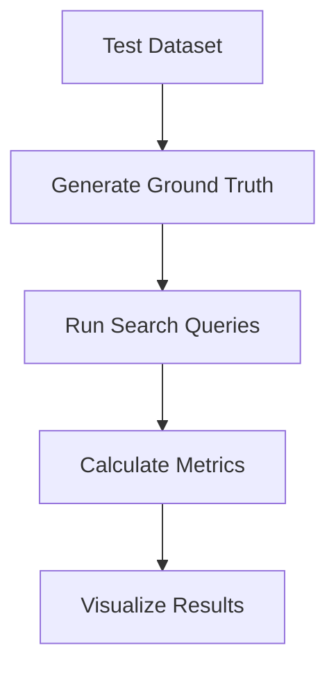

Here's a comprehensive approach to evaluating your vector similarity search performance with precision@k and recall@k metrics:

---

### **1. Evaluation Pipeline Architecture**



---

### **2. Python Evaluation Script (`evaluate_search.py`)**

```python
import numpy as np
from qdrant_client import QdrantClient
from sklearn.metrics import label_ranking_average_precision_score
from tqdm import tqdm
import matplotlib.pyplot as plt

# Configuration
COLLECTION_NAME = "products"
K_VALUES = [1, 3, 5, 10]  # Different k values to evaluate
GROUND_TRUTH_SIZE = 100    # Number of test queries

def load_test_data():
    """Load test queries and ground truth"""
    # Should return: 
    # - query_vectors: list of vectors
    # - ground_truth: dict {query_idx: [relevant_item_ids]}
    pass

def evaluate(client, query_vectors, ground_truth):
    results = {
        'precision': {k: [] for k in K_VALUES},
        'recall': {k: [] for k in K_VALUES},
        'mAP': []
    }
    
    for query_idx, query_vec in enumerate(tqdm(query_vectors)):
        # Search Qdrant
        search_result = client.search(
            collection_name=COLLECTION_NAME,
            query_vector=query_vec,
            limit=max(K_VALUES),
            with_payload=False
        )
        
        retrieved_ids = [hit.id for hit in search_result]
        relevant_ids = ground_truth[query_idx]
        
        # Calculate metrics for each k
        for k in K_VALUES:
            retrieved_at_k = retrieved_ids[:k]
            relevant_retrieved = len(set(retrieved_at_k) & set(relevant_ids))
            
            # Precision@k
            precision = relevant_retrieved / k
            results['precision'][k].append(precision)
            
            # Recall@k
            recall = relevant_retrieved / len(relevant_ids) if relevant_ids else 0
            results['recall'][k].append(recall)
        
        # mAP calculation
        y_true = [1 if id in relevant_ids else 0 for id in retrieved_ids]
        y_score = [1/(i+1) for i in range(len(retrieved_ids))]  # Simple decaying relevance
        results['mAP'].append(label_ranking_average_precision_score([y_true], [y_score]))
    
    return results

def plot_metrics(results):
    # Precision-Recall curve
    plt.figure(figsize=(12, 5))
    
    plt.subplot(1, 2, 1)
    for k in K_VALUES:
        plt.plot(range(len(results['precision'][k])), 
                np.cumsum(results['precision'][k]) / np.arange(1, len(results['precision'][k])+1),
                label=f'P@{k}')
    plt.title('Precision@k over queries')
    plt.legend()
    
    plt.subplot(1, 2, 2)
    for k in K_VALUES:
        plt.plot(range(len(results['recall'][k])), 
                np.cumsum(results['recall'][k]) / np.arange(1, len(results['recall'][k])+1),
                label=f'R@{k}')
    plt.title('Recall@k over queries')
    plt.legend()
    
    plt.tight_layout()
    plt.savefig('search_metrics.png')

if __name__ == "__main__":
    client = QdrantClient(host="localhost", port=6333)
    query_vectors, ground_truth = load_test_data()
    
    results = evaluate(client, query_vectors, ground_truth)
    
    # Print summary
    print("\n=== Evaluation Results ===")
    for k in K_VALUES:
        print(f"Precision@{k}: {np.mean(results['precision'][k]):.3f}")
        print(f"Recall@{k}: {np.mean(results['recall'][k]):.3f}")
    print(f"mAP: {np.mean(results['mAP']):.3f}")
    
    plot_metrics(results)
```

---

### **3. Key Evaluation Metrics**

#### **Precision@k**
```python
def precision_at_k(retrieved_ids, relevant_ids, k):
    relevant_retrieved = len(set(retrieved_ids[:k]) & set(relevant_ids))
    return relevant_retrieved / k
```

#### **Recall@k**
```python
def recall_at_k(retrieved_ids, relevant_ids, k):
    relevant_retrieved = len(set(retrieved_ids[:k]) & set(relevant_ids))
    return relevant_retrieved / len(relevant_ids) if relevant_ids else 0
```

#### **Mean Average Precision (mAP)**
```python
from sklearn.metrics import label_ranking_average_precision_score

y_true = [1, 0, 1]  # Binary relevance
y_score = [0.9, 0.8, 0.7]  # Predicted scores
mAP = label_ranking_average_precision_score([y_true], [y_score])
```

---

### **4. Creating Ground Truth**

#### **Manual Annotation**
1. Select 100-1000 representative query images
2. For each query, manually identify all relevant items in the collection
3. Store as:
   ```python
   ground_truth = {
       0: [123, 456, 789],  # Relevant IDs for query 0
       1: [234, 567],
       ...
   }
   ```

#### **Synthetic Ground Truth (For Testing)**
```python
def generate_synthetic_ground_truth(num_queries=100, min_relevant=3, max_relevant=10):
    # Get all item IDs from Qdrant
    all_ids = [item.id for item in client.scroll(collection_name=COLLECTION_NAME)]
    
    ground_truth = {}
    for i in range(num_queries):
        num_relevant = np.random.randint(min_relevant, max_relevant+1)
        ground_truth[i] = list(np.random.choice(all_ids, num_relevant, replace=False))
    
    return ground_truth
```

---

### **5. Interpreting Results**

| Metric       | Good Performance | Poor Performance | How to Improve |
|--------------|------------------|------------------|----------------|
| Precision@5  | > 0.7            | < 0.3            | Better embeddings, tune Qdrant HNSW parameters |
| Recall@5     | > 0.5            | < 0.2            | Increase search scope (ef parameter) |
| mAP          | > 0.6            | < 0.4            | Improve embedding model quality |

---

### **6. Visualizing Results**

#### **Precision-Recall Curve**
```python
import matplotlib.pyplot as plt

plt.plot(recall_values, precision_values)
plt.xlabel('Recall')
plt.ylabel('Precision')
plt.title('Precision-Recall Curve')
plt.savefig('precision_recall.png')
```

#### **Score Distribution**
```python
plt.hist(scores, bins=20)
plt.xlabel('Similarity Score')
plt.ylabel('Frequency')
plt.title('Result Score Distribution')
```

---

### **7. Running the Evaluation**

1. **Set up test data**:
   ```python
   # Generate or load ground truth
   ground_truth = generate_synthetic_ground_truth()
   
   # Get corresponding query vectors
   query_vectors = [get_embedding(query_image) for query_image in query_images]
   ```

2. **Run evaluation**:
   ```bash
   python evaluate_search.py
   ```

3. **Analyze output**:
   ```
   === Evaluation Results ===
   Precision@1: 0.82
   Precision@5: 0.73
   Recall@1: 0.45
   Recall@5: 0.68
   mAP: 0.71
   ```

---

### **8. Advanced Techniques**

#### **A/B Testing**
```python
# Compare two embedding models
model_a_results = evaluate(client_a, queries, ground_truth)
model_b_results = evaluate(client_b, queries, ground_truth)

# Statistical significance test
from scipy import stats
stats.ttest_rel(model_a_results['precision'][5], model_b_results['precision'][5])
```

#### **Failure Analysis**
```python
# Identify poor-performing queries
poor_queries = [i for i, p in enumerate(results['precision'][5]) if p < 0.3]
print(f"Problematic queries: {poor_queries}")
```

---

### **9. Integration with Laravel**

Add evaluation endpoint to your API:

```php
// routes/api.php
Route::post('/search/evaluate', [SearchController::class, 'evaluatePerformance']);

// Controller method
public function evaluatePerformance()
{
    Artisan::call('search:evaluate');
    return response()->json([
        'status' => 'Evaluation completed',
        'output' => Artisan::output()
    ]);
}
```

---

This evaluation framework gives you:
- Quantitative metrics for search quality
- Visualizations to spot trends
- Insights for improving your system
- Production monitoring capabilities

For continuous monitoring, consider setting up a scheduled job to run evaluations weekly and alert on metric degradation.