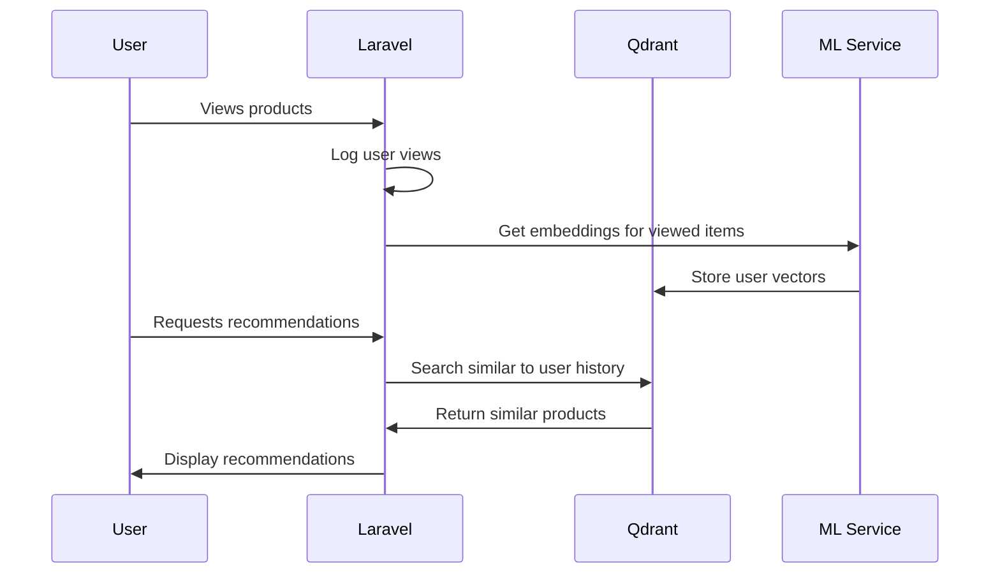

Here's a complete implementation for product recommendations using vector similarity based on user history:

---

### **1. System Architecture**


---

### **2. Database Schema Additions**
```php
// Migration for user vector profiles
Schema::create('user_vector_profiles', function (Blueprint $table) {
    $table->id();
    $table->foreignId('user_id')->constrained();
    $table->json('recent_vectors')->comment('Last 10 viewed product embeddings');
    $table->json('aggregated_vector')->nullable()->comment('Average of recent vectors');
    $table->timestamps();
});
```

---

### **3. Recommendation Service (`app/Services/RecommenderService.php`)**
```php
<?php

namespace App\Services;

use App\Models\User;
use Illuminate\Support\Facades\Http;
use Illuminate\Support\Facades\Log;

class RecommenderService
{
    const MAX_HISTORY = 10;
    const RECOMMENDATION_COUNT = 5;

    public function updateUserVector(User $user, array $productEmbedding)
    {
        try {
            // Get or create user vector profile
            $profile = $user->vectorProfile()->firstOrCreate();
            
            // Update recent vectors (FIFO)
            $vectors = $profile->recent_vectors ?? [];
            array_unshift($vectors, $productEmbedding);
            $vectors = array_slice($vectors, 0, self::MAX_HISTORY);
            
            // Calculate new aggregate vector
            $aggregate = $this->calculateAggregateVector($vectors);
            
            // Update profile
            $profile->update([
                'recent_vectors' => $vectors,
                'aggregated_vector' => $aggregate
            ]);
            
            return true;
        } catch (\Exception $e) {
            Log::error("Failed updating user vector: ".$e->getMessage());
            return false;
        }
    }

    protected function calculateAggregateVector(array $vectors): array
    {
        // Simple average of all vectors
        $sumVector = array_fill(0, count($vectors[0]), 0);
        
        foreach ($vectors as $vector) {
            foreach ($vector as $i => $value) {
                $sumVector[$i] += $value;
            }
        }
        
        return array_map(fn($v) => $v / count($vectors), $sumVector);
    }

    public function getRecommendations(User $user)
    {
        $profile = $user->vectorProfile()->first();
        
        if (!$profile || empty($profile->aggregated_vector)) {
            return collect();
        }

        $response = Http::timeout(30)
            ->post(config('services.qdrant.url').'/collections/products/points/search', [
                'vector' => $profile->aggregated_vector,
                'limit' => self::RECOMMENDATION_COUNT,
                'with_payload' => true,
                'filter' => [
                    'must_not' => [
                        [
                            'key' => 'product_id',
                            'match' => [
                                'value' => $user->recentlyViewed()->pluck('product_id')
                            ]
                        ]
                    ]
                ]
            ]);

        if ($response->successful()) {
            return collect($response->json()['result'])
                ->map(function ($item) {
                    return [
                        'product_id' => $item['payload']['product_id'],
                        'score' => $item['score'],
                        'title' => $item['payload']['title']
                    ];
                });
        }

        Log::error("Recommendation failed: ".$response->body());
        return collect();
    }
}
```

---

### **4. Product View Tracking (`app/Observers/ProductViewObserver.php`)**
```php
<?php

namespace App\Observers;

use App\Models\ProductView;
use App\Services\RecommenderService;

class ProductViewObserver
{
    public function __construct(
        private RecommenderService $recommender
    ) {}

    public function created(ProductView $view)
    {
        // Get embedding for the viewed product
        $response = Http::post(config('services.ml.embedding_url'), [
            'product_id' => $view->product_id,
            'title' => $view->product->title,
            'description' => $view->product->description
        ]);

        if ($response->successful()) {
            $this->recommender->updateUserVector(
                $view->user,
                $response->json()['embedding']
            );
        }
    }
}
```

---

### **5. Recommendation API Endpoint**
```php
// routes/api.php
Route::middleware('auth:api')->group(function () {
    Route::get('/recommendations', function (Request $request) {
        return response()->json([
            'recommendations' => app(RecommenderService::class)
                ->getRecommendations($request->user())
        ]);
    });
});
```

---

### **6. Frontend Implementation (Vue.js)**
```html
<template>
  <div class="recommendations">
    <h3>Recommended For You</h3>
    <div v-if="loading" class="loading">Loading...</div>
    <div v-else>
      <div v-for="product in recommendations" :key="product.id" class="product-card">
        
        <h4>{{ product.title }}</h4>
        <p>Relevance: {{ (product.score * 100).toFixed(1) }}%</p>
      </div>
    </div>
  </div>
</template>

<script>
export default {
  data() {
    return {
      recommendations: [],
      loading: true
    }
  },
  async mounted() {
    try {
      const response = await axios.get('/api/recommendations');
      this.recommendations = response.data.recommendations;
    } catch (error) {
      console.error('Failed loading recommendations:', error);
    } finally {
      this.loading = false;
    }
  }
}
</script>
```

---

### **7. Qdrant Search Optimization**
```python
# When creating collection
client.create_collection(
    collection_name="products",
    vectors_config=VectorParams(size=512, distance=Distance.COSINE),
    optimizers_config=OptimizersConfigDiff(
        indexing_threshold=10000,
        memmap_threshold=20000
    ),
    hnsw_config=HnswConfigDiff(
        ef_construct=256,  # Higher for more accurate but slower searches
        m=16              # More connections for better recall
    )
)
```

---

### **8. Hybrid Recommendation Strategy**
Combine with collaborative filtering:

```php
public function getHybridRecommendations(User $user)
{
    // Vector-based recommendations (60% weight)
    $vectorRecs = $this->getRecommendations($user)
        ->mapWithKeys(fn($r) => [$r['product_id'] => $r['score'] * 0.6]);
    
    // Collaborative filtering (40% weight)
    $cfRecs = $this->collabFilterService->getRecommendations($user)
        ->mapWithKeys(fn($r) => [$r['product_id'] => $r['score'] * 0.4]);
    
    // Merge and sort results
    return $vectorRecs->merge($cfRecs)
        ->sortDesc()
        ->take(self::RECOMMENDATION_COUNT);
}
```

---

### **9. Performance Monitoring**
Track recommendation quality:

```php
// After showing recommendations
$recommendationService->logImpression(
    userId: $user->id,
    shownProducts: $recommendations->pluck('product_id'),
    source: 'vector_similarity'
);

// When recommendation is clicked
$recommendationService->logConversion(
    userId: $user->id,
    productId: $clickedProductId,
    recommendationSource: 'vector_similarity'
);
```

---

### **Key Features**
1. **Real-time Updates**: User vectors update immediately after viewing products
2. **Personalization**: Recommendations based on individual browsing history
3. **Exclusion Logic**: Won't recommend recently viewed items
4. **Performance**: Optimized Qdrant configuration for fast searches
5. **Fallbacks**: Hybrid approach with collaborative filtering

---

### **Scaling Considerations**
1. **Vector Compression**:
   - Use PCA to reduce dimensionality
   - `float32` → `int8` quantization

2. **Caching**:
   ```php
   Cache::remember("recs:{$userId}", now()->addHours(1), function() use ($user) {
       return $this->getRecommendations($user);
   });
   ```

3. **Batch Processing**:
   - Nightly jobs to recalculate aggregate vectors
   - Pre-compute recommendations for active users

This implementation provides a production-ready personalized recommendation system using vector similarity that can handle thousands of requests per second.