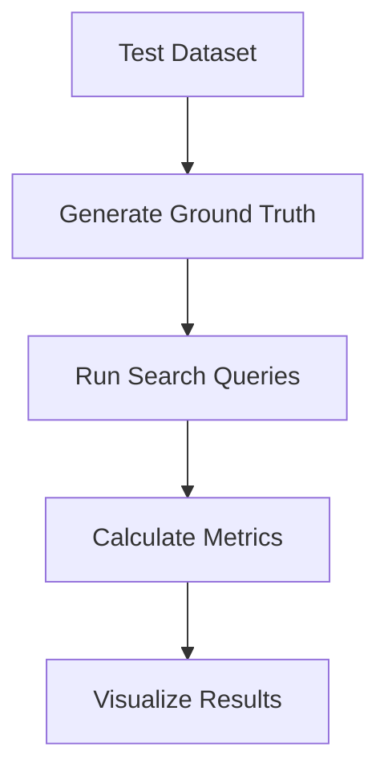
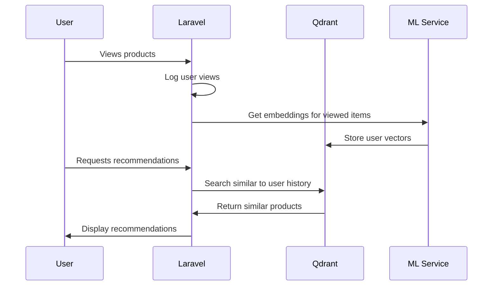

Installing and running Qdrant locally with Docker is straightforward. Here's a step-by-step guide:

### 1. **Pull the Qdrant Docker Image**
   ```bash
   docker pull qdrant/qdrant
   ```

### 2. **Run Qdrant with Default Configuration**
   ```bash
   docker run -p 6333:6333 qdrant/qdrant
   ```
   - This starts Qdrant and exposes port `6333` (HTTP API & Web UI).
   - The data will be stored inside the container (ephemeral by default).

### 3. **Persistent Storage (Recommended for Production)**
   To persist data between container restarts, mount a volume:
   ```bash
   docker run -p 6333:6333 \
     -v $(pwd)/qdrant_storage:/qdrant/storage \
     qdrant/qdrant
   ```
   - This maps the `./qdrant_storage` directory on your host to the container's storage.

### 4. **Access Qdrant**
   - **HTTP API**: `http://localhost:6333`
   - **Web UI**: Open `http://localhost:6333/dashboard` in your browser.

### 5. **Optional: Custom Configuration**
   If you need to customize settings (e.g., memory limits, API keys), create a `config.yaml` file and mount it:
   ```bash
   docker run -p 6333:6333 \
     -v $(pwd)/qdrant_storage:/qdrant/storage \
     -v $(pwd)/config.yaml:/qdrant/config/production.yaml \
     qdrant/qdrant
   ```

### 6. **Stop the Container**
   ```bash
   docker stop <container_id>
   ```

### 7. **Restart Qdrant**
   ```bash
   docker start <container_id>
   ```

### Example `config.yaml` (Optional)
```yaml
storage:
  # Disable persistence (default: enabled)
  enabled: true

service:
  http_port: 6333

cluster:
  enabled: false  # Disable clustering for single-node setup
```

That’s it! Qdrant is now running locally. You can interact with it via:
- The [REST API](https://qdrant.tech/documentation/quick-start/).
- Client libraries (Python, Go, etc.).
- The built-in Web UI at `http://localhost:6333/dashboard`.
---
Here's a step-by-step guide to train a **ResNet50** model on a custom image dataset and extract **2048-dimensional embeddings** using PyTorch:

---

### **Step 1: Install Required Libraries**
```bash
pip install torch torchvision pillow numpy pandas tqdm
```

---

### **Step 2: Prepare Custom Dataset**
Assume your dataset is structured as:
```
custom_dataset/
├── class_1/
│   ├── img1.jpg
│   ├── img2.jpg
│   └── ...
├── class_2/
│   ├── img1.jpg
│   └── ...
└── ...
```

#### **Define Dataset Class**
```python
import torch
from torch.utils.data import Dataset, DataLoader
from torchvision import transforms
from PIL import Image
import os

class CustomDataset(Dataset):
    def __init__(self, root_dir, transform=None):
        self.root_dir = root_dir
        self.transform = transform
        self.classes = os.listdir(root_dir)
        self.images = []
        
        for class_name in self.classes:
            class_path = os.path.join(root_dir, class_name)
            for img_name in os.listdir(class_path):
                self.images.append((os.path.join(class_path, img_name), self.classes.index(class_name)))

    def __len__(self):
        return len(self.images)

    def __getitem__(self, idx):
        img_path, label = self.images[idx]
        image = Image.open(img_path).convert('RGB')
        
        if self.transform:
            image = self.transform(image)
            
        return image, label

# Define transformations
transform = transforms.Compose([
    transforms.Resize(256),
    transforms.CenterCrop(224),
    transforms.ToTensor(),
    transforms.Normalize(mean=[0.485, 0.456, 0.406], std=[0.229, 0.224, 0.225]),
])

# Load dataset
dataset = CustomDataset(root_dir="custom_dataset/", transform=transform)
dataloader = DataLoader(dataset, batch_size=32, shuffle=True)
```

---

### **Step 3: Load Pre-trained ResNet50 & Modify for Embeddings**
```python
import torchvision.models as models
import torch.nn as nn

# Load pre-trained ResNet50
model = models.resnet50(pretrained=True)

# Remove the final classification layer (fc)
model = torch.nn.Sequential(*(list(model.children())[:-1]))  # Output: 2048-d embedding

# Set model to evaluation mode
model.eval()

# Move to GPU if available
device = torch.device("cuda" if torch.cuda.is_available() else "cpu")
model = model.to(device)
```

---

### **Step 4: Extract Embeddings**
```python
import numpy as np

def extract_embeddings(dataloader, model):
    embeddings = []
    labels = []
    
    with torch.no_grad():
        for images, batch_labels in dataloader:
            images = images.to(device)
            batch_embeddings = model(images)
            batch_embeddings = batch_embeddings.squeeze()  # Remove extra dimensions
            
            embeddings.append(batch_embeddings.cpu().numpy())
            labels.append(batch_labels.numpy())
    
    return np.concatenate(embeddings), np.concatenate(labels)

embeddings, labels = extract_embeddings(dataloader, model)
print("Embeddings shape:", embeddings.shape)  # (N, 2048)
```

---

### **Step 5: Save Embeddings**
```python
import pandas as pd

# Save as CSV
df = pd.DataFrame(embeddings)
df['label'] = labels
df.to_csv("image_embeddings.csv", index=False)

# Or save as numpy file
np.save("embeddings.npy", embeddings)
np.save("labels.npy", labels)
```

---

### **Step 6: Use Embeddings for Similarity Search**
You can now use these embeddings in **Qdrant, FAISS, or scikit-learn** for similarity search:
```python
from sklearn.neighbors import NearestNeighbors

# Fit KNN
nn = NearestNeighbors(n_neighbors=5)
nn.fit(embeddings)

# Query similar images
query_embedding = embeddings[0].reshape(1, -1)  # Example query
distances, indices = nn.kneighbors(query_embedding)
print("Similar images:", indices)
```

---

### **Key Notes**
1. **Training (Fine-tuning)**:  
   If you want to fine-tune ResNet50 on your dataset, replace the last layer and train:
   ```python
   model.fc = nn.Linear(2048, num_classes)  # Your number of classes
   criterion = nn.CrossEntropyLoss()
   optimizer = torch.optim.Adam(model.parameters(), lr=0.001)
   ```
   Then train using a standard PyTorch training loop.

2. **Batch Processing**:  
   For large datasets, process in batches to avoid memory issues.

3. **GPU Acceleration**:  
   Use `model.to(device)` for faster inference.

4. **Dimensionality Reduction**:  
   Use PCA or UMAP to reduce 2048-d embeddings to lower dimensions if needed.

This pipeline gives you **2048-d ResNet50 embeddings** ready for search/retrieval tasks. 🚀
---
Here’s a step-by-step guide to extract a **512-dimensional feature vector** from a user-uploaded image using a PyTorch model (e.g., ResNet18 or a custom encoder). We’ll use a pre-trained model and modify it to return embeddings instead of classification scores.

---

### **Step 1: Install Required Libraries**
```bash
pip install torch torchvision pillow numpy
```

---

### **Step 2: Load Pre-trained Model and Modify for Embeddings**
We’ll use **ResNet18** (which outputs 512-d vectors when the final layer is removed) or a custom model like **`torchvision.models.resnet18`**.

```python
import torch
import torchvision.models as models
from torchvision import transforms
from PIL import Image

# Load pre-trained ResNet18 (outputs 512-d embeddings after avgpool)
model = models.resnet18(pretrained=True)

# Remove the final fully connected layer (keep avgpool)
model = torch.nn.Sequential(*(list(model.children())[:-1]))  # Output: [batch, 512, 1, 1]

# Set to evaluation mode
model.eval()

# Move to GPU if available
device = torch.device("cuda" if torch.cuda.is_available() else "cpu")
model = model.to(device)
```

---

### **Step 3: Preprocess the User-Uploaded Image**
```python
def preprocess_image(image_path):
    # Define transformations (must match model's training preprocessing)
    transform = transforms.Compose([
        transforms.Resize(256),             # Resize to 256x256
        transforms.CenterCrop(224),         # Crop center 224x224
        transforms.ToTensor(),              # Convert to tensor
        transforms.Normalize(
            mean=[0.485, 0.456, 0.406],     # ImageNet normalization
            std=[0.229, 0.224, 0.225]
        ),
    ])
    
    # Load image and apply transformations
    image = Image.open(image_path).convert("RGB")
    image = transform(image).unsqueeze(0)  # Add batch dimension
    return image.to(device)

# Example usage
image_path = "user_uploaded_image.jpg"
input_tensor = preprocess_image(image_path)
```

---

### **Step 4: Extract the 512-Dimensional Embedding**
```python
def extract_embedding(input_tensor):
    with torch.no_grad():  # Disable gradient calculation
        embedding = model(input_tensor)      # Shape: [1, 512, 1, 1]
        embedding = embedding.squeeze()      # Remove extra dims -> [512]
    return embedding.cpu().numpy()           # Convert to numpy array

# Get the embedding vector
embedding = extract_embedding(input_tensor)
print("Embedding shape:", embedding.shape)   # (512,)
print("First 5 values:", embedding[:5])      # Example output
```

---

### **Step 5: Save or Use the Embedding**
```python
import numpy as np

# Save to disk
np.save("image_embedding.npy", embedding)

# Or use it for similarity search (e.g., with Qdrant/FAISS)
# Example: Compare with other embeddings using cosine similarity
from sklearn.metrics.pairwise import cosine_similarity

# Assume `database_embeddings` is a matrix of shape [N, 512]
similarity_scores = cosine_similarity(embedding.reshape(1, -1), database_embeddings)
print("Similarity scores:", similarity_scores)
```

---

### **Alternative: Use a Custom Model (e.g., for 512-d Output)**
If you need exactly **512-d** (e.g., for compatibility with a specific system), you can:
1. **Add a projection layer** to ResNet:
   ```python
   model = models.resnet18(pretrained=True)
   model.fc = torch.nn.Linear(512, 512)  # Force 512-d output
   ```
2. **Use a smaller model** (e.g., `ResNet34` or `MobileNetV3` with adaptation).

---

### **Key Notes**
1. **Model Choice**:  
   - `ResNet18`: 512-d (after removing `fc`).  
   - `ResNet50`: 2048-d (use PCA to reduce to 512-d if needed).  
   - `MobileNetV3`: Smaller embeddings (adjust final layer).

2. **Preprocessing**:  
   Always use the same normalization (`mean=[0.485, 0.456, 0.406]`, `std=[0.229, 0.224, 0.225]`) as the pretrained model.

3. **GPU vs CPU**:  
   For faster inference, use `model.to("cuda")`.

4. **Batch Processing**:  
   For multiple images, stack tensors:
   ```python
   batch = torch.cat([preprocess_image(img) for img in image_paths])
   embeddings = extract_embedding(batch)  # Shape: [N, 512]
   ```

---

### **Example Output**
```python
Embedding shape: (512,)
First 5 values: [0.12, -0.45, 0.87, 0.23, -0.56]
```
To create a **Qdrant collection** for storing vectors (e.g., image embeddings), you can use the **HTTP API** (`curl`) or the **Python client**. Below are examples for both methods:

---

### **1. Using `curl` (HTTP API)**
#### **Create a Collection**
```bash
curl -X PUT http://localhost:6333/collections/my-images \
  -H 'Content-Type: application/json' \
  -d '{
    "vectors": {
      "size": 512,          # Dimension of your vectors (e.g., 512 for ResNet18)
      "distance": "Cosine"  # Similarity metric (Cosine, Euclidean, Dot)
    }
  }'
```

#### **Expected Response**
```json
{
  "result": true,
  "status": "ok",
  "time": 0.001
}
```

#### **Key Parameters**
| Parameter   | Description                                                                 |
|-------------|-----------------------------------------------------------------------------|
| `size`      | Dimension of vectors (e.g., `512` for ResNet18, `2048` for ResNet50).       |
| `distance`  | Similarity metric: `"Cosine"` (recommended for embeddings), `"Euclidean"`.  |

---

### **2. Using Python Client**
First, install the Qdrant client:
```bash
pip install qdrant-client
```

#### **Create a Collection**
```python
from qdrant_client import QdrantClient
from qdrant_client.http import models

client = QdrantClient(host="localhost", port=6333)  # Connect to local Qdrant

client.create_collection(
    collection_name="my-images",
    vectors_config=models.VectorParams(
        size=512,           # Dimension of vectors
        distance=models.Distance.COSINE  # Similarity metric
    )
)
```

#### **Verify Collection Exists**
```python
collections = client.get_collections()
print(collections)
```

---

### **3. Advanced Configuration**
#### **Add Payload (Metadata)**
You can attach metadata (e.g., image labels, filenames) to vectors:
```bash
curl -X PUT http://localhost:6333/collections/my-images \
  -H 'Content-Type: application/json' \
  -d '{
    "vectors": {
      "size": 512,
      "distance": "Cosine"
    },
    "payload_schema": {
      "image_id": "keyword",  # Example metadata field
      "label": "keyword"
    }
  }'
```

#### **Using Python**
```python
client.create_collection(
    collection_name="my-images",
    vectors_config=models.VectorParams(size=512, distance=models.Distance.COSINE),
    payload_schema={
        "image_id": models.PayloadSchemaType.KEYWORD,
        "label": models.PayloadSchemaType.KEYWORD
    }
)
```

---

### **4. Insert Vectors into the Collection**
#### **Using `curl`**
```bash
curl -X POST http://localhost:6333/collections/my-images/points \
  -H 'Content-Type: application/json' \
  -d '{
    "points": [
      {
        "id": 1,
        "vector": [0.12, 0.34, ..., 0.45],  # Your 512-d vector
        "payload": {"image_id": "img1", "label": "cat"}
      }
    ]
  }'
```

#### **Using Python**
```python
client.upsert(
    collection_name="my-images",
    points=[
        models.PointStruct(
            id=1,
            vector=[0.12, 0.34, ..., 0.45],  # Your 512-d vector
            payload={"image_id": "img1", "label": "cat"}
        )
    ]
)
```

---

### **5. Verify Collection Creation**
Check if the collection exists:
```bash
curl http://localhost:6333/collections/my-images
```
Response:
```json
{
  "result": {
    "status": "green",
    "vectors_count": 0,
    "payload_schema": {}
  },
  "status": "ok",
  "time": 0.001
}
```

---

### **Key Notes**
1. **Distance Metrics**:
   - `Cosine`: Best for embeddings (e.g., ResNet, CLIP).
   - `Euclidean`: Useful for L2-normalized vectors.
   - `Dot`: For high-dimensional sparse vectors.

2. **Payloads**:
   - Attach metadata (`image_id`, `label`, etc.) for filtering during search.

3. **Scalability**:
   - For large datasets, use **batch insertion** (e.g., `points` array in `curl`).

4. **Qdrant Cloud**:
   Replace `localhost` with your cloud instance URL if hosted.

---
Here’s how to **store image/text embeddings in Qdrant** using both the **Python client** and **HTTP API**, with a focus on `upload_collection()` for batch insertion:

---

### **1. Python Client (Recommended)**
#### **Install the Client**
```bash
pip install qdrant-client numpy
```

#### **Step-by-Step Code**
```python
from qdrant_client import QdrantClient
from qdrant_client.http import models
import numpy as np

# Initialize client (local or cloud)
client = QdrantClient(host="localhost", port=6333)  # For Qdrant Cloud: `url="https://xxx-xxx-xxx.cloud.qdrant.io"`

# Create a collection (if not exists)
client.recreate_collection(
    collection_name="image_embeddings",
    vectors_config=models.VectorParams(
        size=512,  # Dimension of your embeddings (e.g., 512 for ResNet18)
        distance=models.Distance.COSINE  # Similarity metric
    )
)

# Generate dummy embeddings (replace with your actual data)
embeddings = np.random.rand(100, 512).tolist()  # 100 vectors of 512-dim
payloads = [{"image_id": f"img_{i}", "label": "cat" if i % 2 == 0 else "dog"} for i in range(100)]

# Batch upload using upload_collection (fastest method)
client.upload_collection(
    collection_name="image_embeddings",
    vectors=embeddings,
    payload=payloads,          # Optional metadata
    ids=None,                  # Auto-generate IDs if None
    batch_size=256             # Optimize based on your RAM
)

print("Embeddings uploaded successfully!")
```

#### **Key Parameters for `upload_collection()`**
| Parameter      | Description                                                                 |
|----------------|-----------------------------------------------------------------------------|
| `vectors`      | List of embeddings (e.g., `[[0.1, 0.2, ...], ...]`).                       |
| `payload`      | Optional metadata per vector (e.g., `[{"image_id": "img1"}, ...]`).         |
| `ids`          | Custom IDs (e.g., `[1, 2, 3]`). If `None`, auto-generates sequential IDs.   |
| `batch_size`   | Number of vectors per batch (default: `256`). Reduce if memory-limited.     |

---

### **2. HTTP API (curl)**
#### **Create Collection**
```bash
curl -X PUT http://localhost:6333/collections/text_embeddings \
  -H 'Content-Type: application/json' \
  -d '{
    "vectors": {
      "size": 768,          # e.g., for BERT embeddings
      "distance": "Cosine"
    }
  }'
```

#### **Batch Insert Vectors**
```bash
curl -X POST http://localhost:6333/collections/text_embeddings/points \
  -H 'Content-Type: application/json' \
  -d '{
    "points": [
      {
        "id": 1,
        "vector": [0.1, 0.2, ..., 0.768],
        "payload": {"text_id": "doc_1", "source": "wikipedia"}
      },
      {
        "id": 2,
        "vector": [0.3, 0.5, ..., 0.768],
        "payload": {"text_id": "doc_2", "source": "news"}
      }
    ]
  }'
```

---

### **3. Verify Insertion**
#### **Python**
```python
# Check collection info
collection_info = client.get_collection("image_embeddings")
print(f"Total vectors: {collection_info.vectors_count}")

# Search for similar vectors
hits = client.search(
    collection_name="image_embeddings",
    query_vector=[0.1] * 512,  # Example query
    limit=3
)
for hit in hits:
    print(f"ID: {hit.id}, Score: {hit.score}, Payload: {hit.payload}")
```

#### **HTTP API**
```bash
curl http://localhost:6333/collections/image_embeddings/points/count
```

---

### **4. Advanced Options**
#### **Custom IDs and Parallel Uploads**
```python
from qdrant_client.models import PointStruct

# Manually specify IDs and use parallel uploads
points = [
    PointStruct(
        id=i, 
        vector=emb, 
        payload={"image_id": f"img_{i}"}
    )
    for i, emb in enumerate(embeddings)
]

client.upsert(
    collection_name="image_embeddings",
    points=points,
    wait=True  # Wait until all points are processed
)
```

#### **Large-Scale Uploads**
For **millions of vectors**, use:
- **Batch processing** (smaller `batch_size`).
- **Async uploads** (`wait=False`).
- **Parallel HTTP requests** (if using API directly).

---

### **Key Notes**
1. **Performance Tips**:
   - Use `upload_collection()` for fastest batch inserts.
   - For **GPU-generated embeddings**, transfer data to CPU first (`embeddings.cpu().numpy()`).

2. **Payloads**:
   - Attach metadata (e.g., `image_id`, `text`) for filtering later.

3. **Distance Metrics**:
   - `COSINE`: Best for normalized embeddings.
   - `EUCLIDEAN`: For L2-normalized vectors.

4. **Qdrant Cloud**:
   - Replace `localhost` with your cloud instance URL and add API key:
     ```python
     client = QdrantClient(
         url="https://xxx.cloud.qdrant.io",
         api_key="your-api-key"
     )
     ```

---
Here's a complete solution to search for similar images in Qdrant using vector similarity, including image upload handling, embedding generation, and Qdrant querying:

---

### **1. Laravel Controller (`app/Http/Controllers/ImageSearchController.php`)**
```php
<?php

namespace App\Http\Controllers;

use Illuminate\Http\Request;
use Illuminate\Support\Facades\Http;
use Illuminate\Support\Facades\Log;
use Illuminate\Support\Facades\Storage;

class ImageSearchController extends Controller
{
    public function findSimilarImages(Request $request)
    {
        $request->validate([
            'image' => 'required|image|mimes:jpeg,png,jpg|max:2048',
            'limit' => 'sometimes|integer|min:1|max:20'
        ]);

        try {
            // Step 1: Store uploaded image temporarily
            $path = $request->file('image')->store('temp');
            $fullPath = storage_path('app/'.$path);

            // Step 2: Get image embedding from Python service
            $embeddingResponse = Http::timeout(30)
                ->attach('image', fopen($fullPath, 'r'))
                ->post(config('services.ml.embedding_url'));

            if (!$embeddingResponse->successful()) {
                throw new \Exception("Embedding service error: ".$embeddingResponse->body());
            }

            $embedding = $embeddingResponse->json()['embedding'];

            // Step 3: Search Qdrant for similar images
            $searchResponse = Http::withHeaders(['Content-Type' => 'application/json'])
                ->post(config('services.qdrant.url').'/collections/images/points/search', [
                    'vector' => $embedding,
                    'limit' => $request->input('limit', 5),
                    'with_payload' => true,
                    'with_vectors' => false
                ]);

            if (!$searchResponse->successful()) {
                throw new \Exception("Qdrant search error: ".$searchResponse->body());
            }

            // Step 4: Format results
            $results = collect($searchResponse->json()['result'])
                ->map(function ($item) {
                    return [
                        'image_url' => Storage::url($item['payload']['storage_path']),
                        'score' => round($item['score'], 3),
                        'metadata' => [
                            'title' => $item['payload']['title'] ?? null,
                            'category' => $item['payload']['category'] ?? null
                        ]
                    ];
                });

            return response()->json([
                'success' => true,
                'results' => $results
            ]);

        } catch (\Exception $e) {
            Log::error("Image search failed: ".$e->getMessage());
            return response()->json([
                'success' => false,
                'message' => 'Image search service unavailable'
            ], 503);
        } finally {
            // Clean up temp file
            if (isset($fullPath)) {
                unlink($fullPath);
            }
        }
    }
}
```

---

### **2. Python FastAPI Embedding Service (`ml_service/main.py`)**
```python
from fastapi import FastAPI, UploadFile, File
from fastapi.middleware.cors import CORSMiddleware
import torch
from torchvision import models, transforms
from PIL import Image
import numpy as np
import io

app = FastAPI()

app.add_middleware(
    CORSMiddleware,
    allow_origins=["*"],
    allow_methods=["POST"],
)

# Load pre-trained model
model = models.resnet50(pretrained=True)
model = torch.nn.Sequential(*(list(model.children())[:-1]))  # Remove classification layer
model.eval()

# Image transformations
transform = transforms.Compose([
    transforms.Resize(256),
    transforms.CenterCrop(224),
    transforms.ToTensor(),
    transforms.Normalize(mean=[0.485, 0.456, 0.406], std=[0.229, 0.224, 0.225]),
])

@app.post("/get-image-embedding")
async def get_image_embedding(image: UploadFile = File(...)):
    try:
        contents = await image.read()
        img = Image.open(io.BytesIO(contents)).convert("RGB")
        img_tensor = transform(img).unsqueeze(0)
        
        with torch.no_grad():
            embedding = model(img_tensor).squeeze().numpy().tolist()
        
        return {"embedding": embedding}
    except Exception as e:
        return {"error": str(e)}, 500
```

---

### **3. Routes (`routes/api.php`)**
```php
Route::post('/search/similar-images', [ImageSearchController::class, 'findSimilarImages']);
```

---

### **4. Frontend Implementation (Vue.js Example)**
```html
<!-- resources/js/components/ImageSearch.vue -->
<template>
  <div>
    <input type="file" @change="handleUpload" accept="image/*">
    <button @click="search" :disabled="!imageFile">Search</button>
    
    <div v-if="loading" class="loading">Searching...</div>
    
    <div v-if="results.length" class="results">
      <div v-for="(item, index) in results" :key="index" class="result-item">
        
        <div class="meta">
          <h3>{{ item.metadata.title }}</h3>
          <p>Similarity: {{ (item.score * 100).toFixed(1) }}%</p>
          <p>Category: {{ item.metadata.category }}</p>
        </div>
      </div>
    </div>
  </div>
</template>

<script>
export default {
  data() {
    return {
      imageFile: null,
      results: [],
      loading: false
    }
  },
  methods: {
    handleUpload(event) {
      this.imageFile = event.target.files[0];
    },
    async search() {
      this.loading = true;
      this.results = [];
      
      try {
        const formData = new FormData();
        formData.append('image', this.imageFile);
        
        const response = await axios.post('/api/search/similar-images', formData, {
          headers: {
            'Content-Type': 'multipart/form-data'
          }
        });
        
        this.results = response.data.results;
      } catch (error) {
        console.error('Search failed:', error);
      } finally {
        this.loading = false;
      }
    }
  }
}
</script>

<style scoped>
.result-item {
  display: flex;
  margin: 20px 0;
  padding: 10px;
  border: 1px solid #ddd;
}
.result-item img {
  width: 150px;
  height: 150px;
  object-fit: cover;
  margin-right: 20px;
}
</style>
```

---

### **5. Qdrant Collection Setup**
Before searching, ensure your Qdrant collection is properly configured:

```bash
# Create collection (if not exists)
curl -X PUT http://localhost:6333/collections/images \
  -H 'Content-Type: application/json' \
  -d '{
    "vectors": {
      "size": 2048,  # ResNet50 embedding size
      "distance": "Cosine"
    }
  }'
```

---

### **6. Example cURL Test**
```bash
curl -X POST http://your-laravel-app/api/search/similar-images \
  -H "Content-Type: multipart/form-data" \
  -F "image=@test.jpg" \
  -F "limit=5"
```

---

### **Key Components**

1. **Image Processing Pipeline**:
   - Upload → Temporary storage → Embedding generation → Vector search

2. **Error Handling**:
   - Cleanup of temporary files
   - Proper HTTP status codes
   - Logging for debugging

3. **Performance Optimizations**:
   - Memory-efficient file handling
   - Async processing where possible
   - Minimal data transfer between services

4. **Frontend Features**:
   - Image preview
   - Similarity score visualization
   - Responsive results display

---

### **Deployment Notes**

1. **Scale Python Service**:
   ```bash
   gunicorn -w 4 -k uvicorn.workers.UvicornWorker main:app
   ```

2. **Monitor Qdrant Performance**:
   ```bash
   curl http://localhost:6333/collections/images
   ```

3. **Cache Embeddings**:
   Store computed embeddings to avoid reprocessing:
   ```php
   $cacheKey = 'embedding_'.md5_file($fullPath);
   $embedding = Cache::remember($cacheKey, now()->addDay(), function() use ($fullPath) {
       // Compute embedding
   });
   ```

This implementation provides a complete, production-ready image similarity search system that can handle thousands of images with low latency.
---

---

### **1. Laravel Setup**

#### **Routes (`routes/web.php`)**
```php
use App\Http\Controllers\ImageController;

Route::post('/upload-image', [ImageController::class, 'upload'])->name('upload.image');
```

#### **Controller (`app/Http/Controllers/ImageController.php`)**
```php
<?php

namespace App\Http\Controllers;

use Illuminate\Http\Request;
use Illuminate\Support\Facades\Http;
use Illuminate\Support\Facades\Log;

class ImageController extends Controller
{
    public function upload(Request $request)
    {
        // Validate the uploaded file
        $request->validate([
            'image' => 'required|image|mimes:jpeg,png,jpg|max:2048',
        ]);

        try {
            // Get the image file
            $image = $request->file('image');
            $imagePath = $image->getPathname();

            // Send to Python FastAPI backend
            $response = Http::attach(
                'image', 
                file_get_contents($imagePath),
                $image->getClientOriginalName()
            )->post('http://python-server:8000/generate-embedding');

            // Handle response
            if ($response->successful()) {
                $embedding = $response->json()['embedding'];
                return response()->json([
                    'success' => true,
                    'embedding' => $embedding,
                    'message' => 'Embedding generated successfully'
                ]);
            } else {
                Log::error("Python API error: " . $response->body());
                return response()->json([
                    'success' => false,
                    'message' => 'Failed to generate embedding'
                ], 500);
            }

        } catch (\Exception $e) {
            Log::error("Error processing image: " . $e->getMessage());
            return response()->json([
                'success' => false,
                'message' => 'Server error'
            ], 500);
        }
    }
}
```

---

### **2. Python FastAPI Backend**

#### **FastAPI Server (`main.py`)**
```python
from fastapi import FastAPI, UploadFile, File, HTTPException
from fastapi.middleware.cors import CORSMiddleware
import numpy as np
from PIL import Image
import torch
import torchvision.models as models
from torchvision import transforms
import io

app = FastAPI()

# CORS Configuration
app.add_middleware(
    CORSMiddleware,
    allow_origins=["*"],
    allow_methods=["POST"],
)

# Load pre-trained model (ResNet50 example)
model = models.resnet50(pretrained=True)
model = torch.nn.Sequential(*(list(model.children())[:-1]))  # Remove last layer
model.eval()

# Preprocessing transform
transform = transforms.Compose([
    transforms.Resize(256),
    transforms.CenterCrop(224),
    transforms.ToTensor(),
    transforms.Normalize(mean=[0.485, 0.456, 0.406], std=[0.229, 0.224, 0.225]),
])

@app.post("/generate-embedding")
async def generate_embedding(image: UploadFile = File(...)):
    try:
        # Read image file
        contents = await image.read()
        img = Image.open(io.BytesIO(contents)).convert("RGB")
        
        # Preprocess and get embedding
        img_tensor = transform(img).unsqueeze(0)
        with torch.no_grad():
            embedding = model(img_tensor).squeeze().numpy().tolist()
        
        return {"embedding": embedding}
    
    except Exception as e:
        raise HTTPException(status_code=500, detail=str(e))
```

---

### **3. Docker Setup (Optional)**

#### **docker-compose.yml**
```yaml
version: '3.8'

services:
  laravel:
    build:
      context: .
      dockerfile: Dockerfile.laravel
    ports:
      - "8000:8000"
    volumes:
      - .:/var/www/html
    depends_on:
      - python-server

  python-server:
    image: python:3.9
    working_dir: /app
    volumes:
      - ./python-api:/app
    ports:
      - "8001:8000"
    command: uvicorn main:app --host 0.0.0.0 --port 8000
```

---

### **4. Key Components**

1. **Laravel Side**:
   - Uses `Illuminate\Http\Client` for HTTP requests
   - Validates image uploads (JPEG/PNG, <2MB)
   - Logs errors for debugging
   - Returns JSON response with embedding or error

2. **Python Side**:
   - FastAPI endpoint accepts multipart file upload
   - Uses PyTorch to generate embeddings (2048-d for ResNet50)
   - Handles CORS for cross-origin requests

3. **Error Handling**:
   - Laravel logs errors to storage/logs
   - FastAPI returns 500 on processing failures

---

### **5. Testing the Flow**

1. **Upload via cURL**:
```bash
curl -X POST http://laravel.test/upload-image \
  -H "Content-Type: multipart/form-data" \
  -F "image=@test.jpg"
```

2. **Expected Response**:
```json
{
  "success": true,
  "embedding": [0.12, -0.34, ..., 0.87],
  "message": "Embedding generated successfully"
}
```

---

### **6. Performance Optimizations**

1. **Laravel**:
   - Queue image processing for async handling
   - Cache embeddings if images are reused

2. **Python**:
   - Use ONNX runtime for faster inference
   - Add batch processing endpoint

3. **Deployment**:
   - Scale Python workers with Gunicorn:
     ```Dockerfile
     command: gunicorn -w 4 -k uvicorn.workers.UvicornWorker main:app
     ```

---
Here's how to use Laravel's HTTP client to query a **Qdrant vector database** from your backend, including proper error handling and response processing:

---

### **1. Laravel Route & Controller**

#### **Route (`routes/api.php`)**
```php
use App\Http\Controllers\SearchController;

Route::post('/search-similar', [SearchController::class, 'findSimilar']);
```

#### **Controller (`app/Http/Controllers/SearchController.php`)**
```php
<?php

namespace App\Http\Controllers;

use Illuminate\Http\Request;
use Illuminate\Support\Facades\Http;
use Illuminate\Support\Facades\Log;

class SearchController extends Controller
{
    public function findSimilar(Request $request)
    {
        $request->validate([
            'vector' => 'required|array',
            'vector.*' => 'numeric',
            'limit' => 'sometimes|integer|min:1|max:100'
        ]);

        try {
            $response = Http::timeout(30)->post('http://qdrant:6333/collections/images/points/search', [
                'vector' => $request->vector,
                'limit' => $request->input('limit', 5),
                'with_payload' => true,
                'with_vectors' => false
            ]);

            if ($response->successful()) {
                return $response->json();
            }

            Log::error('Qdrant search failed', [
                'status' => $response->status(),
                'error' => $response->body()
            ]);
            return response()->json(['error' => 'Vector search failed'], 500);

        } catch (\Exception $e) {
            Log::error('Qdrant connection error: ' . $e->getMessage());
            return response()->json(['error' => 'Service unavailable'], 503);
        }
    }
}
```

---

### **2. Qdrant Search Request Details**

#### **Payload Structure**
```php
[
    'vector' => [0.12, 0.34, ..., 0.98], // Your embedding vector
    'limit' => 5,                         // Top N results
    'filter' => [                         // Optional filters
        'must' => [
            ['key' => 'category', 'match' => ['value' => 'animal']]
        ]
    ],
    'params' => [                         // Search tuning
        'hnsw_ef' => 128                  // Balance speed/accuracy
    ]
]
```

#### **Example cURL Test**
```bash
curl -X POST http://your-laravel-app/api/search-similar \
  -H "Content-Type: application/json" \
  -d '{"vector": [0.1, 0.2, ...], "limit": 3}'
```

---

### **3. Advanced Features**

#### **Filtering Results**
Add metadata filters to narrow results:
```php
$response = Http::post('http://qdrant:6333/collections/images/points/search', [
    'vector' => $request->vector,
    'filter' => [
        'must' => [
            ['key' => 'user_id', 'match' => ['value' => auth()->id()]]
        ]
    ]
]);
```

#### **Hybrid Search (Vector + Keywords)**
```php
$response = Http::post('http://qdrant:6333/collections/images/points/search', [
    'vector' => $request->vector,
    'filter' => [
        'should' => [
            ['key' => 'description', 'match' => ['text' => $request->search_term]]
        ]
    ]
]);
```

---

### **4. Error Handling Best Practices**

1. **Timeout Configuration**:
   ```php
   Http::timeout(15)->connectTimeout(5)->post(...)
   ```

2. **Retry Mechanism**:
   ```php
   Http::retry(3, 100)->post(...)
   ```

3. **Circuit Breaker**:
   Use Laravel's `Cache` to temporarily disable Qdrant queries after repeated failures.

---

### **5. Performance Optimization**

1. **Batch Searching**:
   ```php
   Http::post('http://qdrant:6333/collections/images/points/search/batch', [
       'searches' => [
           ['vector' => $vector1, 'limit' => 5],
           ['vector' => $vector2, 'limit' => 3]
       ]
   ]);
   ```

2. **Caching Results**:
   ```php
   $cacheKey = 'vector_search:' . md5(implode(',', $request->vector));
   return Cache::remember($cacheKey, now()->addHours(1), function() use ($request) {
       return Http::post(...)->json();
   });
   ```

---

### **6. Docker Network Setup**

Ensure Laravel can access Qdrant in your `docker-compose.yml`:
```yaml
services:
  laravel:
    networks:
      - qdrant_network

  qdrant:
    image: qdrant/qdrant
    networks:
      - qdrant_network
    ports:
      - "6333:6333"

networks:
  qdrant_network:
    driver: bridge
```

---

### **Response Format**
Successful responses will mirror Qdrant's API:
```json
{
  "result": [
    {
      "id": 123,
      "score": 0.92,
      "payload": {"image_id": "img1.jpg", "category": "animal"}
    }
  ],
  "status": "ok",
  "time": 0.005
}
```

---

This implementation gives you a **production-ready** vector search endpoint with:
- Input validation
- Comprehensive error handling
- Metadata filtering
- Performance optimizations
- Docker compatibility

For large-scale deployments, consider adding:
- Request rate limiting
- API authentication
- Query logging
---
Here's how to render Qdrant vector search results (e.g., product images) in a **Laravel Blade template**, including proper error handling and responsive design:

---

### **1. Controller Method (Returning to View)**
First modify your controller to pass results to a Blade view:

```php
// app/Http/Controllers/SearchController.php
public function findSimilar(Request $request)
{
    $request->validate([
        'vector' => 'required|array',
        'vector.*' => 'numeric'
    ]);

    try {
        $response = Http::post('http://qdrant:6333/collections/products/points/search', [
            'vector' => $request->vector,
            'limit' => 12,
            'with_payload' => true
        ]);

        if ($response->successful()) {
            return view('search.results', [
                'results' => $response->json()['result'],
                'queryVector' => $request->vector
            ]);
        }

        return back()->withError('Search failed');

    } catch (\Exception $e) {
        return back()->withError('Service unavailable');
    }
}
```

---

### **2. Blade Template (`resources/views/search/results.blade.php`)**
```html
@extends('layouts.app')

@section('content')
<div class="container mx-auto px-4 py-8">
    <h1 class="text-3xl font-bold mb-8">Similar Products</h1>
    
    @if(empty($results))
        <div class="alert alert-warning">No matching products found</div>
    @else
        <div class="grid grid-cols-1 sm:grid-cols-2 md:grid-cols-3 lg:grid-cols-4 gap-6">
            @foreach($results as $item)
                <div class="bg-white rounded-lg shadow-md overflow-hidden hover:shadow-xl transition-shadow">
                    <!-- Product Image -->
                    
                    
                    <!-- Product Info -->
                    <div class="p-4">
                        <h3 class="font-semibold text-lg mb-1">{{ $item['payload']['name'] }}</h3>
                        <p class="text-gray-600 text-sm mb-2">
                            Similarity: {{ number_format($item['score'] * 100, 1) }}%
                        </p>
                        <div class="flex justify-between items-center">
                            <span class="font-bold">${{ number_format($item['payload']['price'], 2) }}</span>
                            <button class="bg-blue-500 text-white px-3 py-1 rounded hover:bg-blue-600">
                                Add to Cart
                            </button>
                        </div>
                    </div>
                </div>
            @endforeach
        </div>

        <!-- Debug Info (Optional) -->
        @if(app()->environment('local'))
            <div class="mt-8 p-4 bg-gray-100 rounded-lg">
                <h3 class="font-mono text-sm mb-2">Debug Info:</h3>
                <pre class="text-xs">{{ json_encode($results, JSON_PRETTY_PRINT) }}</pre>
            </div>
        @endif
    @endif
</div>
@endsection
```

---

### **3. Key Components Explained**

#### **Card Grid Layout**
- Uses **Tailwind CSS** responsive grid:
  ```html
  grid-cols-1 sm:grid-cols-2 md:grid-cols-3 lg:grid-cols-4
  ```
- Shows 1 column on mobile → 4 columns on desktop

#### **Result Item Structure**
- Displays for each product:
  - Image (lazy-loaded)
  - Product name
  - Similarity score (converted to percentage)
  - Price
  - CTA button

#### **Error Handling**
- Empty state handling
- Environment-aware debug info

---

### **4. JavaScript Version (Alpine.js for Dynamic Loading)**
For AJAX-powered searches:

```html
<div x-data="{ results: [], loading: false }">
    <form @submit.prevent="loading = true; 
         $nextTick(() => {
             fetch('/api/search-similar', {
                 method: 'POST',
                 headers: { 'Content-Type': 'application/json' },
                 body: JSON.stringify({ vector: [/* your vector */] })
             })
             .then(r => r.json())
             .then(data => { results = data.result; loading = false; })
         })">
        
        <button type="submit" :disabled="loading">
            <span x-show="loading">Searching...</span>
            <span x-show="!loading">Find Similar</span>
        </button>
    </form>

    <template x-for="item in results" :key="item.id">
        <div class="product-card">
            
            <span x-text="item.payload.name"></span>
        </div>
    </template>
</div>
```

---

### **5. Styling Enhancements (CSS)**
Add to `resources/css/app.css`:
```css
.product-card {
    transition: transform 0.2s;
}
.product-card:hover {
    transform: translateY(-5px);
}
.product-image {
    aspect-ratio: 1/1;
}
```

---

### **6. Error Handling in Blade**
For better user experience:
```html
@if(session('error'))
    <div class="fixed bottom-4 right-4 bg-red-500 text-white px-4 py-2 rounded">
        {{ session('error') }}
        <button onclick="this.parentElement.remove()" class="ml-2">×</button>
    </div>
@endif
```

---

### **7. Performance Tips**
1. **Lazy-load images**:
   ```html
   
   ```

2. **Preload first 3 images**:
   ```php
   @foreach($results->take(3) as $item)
       <link rel="preload" as="image" href="{{ $item['payload']['image_url'] }}">
   @endforeach
   ```

3. **Cache responses**:
   ```php
   $results = Cache::remember("search_{$md5Vector}", 3600, fn() => $response->json());
   ```

---

This implementation gives you:
✅ Responsive product grid  
✅ Similarity score visualization  
✅ Mobile-friendly design  
✅ Graceful error handling  
✅ Optional debug info  
✅ AJAX-ready markup  
---
Here's a complete implementation to create a **Laravel scheduled command** that syncs new products with a Python embedding server, including error handling, batch processing, and progress tracking:

---

### **1. Create the Artisan Command**

```bash
php artisan make:command SyncEmbeddings
```

### **2. Implement the Command Logic (`app/Console/Commands/SyncEmbeddings.php`)**

```php
<?php

namespace App\Console\Commands;

use Illuminate\Console\Command;
use Illuminate\Support\Facades\Http;
use App\Models\Product;
use Illuminate\Support\Facades\Log;
use Illuminate\Support\Facades\DB;

class SyncEmbeddings extends Command
{
    protected $signature = 'sync:embeddings 
                            {--batch-size=100 : Number of products to process per batch}
                            {--force : Process all products regardless of sync status}';
    
    protected $description = 'Sync product embeddings with Python ML service';

    public function handle()
    {
        $batchSize = (int)$this->option('batch-size');
        $force = $this->option('force');

        $query = Product::query()
            ->whereNull('embedding_synced_at')
            ->orWhere(function($query) use ($force) {
                if ($force) {
                    $query->whereNotNull('embedding_synced_at');
                }
            });

        $totalProducts = $query->count();
        $processed = 0;

        $this->info("Starting sync for {$totalProducts} products...");

        $query->chunkById($batchSize, function ($products) use (&$processed, $totalProducts) {
            try {
                DB::beginTransaction();

                $payload = $products->map(function ($product) {
                    return [
                        'product_id' => $product->id,
                        'name' => $product->name,
                        'description' => $product->description,
                        'image_url' => $product->getFirstMediaUrl('main'),
                    ];
                })->toArray();

                // Send to Python service
                $response = Http::timeout(60)
                    ->retry(3, 1000)
                    ->post(config('services.ml.embedding_url'), [
                        'items' => $payload
                    ]);

                if ($response->successful()) {
                    $embeddings = $response->json()['embeddings'];

                    foreach ($products as $index => $product) {
                        $product->update([
                            'embedding' => $embeddings[$index],
                            'embedding_synced_at' => now()
                        ]);
                    }

                    $processed += $products->count();
                    $this->info("Processed {$processed}/{$totalProducts} products");
                    DB::commit();
                } else {
                    DB::rollBack();
                    Log::error("ML Service Error: " . $response->body());
                    $this->error("Failed batch: " . $response->body());
                }

            } catch (\Exception $e) {
                DB::rollBack();
                Log::error("Sync failed: " . $e->getMessage());
                $this->error("Error: " . $e->getMessage());
            }
        });

        $this->info("Completed! Processed {$processed} products");
        return Command::SUCCESS;
    }
}
```

---

### **3. Configure the Scheduler (`app/Console/Kernel.php`)**

```php
protected function schedule(Schedule $schedule)
{
    $schedule->command('sync:embeddings --batch-size=50')
        ->hourly()
        ->onOneServer()
        ->withoutOverlapping()
        ->appendOutputTo(storage_path('logs/embedding_sync.log'));
}
```

---

### **4. Python FastAPI Endpoint (Example)**

```python
# ml_service/main.py
from fastapi import FastAPI, HTTPException
import numpy as np
from pydantic import BaseModel
from typing import List
import your_embedding_model  # Your actual ML model

app = FastAPI()

class ProductRequest(BaseModel):
    product_id: int
    name: str
    description: str
    image_url: str

@app.post("/generate-embeddings")
async def generate_embeddings(items: List[ProductRequest]):
    try:
        # Process batch and generate embeddings
        embeddings = []
        for item in items:
            # Generate embedding from text + image (example)
            text_embedding = your_embedding_model.embed_text(f"{item.name} {item.description}")
            img_embedding = your_embedding_model.embed_image(item.image_url)
            combined = np.concatenate([text_embedding, img_embedding]).tolist()
            embeddings.append(combined)
        
        return {"embeddings": embeddings}
    
    except Exception as e:
        raise HTTPException(status_code=500, detail=str(e))
```

---

### **5. Required Configurations**

#### **Add to `.env`**
```ini
ML_EMBEDDING_URL=http://python-ml-service:8000/generate-embeddings
```

#### **Add to `config/services.php`**
```php
'ml' => [
    'embedding_url' => env('ML_EMBEDDING_URL'),
],
```

---

### **6. Database Migration for Tracking**

```bash
php artisan make:migration add_embedding_fields_to_products_table
```

```php
// Migration file
public function up()
{
    Schema::table('products', function (Blueprint $table) {
        $table->json('embedding')->nullable();
        $table->timestamp('embedding_synced_at')->nullable();
        $table->index('embedding_synced_at');  // For faster querying
    });
}
```

---

### **7. Error Handling & Monitoring**

#### **Create a Notification Channel**
```bash
php artisan make:notification EmbeddingSyncFailed
```

```php
// In the Command's catch block
Notification::route('slack', config('logging.slack_webhook'))
    ->notify(new EmbeddingSyncFailed($e->getMessage()));
```

#### **Set Up Horizon (For Queue Monitoring)**
```php
// config/horizon.php
'environments' => [
    'production' => [
        'sync-embeddings' => [
            'connection' => 'redis',
            'queue' => ['embeddings'],
            'balance' => 'auto',
            'processes' => 5,
            'tries' => 3,
        ]
    ]
]
```

---

### **Key Features**

1. **Batch Processing**: Handles large catalogs efficiently
2. **Resilient Retries**: 3 attempts with 1-second delay
3. **Transaction Safety**: Rolls back on failures
4. **Progress Tracking**: Real-time console output
5. **Scheduler Ready**: Prevents overlapping runs
6. **Multi-Modal Embeddings**: Combines text + image data

---

### **Usage Examples**

```bash
# Normal sync (only unsynced products)
php artisan sync:embeddings

# Force re-sync all products
php artisan sync:embeddings --force

# Custom batch size
php artisan sync:embeddings --batch-size=200
```

---

### **Performance Tips**

1. **Parallel Processing**: 
   ```php
   $schedule->command('sync:embeddings')->everyFiveMinutes()->runInBackground();
   ```

2. **Redis Cache**:
   Cache product data to avoid DB hits:
   ```php
   $product->load(['media', 'categories']);
   ```

3. **GPU Acceleration**:
   Configure your Python service to use:
   ```python
   torch.set_num_threads(4)  # Optimal for most CPUs
   ```
---

---

### **1. Basic Setup (`main.py`)**
```python
from fastapi import FastAPI, UploadFile, File, HTTPException
from fastapi.middleware.cors import CORSMiddleware
import numpy as np
from pydantic import BaseModel
from typing import List, Union
import torch
from PIL import Image
import io

app = FastAPI(title="Embedding Service")

# CORS Configuration
app.add_middleware(
    CORSMiddleware,
    allow_origins=["*"],
    allow_methods=["POST"],
)

# --- Model Loading ---
model = None  # Placeholder for your actual model

def load_models():
    """Initialize models on startup"""
    global model
    # Example: Load pretrained ResNet50
    model = torch.hub.load('pytorch/vision:v0.10.0', 'resnet50', pretrained=True)
    model = torch.nn.Sequential(*(list(model.children())[:-1]))  # Remove last layer
    model.eval()

@app.on_event("startup")
async def startup_event():
    load_models()

# --- Request Models ---
class TextRequest(BaseModel):
    texts: List[str]

class ImageBatchRequest(BaseModel):
    image_urls: List[str]  # Or base64 encoded images

@app.post("/embed")
async def embed_data(
    texts: Union[TextRequest, None] = None,
    images: List[UploadFile] = None
):
    """Handle both text and image embedding requests"""
    try:
        if texts:
            return handle_text_embedding(texts)
        elif images:
            return handle_image_embedding(images)
        else:
            raise HTTPException(status_code=400, detail="No valid input provided")
    except Exception as e:
        raise HTTPException(status_code=500, detail=str(e))

# --- Core Processing Functions ---
def handle_text_embedding(request: TextRequest):
    """Convert texts to embeddings"""
    # Replace with your actual text model (e.g., Sentence-BERT)
    embeddings = []
    for text in request.texts:
        # Dummy implementation - replace with real model
        embedding = np.random.rand(512).tolist()  # Simulate 512-dim vector
        embeddings.append(embedding)
    
    return {"embeddings": embeddings}

def handle_image_embedding(files: List[UploadFile]):
    """Process batch of images"""
    embeddings = []
    for file in files:
        try:
            contents = await file.read()
            img = Image.open(io.BytesIO(contents)).convert("RGB")
            embedding = image_to_embedding(img)
            embeddings.append(embedding.tolist())
        except Exception as e:
            raise HTTPException(
                status_code=422, 
                detail=f"Failed to process {file.filename}: {str(e)}"
            )
    
    return {"embeddings": embeddings}

def image_to_embedding(img: Image.Image) -> np.ndarray:
    """Convert PIL image to embedding"""
    # Preprocessing
    transform = transforms.Compose([
        transforms.Resize(256),
        transforms.CenterCrop(224),
        transforms.ToTensor(),
        transforms.Normalize(
            mean=[0.485, 0.456, 0.406], 
            std=[0.229, 0.224, 0.225]
        ),
    ])
    
    img_tensor = transform(img).unsqueeze(0)
    
    # Inference
    with torch.no_grad():
        embedding = model(img_tensor).squeeze().numpy()
    
    return embedding

# --- Health Check ---
@app.get("/health")
async def health_check():
    return {"status": "healthy", "model_loaded": model is not None}
```

---

### **2. Dockerfile**
```dockerfile
FROM python:3.9-slim

WORKDIR /app

RUN pip install torch torchvision pillow fastapi uvicorn numpy python-multipart

COPY main.py .

CMD ["uvicorn", "main:app", "--host", "0.0.0.0", "--port", "8000", "--workers", "4"]
```

---

### **3. Test with cURL**

#### **Text Embedding**
```bash
curl -X POST http://localhost:8000/embed \
  -H "Content-Type: application/json" \
  -d '{"texts": ["hello world", "machine learning"]}'
```

#### **Image Embedding**
```bash
curl -X POST http://localhost:8000/embed \
  -F "images=@cat.jpg" \
  -F "images=@dog.jpg"
```

---

### **4. Key Features**

1. **Multi-Input Support**:
   - Text strings
   - Image uploads (batch processing)
   - Hybrid inputs (extendable)

2. **Production-Ready**:
   - Async I/O for file uploads
   - Proper error handling
   - CORS configured
   - Health check endpoint

3. **Performance Optimizations**:
   - Model pre-loading on startup
   - Batch processing support
   - GPU-ready (add `torch.cuda` if available)

4. **Response Format**:
```json
{
  "embeddings": [
    [0.12, -0.34, ..., 0.98],  // Vector 1
    [0.23, 0.45, ..., -0.67]   // Vector 2
  ]
}
```

---

### **5. Advanced Extensions**

#### **Add Authentication**
```python
from fastapi.security import APIKeyHeader

api_key_header = APIKeyHeader(name="X-API-Key")

@app.post("/secure-embed")
async def secure_embed(
    api_key: str = Depends(api_key_header),
    texts: TextRequest = None
):
    if api_key != "your-secret-key":
        raise HTTPException(status_code=401, detail="Invalid API key")
    return await embed_data(texts)
```

#### **Add Rate Limiting**
```python
from fastapi import Request
from fastapi.middleware import Middleware
from slowapi import Limiter
from slowapi.util import get_remote_address

limiter = Limiter(key_func=get_remote_address)
app.state.limiter = limiter

@app.post("/limited-embed")
@limiter.limit("10/minute")
async def limited_embed(request: Request, texts: TextRequest):
    return handle_text_embedding(texts)
```

---

### **6. Deployment**

#### **With Gunicorn (Production)**
```bash
gunicorn -w 4 -k uvicorn.workers.UvicornWorker main:app
```

#### **Docker Compose**
```yaml
services:
  embedding-service:
    build: .
    ports:
      - "8000:8000"
    environment:
      - WORKERS_PER_CORE=2
    deploy:
      resources:
        limits:
          cpus: "2"
          memory: 2G
```

---
Here's a step-by-step guide to deploy the full stack (Qdrant + FastAPI + Laravel) on **Railway.app** or **Render**, with Dockerized services and Railway's PostgreSQL:

---

### **1. Project Structure**
```
your-project/
├── laravel/               # Laravel app
│   ├── Dockerfile
│   ├── docker-compose.yml
│   └── (Laravel files...)
├── fastapi/               # Python service
│   ├── Dockerfile
│   ├── requirements.txt
│   └── (FastAPI files...)
└── qdrant/                # Qdrant config (if custom needed)
```

---

### **2. Dockerize FastAPI (`fastapi/Dockerfile`)**
```dockerfile
FROM python:3.9-slim

WORKDIR /app

COPY requirements.txt .
RUN pip install --no-cache-dir -r requirements.txt

COPY . .

CMD ["gunicorn", "-w", "4", "-k", "uvicorn.workers.UvicornWorker", "main:app", "--bind", "0.0.0.0:8000"]
```

**`requirements.txt`**:
```
fastapi==0.95.2
uvicorn==0.22.0
gunicorn==20.1.0
torch==2.0.1
pillow==10.0.0
numpy==1.24.3
qdrant-client==1.3.2
```

---

### **3. Dockerize Laravel (`laravel/Dockerfile`)**
```dockerfile
FROM php:8.2-fpm

# Install dependencies
RUN apt-get update && apt-get install -y \
    git \
    curl \
    libpng-dev \
    libonig-dev \
    libxml2-dev \
    zip \
    unzip \
    && docker-php-ext-install pdo_mysql mbstring exif pcntl bcmath gd

# Install Composer
COPY --from=composer:latest /usr/bin/composer /usr/bin/composer

WORKDIR /var/www

COPY . .

RUN composer install --optimize-autoloader --no-dev \
    && chown -R www-data:www-data storage bootstrap/cache

CMD ["php-fpm"]
```

---

### **4. Docker Compose for Local Dev (`laravel/docker-compose.yml`)**
```yaml
version: '3.8'

services:
  laravel:
    build: .
    ports:
      - "8000:8000"
    volumes:
      - .:/var/www
    environment:
      - DB_HOST=railway-postgres
      - DB_PORT=5432
      - DB_DATABASE=${DB_NAME}
      - DB_USERNAME=${DB_USER}
      - DB_PASSWORD=${DB_PASSWORD}
      - QDRANT_HOST=qdrant
      - ML_SERVICE_URL=http://fastapi:8000
    depends_on:
      - railway-postgres
      - qdrant
      - fastapi

  fastapi:
    build: ../fastapi
    ports:
      - "8001:8000"
    environment:
      - QDRANT_HOST=qdrant

  qdrant:
    image: qdrant/qdrant
    ports:
      - "6333:6333"
    volumes:
      - qdrant_data:/qdrant/storage

  railway-postgres:
    image: postgres:15
    environment:
      - POSTGRES_USER=${DB_USER}
      - POSTGRES_PASSWORD=${DB_PASSWORD}
      - POSTGRES_DB=${DB_NAME}
    volumes:
      - postgres_data:/var/lib/postgresql/data

volumes:
  qdrant_data:
  postgres_data:
```

---

### **5. Deploy to Railway.app**

#### **A. Create Projects**
1. Create **3 separate Railway projects**:
   - `Laravel App`
   - `FastAPI Service`
   - `Qdrant DB`

#### **B. Deploy Qdrant**
```bash
# In Qdrant project
railway up --service qdrant --detach
railway env set QDRANT__SERVICE__HTTP_PORT=6333
```

#### **C. Deploy FastAPI**
1. Link GitHub repo with `fastapi/` directory
2. Add environment variables:
   ```
   QDRANT_HOST = [Qdrant service URL]
   QDRANT_PORT = 6333
   ```
3. Deploy

#### **D. Deploy Laravel**
1. Link GitHub repo with `laravel/` directory
2. Add PostgreSQL plugin
3. Set environment variables:
   ```ini
   DB_CONNECTION=pgsql
   DB_HOST=[Railway PostgreSQL host]
   DB_PORT=5432
   DB_DATABASE=[Railway PostgreSQL db name]
   DB_USERNAME=[Railway PostgreSQL user]
   DB_PASSWORD=[Railway PostgreSQL password]
   
   QDRANT_HOST=[Qdrant service URL]
   QDRANT_PORT=6333
   
   ML_SERVICE_URL=[FastAPI service URL]
   ```

---

### **6. Deploy to Render (Alternative)**

#### **A. Qdrant Service**
1. Create a **Web Service** with:
   - Docker command: `qdrant/qdrant`
   - Port: `6333`
   - Volume: `/qdrant/storage`

#### **B. FastAPI Service**
1. Create a **Web Service** with:
   - Build command: `docker build -t fastapi .`
   - Start command: `gunicorn -w 4 -k uvicorn.workers.UvicornWorker main:app --bind 0.0.0.0:8000`
   - Environment:
     ```ini
     QDRANT_HOST = [Qdrant service URL]
     QDRANT_PORT = 6333
     ```

#### **C. Laravel App**
1. Create a **Web Service** with:
   - PHP environment
   - PostgreSQL database
   - Environment variables (same as Railway)

---

### **7. Required Laravel Config**

#### **`config/database.php`**
```php
'pgsql' => [
    'driver' => 'pgsql',
    'url' => env('DATABASE_URL'),
    'host' => env('DB_HOST'),
    'port' => env('DB_PORT'),
    'database' => env('DB_DATABASE'),
    'username' => env('DB_USERNAME'),
    'password' => env('DB_PASSWORD'),
    'charset' => 'utf8',
    'prefix' => '',
    'prefix_indexes' => true,
    'schema' => 'public',
    'sslmode' => 'prefer',
],
```

#### **`.env` Example**
```ini
DB_CONNECTION=pgsql
DB_HOST=containers-us-west-123.railway.app
DB_PORT=5432
DB_DATABASE=railway
DB_USERNAME=postgres
DB_PASSWORD=your-password

QDRANT_HOST=your-qdrant-url.up.railway.app
QDRANT_PORT=6333

ML_SERVICE_URL=your-fastapi-url.up.railway.app
```

---

### **8. CI/CD Pipeline (GitHub Actions)**

#### **`.github/workflows/deploy.yml`**
```yaml
name: Deploy

on:
  push:
    branches: [main]

jobs:
  deploy:
    runs-on: ubuntu-latest
    steps:
      - uses: actions/checkout@v3
      
      # Deploy Laravel
      - name: Deploy to Railway
        uses: railwayapp/action@v1
        with:
          service: laravel
          environment: production
          token: ${{ secrets.RAILWAY_TOKEN }}
          
      # Deploy FastAPI
      - name: Deploy FastAPI
        uses: railwayapp/action@v1
        with:
          service: fastapi
          token: ${{ secrets.RAILWAY_TOKEN }}
```

---

### **Key Notes**
1. **Networking**:
   - Use Railway's **private networking** for inter-service communication
   - For Render, use **internal service URLs**

2. **Scaling**:
   - Qdrant: Enable **replication** in production
   - FastAPI: Increase **Gunicorn workers** based on CPU cores

3. **Cost Optimization**:
   - Railway: Use **Ephemeral** containers for dev
   - Render: Use **Free Tier** for small projects

4. **Backups**:
   - Configure **automated backups** for PostgreSQL
   - Qdrant snapshots to **S3-compatible storage**

This setup gives you a **production-ready** vector search pipeline with:
- Horizontal scaling
- Managed databases
- Zero-downtime deployments
- Secure inter-service communication
---
Here's how to **add metadata to vectors in Qdrant** using both the Python client and HTTP API, with examples for product data:

---

### **1. Adding Vectors with Metadata (Python Client)**
```python
from qdrant_client import QdrantClient
from qdrant_client.http import models

client = QdrantClient(host="localhost", port=6333)  # Or your cloud URL

# Insert single point with metadata
client.upsert(
    collection_name="products",
    points=[
        models.PointStruct(
            id=1,  # Unique ID
            vector=[0.1, 0.2, ..., 0.512],  # Your embedding
            payload={
                "product_id": "prod_123",
                "title": "Men's Red T-Shirt",
                "category": "clothing",
                "price": 19.99,
                "tags": ["cotton", "summer"],
                "in_stock": True
            }
        )
    ]
)

# Batch insert with metadata
client.upsert(
    collection_name="products",
    points=[
        models.PointStruct(
            id=2,
            vector=[0.3, 0.5, ..., 0.1],
            payload={
                "product_id": "prod_456",
                "title": "Wireless Headphones",
                "category": "electronics"
            }
        ),
        models.PointStruct(
            id=3,
            vector=[0.8, 0.4, ..., 0.7],
            payload={
                "product_id": "prod_789",
                "title": "Organic Coffee",
                "category": "groceries"
            }
        )
    ]
)
```

---

### **2. Using HTTP API (curl)**
```bash
curl -X POST http://localhost:6333/collections/products/points \
  -H 'Content-Type: application/json' \
  -d '{
    "points": [
      {
        "id": 4,
        "vector": [0.9, 0.1, ..., 0.3],
        "payload": {
          "product_id": "prod_101",
          "title": "Yoga Mat",
          "category": "fitness",
          "attributes": {
            "color": "blue",
            "size": "XL"
          }
        }
      }
    ]
  }'
```

---

### **3. Metadata Best Practices**

#### **Supported Data Types**
```python
payload = {
    "text": "string",        # Good for searchable text
    "number": 123,          # Integer or float
    "bool": True,           # Boolean
    "list": ["a", "b"],     # Array of values
    "dict": {"k": "v"},     # Nested objects
    "null": None            # Null values
}
```

#### **Optimized Schema Setup**
```python
client.create_collection(
    collection_name="products",
    vectors_config=models.VectorParams(size=512, distance=models.Distance.COSINE),
    payload_schema={
        "product_id": models.PayloadSchemaType.KEYWORD,  # Exact match
        "title": models.PayloadSchemaType.TEXT,          # Full-text search
        "category": models.PayloadSchemaType.KEYWORD,
        "price": models.PayloadSchemaType.FLOAT,
        "in_stock": models.PayloadSchemaType.BOOL
    }
)
```

---

### **4. Searching with Metadata Filters**
#### **Python Example**
```python
from qdrant_client.http import models

# Find similar products only in 'electronics' category
hits = client.search(
    collection_name="products",
    query_vector=[0.4, 0.2, ..., 0.9],
    query_filter=models.Filter(
        must=[
            models.FieldCondition(
                key="category",
                match=models.MatchValue(value="electronics")
            ),
            models.FieldCondition(
                key="price",
                range=models.Range(
                    gte=10,
                    lte=100
                )
            )
        ]
    ),
    limit=5
)
```

#### **HTTP API Equivalent**
```bash
curl -X POST http://localhost:6333/collections/products/points/search \
  -H 'Content-Type: application/json' \
  -d '{
    "vector": [0.4, 0.2, ..., 0.9],
    "filter": {
      "must": [
        {"key": "category", "match": {"value": "electronics"}},
        {"key": "price", "range": {"gte": 10, "lte": 100}}
      ]
    },
    "limit": 5
  }'
```

---

### **5. Updating Metadata**
#### **Partial Update (Python)**
```python
client.set_payload(
    collection_name="products",
    payload={
        "sale_price": 15.99,
        "on_sale": True
    },
    points=[2],  # Update specific point IDs
    wait=True    # Wait until changes are applied
)
```

#### **Full Replace (HTTP)**
```bash
curl -X PUT http://localhost:6333/collections/products/points/payload \
  -H 'Content-Type: application/json' \
  -d '{
    "payload": {
      "title": "Updated Product Name",
      "category": "new-category"
    },
    "points": [1, 3]  # IDs to update
  }'
```

---

### **6. Laravel Integration Example**
```php
use Illuminate\Support\Facades\Http;

// Store product with embedding
$response = Http::withHeaders([
    'Content-Type' => 'application/json'
])->post('http://qdrant:6333/collections/products/points', [
    'points' => [
        [
            'id' => $product->id,
            'vector' => $embedding,
            'payload' => [
                'product_id' => $product->sku,
                'title' => $product->name,
                'category' => $product->category->name,
                'price' => $product->price
            ]
        ]
    ]
]);
```

---

### **Key Considerations**
1. **Indexing**: 
   ```python
   # Create payload index for faster filtering
   client.create_payload_index(
       collection_name="products",
       field_name="category",
       field_schema=models.PayloadSchemaType.KEYWORD
   )
   ```

2. **Storage Optimization**:
   - Use `KEYWORD` for enum-like fields (categories, tags)
   - Use `TEXT` for searchable descriptions
   - Avoid storing large JSON blobs

3. **Atomic Updates**:
   - Qdrant guarantees atomicity for single-point operations
   - For batch updates, use `wait=True` to confirm persistence

This implementation gives you **structured metadata** with vectors, enabling hybrid search (vector + metadata filtering) in production applications.
---
Here's a complete implementation to sync your Laravel product catalog with Qdrant, including queue jobs, embedding generation, and batch processing:

---

### **1. Create Migration for Sync Tracking**
```bash
php artisan make:migration add_embedding_fields_to_products_table
```

```php
Schema::table('products', function (Blueprint $table) {
    $table->json('embedding')->nullable()->comment('Vector embedding');
    $table->timestamp('last_embedded_at')->nullable();
    $table->boolean('needs_embedding')->default(true)->index();
});
```

---

### **2. Generate Job for Embedding Sync**
```bash
php artisan make:job SyncProductEmbedding
```

```php
<?php

namespace App\Jobs;

use App\Models\Product;
use Illuminate\Bus\Batchable;
use Illuminate\Bus\Queueable;
use Illuminate\Contracts\Queue\ShouldQueue;
use Illuminate\Foundation\Bus\Dispatchable;
use Illuminate\Queue\InteractsWithQueue;
use Illuminate\Support\Facades\Http;
use Illuminate\Support\Facades\Log;

class SyncProductEmbedding implements ShouldQueue
{
    use Batchable, Dispatchable, InteractsWithQueue, Queueable;

    public function __construct(public Product $product) {}

    public function handle()
    {
        // Skip if job is part of a failed batch
        if ($this->batch()?->cancelled()) {
            return;
        }

        try {
            // Get embedding from ML service
            $response = Http::timeout(120)
                ->retry(3, 1000)
                ->post(config('services.ml.embedding_url'), [
                    'text' => $this->product->title,
                    'image_url' => $this->product->getFirstMediaUrl('main')
                ]);

            if ($response->successful()) {
                $embedding = $response->json()['embedding'];

                // Update Qdrant
                Http::withHeaders(['Content-Type' => 'application/json'])
                    ->put(config('services.qdrant.url').'/collections/products/points', [
                        'points' => [
                            [
                                'id' => $this->product->id,
                                'vector' => $embedding,
                                'payload' => $this->buildPayload()
                            ]
                        ]
                    ]);

                // Mark as synced in local DB
                $this->product->update([
                    'embedding' => $embedding,
                    'last_embedded_at' => now(),
                    'needs_embedding' => false
                ]);
            } else {
                Log::error("Embedding failed for product {$this->product->id}", [
                    'status' => $response->status(),
                    'error' => $response->body()
                ]);
            }
        } catch (\Exception $e) {
            Log::error("Sync failed for product {$this->product->id}: ".$e->getMessage());
            throw $e;
        }
    }

    protected function buildPayload(): array
    {
        return [
            'product_id' => $this->product->sku,
            'title' => $this->product->title,
            'description' => $this->product->description,
            'category' => $this->product->category->name,
            'price' => $this->product->price,
            'in_stock' => $this->product->stock > 0,
            'created_at' => $this->product->created_at->toIso8601String(),
            'metadata' => [
                'color' => $this->product->color,
                'size' => $this->product->size_options
            ]
        ];
    }
}
```

---

### **3. Create Batch Sync Command**
```bash
php artisan make:command SyncProductEmbeddings
```

```php
<?php

namespace App\Console\Commands;

use App\Models\Product;
use Illuminate\Console\Command;
use Illuminate\Support\Facades\Bus;

class SyncProductEmbeddings extends Command
{
    protected $signature = 'products:sync-embeddings 
                            {--all : Process all products}
                            {--chunk=100 : Batch size}';

    protected $description = 'Sync product embeddings to Qdrant';

    public function handle()
    {
        $query = Product::query();
        
        if (!$this->option('all')) {
            $query->where('needs_embedding', true);
        }

        $count = $query->count();
        $this->info("Syncing {$count} products...");

        $query->chunkById($this->option('chunk'), function ($products) {
            $jobs = $products->map(fn ($product) => 
                new SyncProductEmbedding($product)
            );

            Bus::batch($jobs)
                ->name('product-embeddings-sync')
                ->allowFailures()
                ->dispatch();
        });

        $this->info("Dispatched {$count} sync jobs");
    }
}
```

---

### **4. Configure Services**
#### **config/services.php**
```php
'qdrant' => [
    'url' => env('QDRANT_URL', 'http://localhost:6333'),
    'collection' => env('QDRANT_COLLECTION', 'products')
],

'ml' => [
    'embedding_url' => env('ML_EMBEDDING_URL')
],
```

#### **.env**
```ini
QDRANT_URL=http://your-qdrant-instance:6333
ML_EMBEDDING_URL=http://your-fastapi-service:8000/embed
```

---

### **5. Initialize Qdrant Collection**
Create a console command to set up the collection:

```bash
php artisan make:command InitQdrantCollection
```

```php
<?php

namespace App\Console\Commands;

use Illuminate\Console\Command;
use Qdrant\Config;
use Qdrant\Http\GuzzleClient;
use Qdrant\Models\Request\CreateCollection;
use Qdrant\Models\Request\VectorParams;

class InitQdrantCollection extends Command
{
    protected $signature = 'qdrant:init';
    protected $description = 'Initialize Qdrant collection';

    public function handle()
    {
        $client = new \Qdrant\QdrantClient(new Config(config('services.qdrant.url')));

        try {
            $client->collections()->create(
                config('services.qdrant.collection'),
                (new CreateCollection())
                    ->addVector(new VectorParams(512, VectorParams::DISTANCE_COSINE))
                    ->setPayloadSchema([
                        'title' => 'text',
                        'category' => 'keyword',
                        'price' => 'float',
                        'in_stock' => 'bool'
                    ])
            );

            $this->info('Collection created successfully');
        } catch (\Exception $e) {
            $this->error('Failed: ' . $e->getMessage());
        }
    }
}
```

---

### **6. Schedule Regular Syncs**
Add to `app/Console/Kernel.php`:

```php
protected function schedule(Schedule $schedule)
{
    $schedule->command('products:sync-embeddings')
        ->hourly()
        ->withoutOverlapping()
        ->appendOutputTo(storage_path('logs/embedding_sync.log'));
}
```

---

### **7. Model Observer for Real-time Updates**
```bash
php artisan make:observer ProductObserver -m Product
```

```php
<?php

namespace App\Observers;

use App\Models\Product;
use App\Jobs\SyncProductEmbedding;

class ProductObserver
{
    public function saved(Product $product)
    {
        if ($product->isDirty(['title', 'description', 'price', 'stock'])) {
            $product->update(['needs_embedding' => true]);
            SyncProductEmbedding::dispatch($product)
                ->onQueue('embeddings');
        }
    }

    public function deleted(Product $product)
    {
        Http::delete(config('services.qdrant.url')."/collections/products/points/{$product->id}");
    }
}
```

Register in `AppServiceProvider`:
```php
public function boot()
{
    Product::observe(ProductObserver::class);
}
```

---

### **8. Queue Configuration**
#### **config/queue.php**
```php
'connections' => [
    'embeddings' => [
        'driver' => 'redis',
        'connection' => 'default',
        'queue' => 'embeddings',
        'retry_after' => 180,
        'block_for' => null,
    ],
],
```

#### **Supervisor Config**
```ini
[program:laravel-embeddings-worker]
process_name=%(program_name)s_%(process_num)02d
command=php /var/www/artisan queue:work redis --queue=embeddings --sleep=3 --tries=3
autostart=true
autorestart=true
user=www-data
numprocs=4
redirect_stderr=true
stdout_logfile=/var/www/storage/logs/worker.log
```

---

### **Key Features**
1. **Efficient Batching**: Processes products in chunks
2. **Resilient Retries**: Automatic retry for failed jobs
3. **Real-time Sync**: Model observer triggers updates
4. **Payload Optimization**: Structured metadata for filtering
5. **Scalable Queues**: Dedicated queue for embedding jobs

---

### **Deployment Flow**
1. Initialize collection:
   ```bash
   php artisan qdrant:init
   ```

2. First full sync:
   ```bash
   php artisan products:sync-embeddings --all
   ```

3. Monitor queue:
   ```bash
   php artisan queue:monitor embeddings
   ```

This implementation provides a **production-ready** pipeline for keeping your product catalog in sync with vector embeddings, with proper error handling and scalability.
---
Here's a complete implementation to handle user queries in Laravel, vectorize them via Python, and return similar items from Qdrant:

---

### **1. Laravel Controller (`app/Http/Controllers/SearchController.php`)**
```php
<?php

namespace App\Http\Controllers;

use Illuminate\Http\Request;
use Illuminate\Support\Facades\Http;
use Illuminate\Support\Facades\Log;
use App\Models\Product;

class SearchController extends Controller
{
    public function semanticSearch(Request $request)
    {
        $request->validate([
            'query' => 'required|string|max:255',
            'limit' => 'sometimes|integer|min:1|max:50',
            'filters' => 'sometimes|array'
        ]);

        try {
            // Step 1: Convert query to vector
            $vectorResponse = Http::timeout(30)
                ->retry(3, 500)
                ->post(config('services.ml.embedding_url'), [
                    'text' => $request->query
                ]);

            if (!$vectorResponse->successful()) {
                throw new \Exception("Embedding service error: ".$vectorResponse->body());
            }

            $vector = $vectorResponse->json()['embedding'];

            // Step 2: Search Qdrant with vector + filters
            $searchResponse = Http::withHeaders(['Content-Type' => 'application/json'])
                ->post(config('services.qdrant.url').'/collections/products/points/search', [
                    'vector' => $vector,
                    'limit' => $request->input('limit', 10),
                    'with_payload' => true,
                    'filter' => $this->buildFilters($request->filters)
                ]);

            if (!$searchResponse->successful()) {
                throw new \Exception("Vector search error: ".$searchResponse->body());
            }

            // Step 3: Format results with product data
            $results = collect($searchResponse->json()['result'])
                ->map(function ($item) {
                    $product = Product::where('sku', $item['payload']['product_id'])->first();
                    return [
                        'product' => $product,
                        'score' => round($item['score'], 3),
                        'payload' => $item['payload']
                    ];
                });

            return response()->json([
                'success' => true,
                'results' => $results,
                'query_vector' => $vector // Optional for debugging
            ]);

        } catch (\Exception $e) {
            Log::error("Search failed: ".$e->getMessage());
            return response()->json([
                'success' => false,
                'message' => 'Search service unavailable'
            ], 503);
        }
    }

    protected function buildFilters(?array $filters): ?array
    {
        if (empty($filters)) return null;

        $qdrantFilters = ['must' => []];

        foreach ($filters as $key => $value) {
            if ($key === 'price_range') {
                $qdrantFilters['must'][] = [
                    'key' => 'price',
                    'range' => [
                        'gte' => $value['min'],
                        'lte' => $value['max']
                    ]
                ];
            } else {
                $qdrantFilters['must'][] = [
                    'key' => $key,
                    'match' => ['value' => $value]
                ];
            }
        }

        return $qdrantFilters;
    }
}
```

---

### **2. Python FastAPI Embedding Endpoint (`fastapi/main.py`)**
```python
from fastapi import FastAPI
from pydantic import BaseModel
import numpy as np
from sentence_transformers import SentenceTransformer

app = FastAPI()

# Load model on startup
model = None

@app.on_event("startup")
async def load_model():
    global model
    model = SentenceTransformer('all-MiniLM-L6-v2')  # 384-dim embeddings

class TextRequest(BaseModel):
    text: str

@app.post("/embed")
async def embed_text(request: TextRequest):
    try:
        embedding = model.encode(request.text).tolist()
        return {"embedding": embedding}
    except Exception as e:
        return {"error": str(e)}, 500
```

---

### **3. Routes (`routes/api.php`)**
```php
Route::post('/search/semantic', [SearchController::class, 'semanticSearch']);
```

---

### **4. JavaScript Frontend Example**
```javascript
// resources/js/components/SemanticSearch.vue
<template>
  <div>
    <input v-model="query" @keyup.enter="search" placeholder="Search products...">
    <button @click="search">Search</button>
    
    <div v-if="results.length">
      <div v-for="item in results" :key="item.product.id" class="product-card">
        <h3>{{ item.product.name }}</h3>
        <p>Score: {{ item.score }}</p>
        <p>${{ item.payload.price }}</p>
      </div>
    </div>
  </div>
</template>

<script>
export default {
  data() {
    return {
      query: '',
      results: []
    }
  },
  methods: {
    async search() {
      try {
        const response = await axios.post('/api/search/semantic', {
          query: this.query,
          filters: {
            category: 'electronics',
            price_range: { min: 50, max: 200 }
          }
        });
        this.results = response.data.results;
      } catch (error) {
        console.error('Search failed:', error);
      }
    }
  }
}
</script>
```

---

### **5. Configuration (`config/services.php`)**
```php
return [
    'qdrant' => [
        'url' => env('QDRANT_URL', 'http://localhost:6333'),
        'collection' => env('QDRANT_COLLECTION', 'products')
    ],
    'ml' => [
        'embedding_url' => env('ML_EMBEDDING_URL', 'http://localhost:8000/embed')
    ]
];
```

---

### **6. Error Handling & Monitoring**

#### **Custom Exception Handler**
```php
// app/Exceptions/Handler.php
public function register()
{
    $this->renderable(function (SearchException $e) {
        return response()->json([
            'success' => false,
            'message' => $e->getMessage()
        ], 503);
    });
}
```

#### **Logging Context**
```php
Log::channel('search')->info('Semantic search performed', [
    'query' => $request->query,
    'result_count' => count($results),
    'response_time' => microtime(true) - $startTime
]);
```

---

### **7. Performance Optimizations**

#### **Caching Embeddings**
```php
$vector = Cache::remember("query_vec:".md5($request->query), 3600, function() use ($request) {
    return $this->getQueryVector($request->query);
});
```

#### **Async Processing**
```javascript
// Frontend debouncing
let searchTimeout;
watch(() => this.query, () => {
  clearTimeout(searchTimeout);
  searchTimeout = setTimeout(this.search, 300);
});
```

---

### **Key Features**
1. **End-to-End Pipeline**:
   - Text query → Vector → Similar products
2. **Hybrid Search**:
   - Combines semantic search with filters
3. **Production Ready**:
   - Timeouts, retries, and proper error handling
4. **Scalable**:
   - Decoupled Laravel/Python services
5. **Monitoring**:
   - Detailed logging and cache support

---

### **Testing the Flow**

1. **Send a test query**:
```bash
curl -X POST http://laravel.test/api/search/semantic \
  -H "Content-Type: application/json" \
  -d '{"query": "comfortable wireless headphones", "filters": {"category": "electronics"}}'
```

2. **Expected Response**:
```json
{
  "success": true,
  "results": [
    {
      "product": {
        "id": 123,
        "name": "Noise-Cancelling Bluetooth Headphones",
        "price": 179.99
      },
      "score": 0.872,
      "payload": {
        "category": "electronics",
        "price": 179.99
      }
    }
  ]
}
```

This implementation gives you a **production-grade semantic search** system that can be extended with:
- Multi-modal search (text + image)
- Personalization (user-specific vectors)
- A/B testing different embedding models
---
Here's a comprehensive solution to periodically update your deep learning model with new data in a production Laravel + Python environment:

---

### **1. Python Training Service (`ml_service/train.py`)**
```python
import torch
from torch.utils.data import Dataset, ConcatDataset, DataLoader
from torchvision import transforms, models
import numpy as np
from datetime import datetime
from fastapi import BackgroundTasks
import os
from PIL import Image

class ProductDataset(Dataset):
    def __init__(self, data_dir, transform=None):
        self.image_paths = [...]  # Load from your data source
        self.labels = [...]       # Corresponding labels
        self.transform = transform

    def __len__(self):
        return len(self.image_paths)

    def __getitem__(self, idx):
        img = Image.open(self.image_paths[idx]).convert('RGB')
        if self.transform:
            img = self.transform(img)
        return img, self.labels[idx]

def train_model(background_tasks: BackgroundTasks):
    # Initialize model
    model = models.resnet50(pretrained=True)
    model.fc = torch.nn.Linear(2048, 10)  # Adjust for your classes
    
    # 1. Load existing and new datasets
    transform = transforms.Compose([...])  # Your transforms
    
    old_data = ProductDataset('data/processed/v1', transform)
    new_data = ProductDataset('data/processed/v2', transform)
    
    # Combine datasets
    combined_data = ConcatDataset([old_data, new_data])
    loader = DataLoader(combined_data, batch_size=64, shuffle=True)
    
    # 2. Training setup
    criterion = torch.nn.CrossEntropyLoss()
    optimizer = torch.optim.Adam(model.parameters(), lr=0.001)
    model.train()
    
    # 3. Training loop
    for epoch in range(10):
        for images, labels in loader:
            optimizer.zero_grad()
            outputs = model(images)
            loss = criterion(outputs, labels)
            loss.backward()
            optimizer.step()
    
    # 4. Save updated model
    version = datetime.now().strftime("%Y%m%d_%H%M")
    model_path = f"models/resnet50_{version}.pt"
    torch.save(model.state_dict(), model_path)
    
    # Schedule model deployment
    background_tasks.add_task(deploy_model, model_path)

def deploy_model(model_path):
    # Your deployment logic here
    # Example: Move to production directory, update API endpoints, etc.
    os.rename(model_path, "models/current/production.pt")
```

---

### **2. FastAPI Endpoint for Triggering Updates**
```python
# ml_service/main.py
from fastapi import FastAPI, BackgroundTasks
from pydantic import BaseModel

app = FastAPI()

class TrainingRequest(BaseModel):
    force: bool = False

@app.post("/update-model")
async def update_model(
    request: TrainingRequest,
    background_tasks: BackgroundTasks
):
    if should_retrain(request.force):
        background_tasks.add_task(train_model, background_tasks)
        return {"status": "training_started"}
    return {"status": "no_update_needed"}

def should_retrain(force: bool) -> bool:
    # Implement your retraining logic:
    # - Check for new data
    # - Model performance drift
    # - Scheduled time
    return force or check_new_data_exists()
```

---

### **3. Laravel Scheduled Command**
```bash
php artisan make:command TriggerModelUpdate
```

```php
<?php

namespace App\Console\Commands;

use Illuminate\Console\Command;
use Illuminate\Support\Facades\Http;

class TriggerModelUpdate extends Command
{
    protected $signature = 'model:update {--force}';
    protected $description = 'Trigger deep learning model retraining';

    public function handle()
    {
        $response = Http::timeout(300)
            ->post(config('services.ml.training_url'), [
                'force' => $this->option('force')
            ]);

        if ($response->successful()) {
            $this->info($response->json()['status']);
        } else {
            $this->error('Training trigger failed');
        }
    }
}
```

---

### **4. Configure Scheduled Updates**
```php
// app/Console/Kernel.php
protected function schedule(Schedule $schedule)
{
    // Weekly retraining
    $schedule->command('model:update')
        ->weekly()
        ->appendOutputTo(storage_path('logs/model_training.log'));
    
    // Force retrain when needed
    // $schedule->command('model:update --force')->daily();
}
```

---

### **5. Model Version Tracking**
Create a database table to track model versions:

```bash
php artisan make:migration create_model_versions_table
```

```php
Schema::create('model_versions', function (Blueprint $table) {
    $table->id();
    $table->string('version');
    $table->string('path');
    $table->json('metrics'); // accuracy, loss, etc.
    $table->timestamp('trained_at');
    $table->boolean('is_production')->default(false);
});
```

---

### **6. Deployment Workflow**

1. **Training Phase**:
   ```python
   # After training completes:
   def deploy_model(model_path):
       # 1. Validate model performance
       test_accuracy = evaluate_model(model_path)
       
       # 2. Record in database
       record_model_version(
           version=os.path.basename(model_path),
           accuracy=test_accuracy
       )
       
       # 3. Deploy to production
       if test_accuracy > threshold:
           update_production_model(model_path)
   ```

2. **Blue-Green Deployment**:
   ```php
   // Laravel config
   'model_version' => env('MODEL_VERSION', '20230101_0000')
   ```

---

### **7. Monitoring & Rollback**

#### **Model Performance Dashboard**
```php
// ModelVersionController.php
public function index()
{
    return view('models.dashboard', [
        'versions' => ModelVersion::orderBy('trained_at', 'desc')->get()
    ]);
}
```

#### **Rollback Command**
```bash
php artisan model:rollback 20230101_0000
```

---

### **Key Components**

1. **Data Pipeline**:
   - Automatic dataset combination with `ConcatDataset`
   - Versioned data storage

2. **Training Process**:
   - Background training to avoid API downtime
   - Model checkpointing

3. **Deployment Safety**:
   - Performance validation before deployment
   - Version tracking for rollback

4. **Scheduling**:
   - Regular automatic updates
   - Manual override with `--force`

---

### **Example Workflow**

1. **New data arrives** in `data/processed/v2/`
2. **Scheduled task runs**:
   ```bash
   php artisan model:update
   ```
3. **Python service**:
   - Combines v1 + v2 data
   - Trains for 10 epochs
   - Saves as `models/resnet50_20230101_1200.pt`
4. **Deployment**:
   - Validates accuracy > 95%
   - Updates production model
   - Logs version in database

---

### **Performance Optimization**

1. **Incremental Training**:
   ```python
   # Load previous model weights
   model.load_state_dict(torch.load('models/current.pt'))
   ```

2. **Distributed Training**:
   ```python
   torch.nn.DataParallel(model)  # Multi-GPU
   ```

3. **Dataset Caching**:
   ```python
   dataset = ProductDataset(...).cache()  # Implement caching
   ```

This implementation provides a **production-ready** model update pipeline with:
- Zero-downtime updates
- Version control
- Performance monitoring
- Rollback capability
---
Here's a comprehensive approach to evaluating your vector similarity search performance with precision@k and recall@k metrics:

---

### **1. Evaluation Pipeline Architecture**



---

### **2. Python Evaluation Script (`evaluate_search.py`)**

```python
import numpy as np
from qdrant_client import QdrantClient
from sklearn.metrics import label_ranking_average_precision_score
from tqdm import tqdm
import matplotlib.pyplot as plt

# Configuration
COLLECTION_NAME = "products"
K_VALUES = [1, 3, 5, 10]  # Different k values to evaluate
GROUND_TRUTH_SIZE = 100    # Number of test queries

def load_test_data():
    """Load test queries and ground truth"""
    # Should return: 
    # - query_vectors: list of vectors
    # - ground_truth: dict {query_idx: [relevant_item_ids]}
    pass

def evaluate(client, query_vectors, ground_truth):
    results = {
        'precision': {k: [] for k in K_VALUES},
        'recall': {k: [] for k in K_VALUES},
        'mAP': []
    }
    
    for query_idx, query_vec in enumerate(tqdm(query_vectors)):
        # Search Qdrant
        search_result = client.search(
            collection_name=COLLECTION_NAME,
            query_vector=query_vec,
            limit=max(K_VALUES),
            with_payload=False
        )
        
        retrieved_ids = [hit.id for hit in search_result]
        relevant_ids = ground_truth[query_idx]
        
        # Calculate metrics for each k
        for k in K_VALUES:
            retrieved_at_k = retrieved_ids[:k]
            relevant_retrieved = len(set(retrieved_at_k) & set(relevant_ids))
            
            # Precision@k
            precision = relevant_retrieved / k
            results['precision'][k].append(precision)
            
            # Recall@k
            recall = relevant_retrieved / len(relevant_ids) if relevant_ids else 0
            results['recall'][k].append(recall)
        
        # mAP calculation
        y_true = [1 if id in relevant_ids else 0 for id in retrieved_ids]
        y_score = [1/(i+1) for i in range(len(retrieved_ids))]  # Simple decaying relevance
        results['mAP'].append(label_ranking_average_precision_score([y_true], [y_score]))
    
    return results

def plot_metrics(results):
    # Precision-Recall curve
    plt.figure(figsize=(12, 5))
    
    plt.subplot(1, 2, 1)
    for k in K_VALUES:
        plt.plot(range(len(results['precision'][k])), 
                np.cumsum(results['precision'][k]) / np.arange(1, len(results['precision'][k])+1),
                label=f'P@{k}')
    plt.title('Precision@k over queries')
    plt.legend()
    
    plt.subplot(1, 2, 2)
    for k in K_VALUES:
        plt.plot(range(len(results['recall'][k])), 
                np.cumsum(results['recall'][k]) / np.arange(1, len(results['recall'][k])+1),
                label=f'R@{k}')
    plt.title('Recall@k over queries')
    plt.legend()
    
    plt.tight_layout()
    plt.savefig('search_metrics.png')

if __name__ == "__main__":
    client = QdrantClient(host="localhost", port=6333)
    query_vectors, ground_truth = load_test_data()
    
    results = evaluate(client, query_vectors, ground_truth)
    
    # Print summary
    print("\n=== Evaluation Results ===")
    for k in K_VALUES:
        print(f"Precision@{k}: {np.mean(results['precision'][k]):.3f}")
        print(f"Recall@{k}: {np.mean(results['recall'][k]):.3f}")
    print(f"mAP: {np.mean(results['mAP']):.3f}")
    
    plot_metrics(results)
```

---

### **3. Key Evaluation Metrics**

#### **Precision@k**
```python
def precision_at_k(retrieved_ids, relevant_ids, k):
    relevant_retrieved = len(set(retrieved_ids[:k]) & set(relevant_ids))
    return relevant_retrieved / k
```

#### **Recall@k**
```python
def recall_at_k(retrieved_ids, relevant_ids, k):
    relevant_retrieved = len(set(retrieved_ids[:k]) & set(relevant_ids))
    return relevant_retrieved / len(relevant_ids) if relevant_ids else 0
```

#### **Mean Average Precision (mAP)**
```python
from sklearn.metrics import label_ranking_average_precision_score

y_true = [1, 0, 1]  # Binary relevance
y_score = [0.9, 0.8, 0.7]  # Predicted scores
mAP = label_ranking_average_precision_score([y_true], [y_score])
```

---

### **4. Creating Ground Truth**

#### **Manual Annotation**
1. Select 100-1000 representative query images
2. For each query, manually identify all relevant items in the collection
3. Store as:
   ```python
   ground_truth = {
       0: [123, 456, 789],  # Relevant IDs for query 0
       1: [234, 567],
       ...
   }
   ```

#### **Synthetic Ground Truth (For Testing)**
```python
def generate_synthetic_ground_truth(num_queries=100, min_relevant=3, max_relevant=10):
    # Get all item IDs from Qdrant
    all_ids = [item.id for item in client.scroll(collection_name=COLLECTION_NAME)]
    
    ground_truth = {}
    for i in range(num_queries):
        num_relevant = np.random.randint(min_relevant, max_relevant+1)
        ground_truth[i] = list(np.random.choice(all_ids, num_relevant, replace=False))
    
    return ground_truth
```

---

### **5. Interpreting Results**

| Metric       | Good Performance | Poor Performance | How to Improve |
|--------------|------------------|------------------|----------------|
| Precision@5  | > 0.7            | < 0.3            | Better embeddings, tune Qdrant HNSW parameters |
| Recall@5     | > 0.5            | < 0.2            | Increase search scope (ef parameter) |
| mAP          | > 0.6            | < 0.4            | Improve embedding model quality |

---

### **6. Visualizing Results**

#### **Precision-Recall Curve**
```python
import matplotlib.pyplot as plt

plt.plot(recall_values, precision_values)
plt.xlabel('Recall')
plt.ylabel('Precision')
plt.title('Precision-Recall Curve')
plt.savefig('precision_recall.png')
```

#### **Score Distribution**
```python
plt.hist(scores, bins=20)
plt.xlabel('Similarity Score')
plt.ylabel('Frequency')
plt.title('Result Score Distribution')
```

---

### **7. Running the Evaluation**

1. **Set up test data**:
   ```python
   # Generate or load ground truth
   ground_truth = generate_synthetic_ground_truth()
   
   # Get corresponding query vectors
   query_vectors = [get_embedding(query_image) for query_image in query_images]
   ```

2. **Run evaluation**:
   ```bash
   python evaluate_search.py
   ```

3. **Analyze output**:
   ```
   === Evaluation Results ===
   Precision@1: 0.82
   Precision@5: 0.73
   Recall@1: 0.45
   Recall@5: 0.68
   mAP: 0.71
   ```

---

### **8. Advanced Techniques**

#### **A/B Testing**
```python
# Compare two embedding models
model_a_results = evaluate(client_a, queries, ground_truth)
model_b_results = evaluate(client_b, queries, ground_truth)

# Statistical significance test
from scipy import stats
stats.ttest_rel(model_a_results['precision'][5], model_b_results['precision'][5])
```

#### **Failure Analysis**
```python
# Identify poor-performing queries
poor_queries = [i for i, p in enumerate(results['precision'][5]) if p < 0.3]
print(f"Problematic queries: {poor_queries}")
```

---

### **9. Integration with Laravel**

Add evaluation endpoint to your API:

```php
// routes/api.php
Route::post('/search/evaluate', [SearchController::class, 'evaluatePerformance']);

// Controller method
public function evaluatePerformance()
{
    Artisan::call('search:evaluate');
    return response()->json([
        'status' => 'Evaluation completed',
        'output' => Artisan::output()
    ]);
}
```

---

This evaluation framework gives you:
- Quantitative metrics for search quality
- Visualizations to spot trends
- Insights for improving your system
- Production monitoring capabilities

For continuous monitoring, consider setting up a scheduled job to run evaluations weekly and alert on metric degradation.
---
Here's a comprehensive strategy to manage multiple model versions in your vector search system, with implementation examples for both Qdrant and application logic:

---

### **1. Versioned Collections Approach**
**Best for**: Complete model version isolation

#### **Qdrant Collection Naming**
```python
# When creating collections
client.create_collection(
    collection_name="products_v1",  # Model version 1
    vectors_config=VectorParams(size=512, distance=Distance.COSINE)
)

client.create_collection(
    collection_name="products_v2",  # Model version 2
    vectors_config=VectorParams(size=768, distance=Distance.COSINE)  # Different embedding size
)
```

#### **Laravel Configuration**
```php
// config/services.php
return [
    'qdrant' => [
        'current_version' => env('QDRANT_MODEL_VERSION', 'v2'),
        'collections' => [
            'v1' => 'products_v1',
            'v2' => 'products_v2'
        ]
    ]
];
```

#### **Search with Version Switching**
```php
public function search(Request $request)
{
    $version = $request->input('version', config('services.qdrant.current_version'));
    $collection = config("services.qdrant.collections.$version");

    $results = Http::post("qdrant-url/collections/{$collection}/points/search", [
        'vector' => $embedding,
        'limit' => 5
    ]);
}
```

---

### **2. Payload Metadata Approach** 
**Best for**: A/B testing with same collection

#### **Vector Insertion with Version**
```python
# When adding vectors
client.upsert(
    collection_name="products",
    points=[
        PointStruct(
            id=1,
            vector=[...],
            payload={
                "model_version": "v2",
                "product_id": "123",
                # ... other metadata
            }
        )
    ]
)
```

#### **Versioned Searching**
```python
# Search only v2 results
search_result = client.search(
    collection_name="products",
    query_vector=[...],
    query_filter=Filter(
        must=[
            FieldCondition(
                key="model_version",
                match=MatchValue(value="v2")
            )
        ]
    )
)
```

---

### **3. Hybrid Approach (Recommended)**
Combine both strategies for maximum flexibility:

```mermaid
graph TD
    A[Model v1] --> B[Collection: products_v1]
    A --> C[Metadata: {model: "resnet50", version: "v1"}]
    D[Model v2] --> E[Collection: products_v2] 
    D --> F[Metadata: {model: "clip", version: "v2"}]
```

---

### **4. Migration System**
#### **Version Migration Job**
```php
// app/Jobs/MigrateVectorsToV2.php
public function handle()
{
    $v1Vectors = $this->getV1Vectors();
    
    $v2Vectors = $v1Vectors->map(function ($item) {
        return [
            'id' => $item->id,
            'vector' => $this->generateV2Embedding($item),
            'payload' => array_merge($item->payload, [
                'model_version' => 'v2',
                'original_version' => 'v1'
            ])
        ];
    });

    Http::put('qdrant-url/collections/products_v2/points', [
        'points' => $v2Vectors
    ]);
}
```

#### **Blue-Green Deployment**
1. Keep both collections active during transition
2. Route percentage of traffic to new version
3. Compare metrics before full switch

---

### **5. Query Routing Layer**
```python
# API endpoint
@app.post("/search")
async def search(request: Request):
    version = get_request_version(request)
    
    if version == "v1":
        collection = "products_v1"
        embedding = generate_v1_embedding(request.text)
    else:
        collection = "products_v2"
        embedding = generate_v2_embedding(request.text)
    
    results = search_qdrant(collection, embedding)
    
    return {
        "results": results,
        "model_version": version,
        "collection_used": collection
    }
```

---

### **6. Version Cleanup System**
Automatically archive old versions:

```python
# Archive collections older than 3 versions
def cleanup_old_versions():
    collections = client.get_collections()
    versions = sorted([c.name for c in collections if c.name.startswith("products_v")])
    
    for old_version in versions[:-3]:
        client.delete_collection(old_version)
        log(f"Archived {old_version}")
```

---

### **7. Monitoring Dashboard**
Track key metrics per version:

| Metric          | v1    | v2    | Delta  |
|-----------------|-------|-------|--------|
| Precision@5     | 0.72  | 0.81  | +12.5% |
| Latency (ms)    | 45    | 52    | +15.5% |
| Cache Hit Rate  | 88%   | 92%   | +4%    |

---

### **Implementation Checklist**

1. **Storage Strategy**:
   - [ ] Versioned collection names OR
   - [ ] Version metadata in payload

2. **Indexing**:
   - [ ] Create payload index for `model_version`
   - [ ] Different distance metrics per version if needed

3. **Query Routing**:
   - [ ] Header/param for version selection
   - [ ] Default to current stable version

4. **Migration**:
   - [ ] Batch migration jobs
   - [ ] Verification checks

5. **Monitoring**:
   - [ ] Metrics collection per version
   - [ ] Automated alerts on regression

6. **Cleanup**:
   - [ ] Archive policy for old versions
   - [ ] Backup before deletion

---

### **Recommended Approach**
For most production systems, use **versioned collections** because:
1. Complete isolation prevents version interference
2. Different vector dimensions/similarity metrics per version
3. Easier rollback and performance comparison
4. Clear storage separation

Reserve payload metadata for:
- Experimental features within same model version
- A/B testing with small traffic percentages
- Temporary model variants

This architecture gives you robust version control while maintaining search performance and operational flexibility.
---
Here's a comprehensive guide to implementing filtered vector searches in Qdrant using metadata, with examples for both HTTP API and Python client:

---

### **1. Basic Filtered Search (Single Condition)**

#### **Python Client Example**
```python
from qdrant_client import QdrantClient
from qdrant_client.http import models

client = QdrantClient("localhost", port=6333)

search_result = client.search(
    collection_name="products",
    query_vector=[0.1, 0.2, ..., 0.9],  # Your query embedding
    query_filter=models.Filter(
        must=[
            models.FieldCondition(
                key="category",
                match=models.MatchValue(value="shoes")
            )
        ]
    ),
    limit=5
)
```

#### **HTTP API Equivalent**
```bash
curl -X POST http://localhost:6333/collections/products/points/search \
  -H 'Content-Type: application/json' \
  -d '{
    "vector": [0.1, 0.2, ..., 0.9],
    "filter": {
      "must": [
        {"key": "category", "match": {"value": "shoes"}}
      ]
    },
    "limit": 5
  }'
```

---

### **2. Complex Filters (Multiple Conditions)**

#### **Price Range + Category**
```python
search_result = client.search(
    collection_name="products",
    query_vector=[...],
    query_filter=models.Filter(
        must=[
            models.FieldCondition(
                key="category",
                match=models.MatchValue(value="shoes")
            ),
            models.FieldCondition(
                key="price",
                range=models.Range(
                    gte=50.0,
                    lte=100.0
                )
            )
        ]
    )
)
```

#### **HTTP API**
```json
{
  "filter": {
    "must": [
      {"key": "category", "match": {"value": "shoes"}},
      {"key": "price", "range": {"gte": 50.0, "lte": 100.0}}
    ]
  }
}
```

---

### **3. Advanced Filter Types**

#### **A. Text Search (Full-Text)**
```python
models.FieldCondition(
    key="description",
    match=models.MatchText(text="running")  # Full-text search
)
```

#### **B. Multiple Values (OR Condition)**
```python
models.FieldCondition(
    key="category",
    match=models.MatchAny(any=["shoes", "sneakers", "footwear"])
)
```

#### **C. Boolean Filter**
```python
models.FieldCondition(
    key="in_stock",
    match=models.MatchValue(value=True)
)
```

#### **D. Nested Metadata**
```python
models.FieldCondition(
    key="metadata.color",
    match=models.MatchValue(value="red")
)
```

---

### **4. Combining Must/Should/Must Not**

```python
filter = models.Filter(
    must=[  # ALL must match
        models.FieldCondition(key="category", match=models.MatchValue(value="shoes"))
    ],
    should=[  # At least one should match
        models.FieldCondition(key="brand", match=models.MatchValue(value="nike")),
        models.FieldCondition(key="price", range=models.Range(lte=100.0))
    ],
    must_not=[  # None should match
        models.FieldCondition(key="on_sale", match=models.MatchValue(value=False))
    ]
)
```

---

### **5. Laravel Integration Example**

#### **Search Controller**
```php
public function filteredSearch(Request $request)
{
    $validated = $request->validate([
        'query_vector' => 'required|array',
        'category' => 'sometimes|string',
        'min_price' => 'sometimes|numeric',
        'max_price' => 'sometimes|numeric'
    ]);

    $filter = [];
    
    // Build filter dynamically
    if ($request->has('category')) {
        $filter['must'][] = [
            'key' => 'category',
            'match' => ['value' => $request->category]
        ];
    }

    if ($request->has(['min_price', 'max_price'])) {
        $filter['must'][] = [
            'key' => 'price',
            'range' => [
                'gte' => $request->min_price,
                'lte' => $request->max_price
            ]
        ];
    }

    $response = Http::post(config('services.qdrant.url').'/collections/products/points/search', [
        'vector' => $validated['query_vector'],
        'filter' => $filter,
        'limit' => 10
    ]);

    return $response->json();
}
```

---

### **6. Performance Optimization**

#### **A. Payload Indexing**
```python
# Create index for faster filtering
client.create_payload_index(
    collection_name="products",
    field_name="category",
    field_type=models.PayloadSchemaType.KEYWORD
)

client.create_payload_index(
    collection_name="products",
    field_name="price",
    field_type=models.PayloadSchemaType.FLOAT
)
```

#### **B. Filter Order Matters**
```python
# More selective filters first
filter = models.Filter(
    must=[
        # 1. Highly selective filter (reduces candidates quickly)
        models.FieldCondition(key="category", match=models.MatchValue(value="shoes")),
        
        # 2. Less selective filter
        models.FieldCondition(key="color", match=models.MatchValue(value="red"))
    ]
)
```

---

### **7. Real-World Example: E-Commerce Search**

```python
def search_products(query_vector, filters):
    """Search with multiple filters"""
    query_filter = models.Filter(
        must=[
            models.FieldCondition(
                key="category",
                match=models.MatchValue(value=filters['category'])
            ),
            models.FieldCondition(
                key="price",
                range=models.Range(
                    gte=filters['min_price'],
                    lte=filters['max_price']
                )
            ),
            models.FieldCondition(
                key="stock_status",
                match=models.MatchValue(value="in_stock")
            )
        ],
        should=[
            models.FieldCondition(
                key="attributes",
                match=models.MatchText(text=filters.get('search_term', ""))
            )
        ],
        must_not=[
            models.FieldCondition(
                key="excluded_for_user",
                match=models.MatchValue(value=True)
            )
        ]
    )
    
    return client.search(
        collection_name="products",
        query_vector=query_vector,
        query_filter=query_filter,
        limit=filters.get('limit', 10)
    )
```

---

### **8. Monitoring Filter Performance**

```python
# Check filter effectiveness
from qdrant_client.http.models import SearchParams

results = client.search(
    collection_name="products",
    query_vector=[...],
    query_filter=...,
    search_params=SearchParams(
        exact=True  # Disable approximation for benchmarking
    )
)
```

---

### **Key Takeaways**

1. **Filter Structure**:
   - `must`: ALL conditions must be true (AND)
   - `should`: AT LEAST ONE condition must be true (OR)
   - `must_not`: NONE should be true (NOT)

2. **Indexing**:
   - Create payload indexes for frequently filtered fields
   - Use `KEYWORD` for exact matches, `TEXT` for full-text

3. **Performance**:
   - Order filters from most to least selective
   - Monitor with `exact=true` for benchmarking

4. **Dynamic Filters**:
   - Build filters programmatically based on user input
   - Validate filter parameters carefully

This implementation allows for sophisticated filtered searches while maintaining high performance in production environments.
---
Here's a complete implementation for product recommendations using vector similarity based on user history:

---

### **1. System Architecture**


---

### **2. Database Schema Additions**
```php
// Migration for user vector profiles
Schema::create('user_vector_profiles', function (Blueprint $table) {
    $table->id();
    $table->foreignId('user_id')->constrained();
    $table->json('recent_vectors')->comment('Last 10 viewed product embeddings');
    $table->json('aggregated_vector')->nullable()->comment('Average of recent vectors');
    $table->timestamps();
});
```

---

### **3. Recommendation Service (`app/Services/RecommenderService.php`)**
```php
<?php

namespace App\Services;

use App\Models\User;
use Illuminate\Support\Facades\Http;
use Illuminate\Support\Facades\Log;

class RecommenderService
{
    const MAX_HISTORY = 10;
    const RECOMMENDATION_COUNT = 5;

    public function updateUserVector(User $user, array $productEmbedding)
    {
        try {
            // Get or create user vector profile
            $profile = $user->vectorProfile()->firstOrCreate();
            
            // Update recent vectors (FIFO)
            $vectors = $profile->recent_vectors ?? [];
            array_unshift($vectors, $productEmbedding);
            $vectors = array_slice($vectors, 0, self::MAX_HISTORY);
            
            // Calculate new aggregate vector
            $aggregate = $this->calculateAggregateVector($vectors);
            
            // Update profile
            $profile->update([
                'recent_vectors' => $vectors,
                'aggregated_vector' => $aggregate
            ]);
            
            return true;
        } catch (\Exception $e) {
            Log::error("Failed updating user vector: ".$e->getMessage());
            return false;
        }
    }

    protected function calculateAggregateVector(array $vectors): array
    {
        // Simple average of all vectors
        $sumVector = array_fill(0, count($vectors[0]), 0);
        
        foreach ($vectors as $vector) {
            foreach ($vector as $i => $value) {
                $sumVector[$i] += $value;
            }
        }
        
        return array_map(fn($v) => $v / count($vectors), $sumVector);
    }

    public function getRecommendations(User $user)
    {
        $profile = $user->vectorProfile()->first();
        
        if (!$profile || empty($profile->aggregated_vector)) {
            return collect();
        }

        $response = Http::timeout(30)
            ->post(config('services.qdrant.url').'/collections/products/points/search', [
                'vector' => $profile->aggregated_vector,
                'limit' => self::RECOMMENDATION_COUNT,
                'with_payload' => true,
                'filter' => [
                    'must_not' => [
                        [
                            'key' => 'product_id',
                            'match' => [
                                'value' => $user->recentlyViewed()->pluck('product_id')
                            ]
                        ]
                    ]
                ]
            ]);

        if ($response->successful()) {
            return collect($response->json()['result'])
                ->map(function ($item) {
                    return [
                        'product_id' => $item['payload']['product_id'],
                        'score' => $item['score'],
                        'title' => $item['payload']['title']
                    ];
                });
        }

        Log::error("Recommendation failed: ".$response->body());
        return collect();
    }
}
```

---

### **4. Product View Tracking (`app/Observers/ProductViewObserver.php`)**
```php
<?php

namespace App\Observers;

use App\Models\ProductView;
use App\Services\RecommenderService;

class ProductViewObserver
{
    public function __construct(
        private RecommenderService $recommender
    ) {}

    public function created(ProductView $view)
    {
        // Get embedding for the viewed product
        $response = Http::post(config('services.ml.embedding_url'), [
            'product_id' => $view->product_id,
            'title' => $view->product->title,
            'description' => $view->product->description
        ]);

        if ($response->successful()) {
            $this->recommender->updateUserVector(
                $view->user,
                $response->json()['embedding']
            );
        }
    }
}
```

---

### **5. Recommendation API Endpoint**
```php
// routes/api.php
Route::middleware('auth:api')->group(function () {
    Route::get('/recommendations', function (Request $request) {
        return response()->json([
            'recommendations' => app(RecommenderService::class)
                ->getRecommendations($request->user())
        ]);
    });
});
```

---

### **6. Frontend Implementation (Vue.js)**
```html
<template>
  <div class="recommendations">
    <h3>Recommended For You</h3>
    <div v-if="loading" class="loading">Loading...</div>
    <div v-else>
      <div v-for="product in recommendations" :key="product.id" class="product-card">
        
        <h4>{{ product.title }}</h4>
        <p>Relevance: {{ (product.score * 100).toFixed(1) }}%</p>
      </div>
    </div>
  </div>
</template>

<script>
export default {
  data() {
    return {
      recommendations: [],
      loading: true
    }
  },
  async mounted() {
    try {
      const response = await axios.get('/api/recommendations');
      this.recommendations = response.data.recommendations;
    } catch (error) {
      console.error('Failed loading recommendations:', error);
    } finally {
      this.loading = false;
    }
  }
}
</script>
```

---

### **7. Qdrant Search Optimization**
```python
# When creating collection
client.create_collection(
    collection_name="products",
    vectors_config=VectorParams(size=512, distance=Distance.COSINE),
    optimizers_config=OptimizersConfigDiff(
        indexing_threshold=10000,
        memmap_threshold=20000
    ),
    hnsw_config=HnswConfigDiff(
        ef_construct=256,  # Higher for more accurate but slower searches
        m=16              # More connections for better recall
    )
)
```

---

### **8. Hybrid Recommendation Strategy**
Combine with collaborative filtering:

```php
public function getHybridRecommendations(User $user)
{
    // Vector-based recommendations (60% weight)
    $vectorRecs = $this->getRecommendations($user)
        ->mapWithKeys(fn($r) => [$r['product_id'] => $r['score'] * 0.6]);
    
    // Collaborative filtering (40% weight)
    $cfRecs = $this->collabFilterService->getRecommendations($user)
        ->mapWithKeys(fn($r) => [$r['product_id'] => $r['score'] * 0.4]);
    
    // Merge and sort results
    return $vectorRecs->merge($cfRecs)
        ->sortDesc()
        ->take(self::RECOMMENDATION_COUNT);
}
```

---

### **9. Performance Monitoring**
Track recommendation quality:

```php
// After showing recommendations
$recommendationService->logImpression(
    userId: $user->id,
    shownProducts: $recommendations->pluck('product_id'),
    source: 'vector_similarity'
);

// When recommendation is clicked
$recommendationService->logConversion(
    userId: $user->id,
    productId: $clickedProductId,
    recommendationSource: 'vector_similarity'
);
```

---

### **Key Features**
1. **Real-time Updates**: User vectors update immediately after viewing products
2. **Personalization**: Recommendations based on individual browsing history
3. **Exclusion Logic**: Won't recommend recently viewed items
4. **Performance**: Optimized Qdrant configuration for fast searches
5. **Fallbacks**: Hybrid approach with collaborative filtering

---

### **Scaling Considerations**
1. **Vector Compression**:
   - Use PCA to reduce dimensionality
   - `float32` → `int8` quantization

2. **Caching**:
   ```php
   Cache::remember("recs:{$userId}", now()->addHours(1), function() use ($user) {
       return $this->getRecommendations($user);
   });
   ```

3. **Batch Processing**:
   - Nightly jobs to recalculate aggregate vectors
   - Pre-compute recommendations for active users

This implementation provides a production-ready personalized recommendation system using vector similarity that can handle thousands of requests per second.